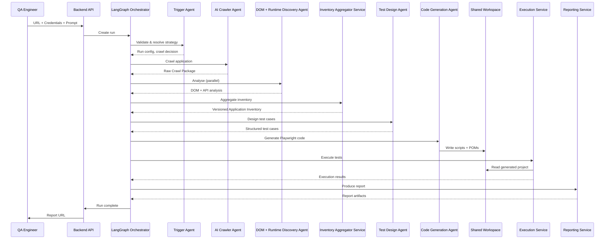

# Architecture

## Document Metadata

| Field | Value |
|---|---|
| Document | Architecture |
| Document ID | SDD-ARCH-001 |
| Version | 1.0 |
| Status | Draft |
| Owner | Platform Architecture Team |
| Last Updated | 2026-07-20 |
| Review Frequency | Quarterly or on major architectural change |

## Architecture Overview

The system follows a **multi-agent pipeline architecture** orchestrated by a LangGraph state machine running inside a single FastAPI process (MVP tier). It is composed of two distinct execution layers: **AI agents** that perform reasoning and content generation, and **deterministic services** that process data and execute actions without AI involvement.

The pipeline is structured as a series of stages, each owned by exactly one component. Data flows forward through the pipeline; there are no lateral dependencies between stages. The boundary between AI and deterministic execution is enforced at the architectural level: no AI agent has the ability to invoke Playwright or modify persistent state directly.

At MVP, all components are in-process Python modules within a single deployable unit. From Phase 2 onward, agents decompose into independently deployable services.

For the visual workflow, see `docs/diagrams/Flow_Diagram_Testing_AI_Agent_v3.jpg`. For the full reference, see `docs/references/Executive-Architecture-Design-Document-MVP.docx` and `docs/references/Agentic-AI-Testing-Platform-SDD-HLD-MVP-5-Agent-Revision.docx`.

## Architectural Goals

| Goal | Description |
|---|---|
| **Deterministic Execution** | Test execution is always deterministic and independent of AI behaviour. AI defects never affect a live test run. |
| **AI-Assisted Reasoning** | AI is used where human judgement adds value — test intent, scenario design, code synthesis — and not where deterministic logic suffices. |
| **Modular Composability** | Every component has a single responsibility and communicates via typed contracts. Components can be replaced, split, or extracted without redesign. |
| **Auditable Transparency** | Every AI decision — page discovered, selector chosen, test case created — is surfaced in a structured, reviewable format. |
| **Incremental Evolvability** | The architecture supports three clear tiers (MVP, Phase 2, Production) with no capability built before its tier. Agent consolidation at MVP is reversible by design. |
| **Minimal Hallucination Surface** | AI receives only purpose-built, scope-filtered inventory data — never raw DOM — and outputs are schema-validated with bounded retry. |

## Core Design Principles

**Separation of Responsibilities.** Every component owns exactly one concern. No component mixes AI reasoning with deterministic processing. No component both generates and executes tests. This is enforced at the module boundary, not by convention.

**AI Generates, Services Execute.** AI agents produce only artifacts — test cases, Playwright scripts, Page Object Models. Deterministic services consume those artifacts to perform execution, aggregation, and reporting. The two tiers communicate only through the Shared Workspace and the Inventory Store.

**Inventory as Source of Truth.** The Application Inventory is the single authoritative representation of the target application's structure. Every AI agent receives its context from the Inventory, never from raw crawl output. The Inventory is versioned, persisted, and reusable across runs.

**Specification First.** All features are defined by written specifications before implementation. Architecture changes are recorded as ADRs before code changes.

**Explicit Contracts.** Every cross-component interaction is defined by a typed data contract. No component passes raw dicts, raw HTML, or undocumented structures across its boundary.

**Stateless AI Agents.** AI agents hold no state between invocations. All context is passed through the LangGraph state and read from the Inventory. This makes agents independently testable and, later, independently deployable.

**Human-Readable Artifacts.** Generated outputs — test case Excel workbooks, Playwright scripts, Page Object Model classes — are designed to be read, understood, and modified by humans. The platform generates engineer-friendly assets, not opaque AI output.

## High-Level System Components

### Frontend Application

A Next.js web application that provides the user interface for initiating test runs and viewing results. Responsibilities include run creation, status polling, and report visualisation. The frontend communicates only with the Backend API — it has no direct access to agents, services, or the database.

### Backend API

A FastAPI application that serves as the single entry point for all client interactions. It handles request validation, run orchestration, and response delivery. The API layer has no AI or execution logic — it delegates to the Orchestrator and returns results.

### LangGraph Orchestrator

The state machine that sequences pipeline execution. It owns the run lifecycle, manages the flow of data between agents and services, and handles conditional branching (recrawl vs. reuse, retry logic). The Orchestrator is the only component that invokes agents and services in sequence.

### AI Agents

Five modules (MVP tier) that perform AI-assisted reasoning and content generation. Each agent has a single responsibility, receives structured inventory data as input, and produces typed output validated against a schema. Agents are stateless and communicate only through the Orchestrator.

### Deterministic Services

Three services (MVP tier) that perform data processing and execution without AI involvement. These services are responsible for aggregation, test execution, and reporting. They are invoked by the Orchestrator and operate on artifacts produced by AI agents.

### Shared Workspace

A run-scoped filesystem boundary that decouples the Code Generation Agent from the Execution Service. The Code Generation Agent writes generated Playwright projects into the Shared Workspace; the Execution Service reads from it. No AI agent ever reads from or modifies the Shared Workspace after the hand-off.

### Inventory Store

A versioned, persisted repository of Application Inventory data. Written once by the Inventory Aggregator Service, read by multiple agents across runs. The Inventory Store is the single source of truth about the target application's structure.

### Generated Artifacts Storage

Persistent storage for all generated outputs: test case Excel workbooks, Playwright test scripts, Page Object Model files, and execution reports. These artifacts are organised by run ID and retained for inspection, review, and reuse.

### Database

A relational database (SQLite at MVP, PostgreSQL from Phase 2) that stores run metadata, application registrations, inventory versions, and execution history. The database is owned by the Backend API and accessed by deterministic services — AI agents never query the database directly.

### Human Review Workflow Gate (Phase 2)

A human-in-the-loop approval workflow introduced in Phase 2 that allows QA engineers to review, edit, and approve generated test cases before they are passed to the Code Generation Agent. This is not an AI agent or a deterministic service — it is a workflow gate with human decision-making UI and approval logic. MVP ships without this gate; test cases flow directly from Test Design Agent to Code Generation Agent.

## Agent Responsibilities

All five agents exist at MVP tier. The first three are unchanged from the full architecture; the last two consolidate responsibilities that split into separate agents from Phase 2 onward.

| Agent | Primary Responsibility | Input | Output |
|---|---|---|---|
| **Trigger Agent** | Validate inputs, resolve crawl strategy, initialise run state | URL, credentials, prompt, application ID | Validated run configuration, crawl strategy decision |
| **AI Crawler Agent** | Crawl the target application and produce an immutable record of observed pages, network traffic, and screenshots | URL, credentials, scope configuration | Raw Crawl Package (HTML, DOM, network logs, screenshots) |
| **DOM + Runtime API Discovery Agent** | Analyse the Raw Crawl Package in two parallel branches: DOM analysis (selector ranking, form/table grouping) and runtime API discovery (endpoint detection, schema observation) | Raw Crawl Package | Structured page elements, form definitions, discovered API endpoints |
| **Test Design Agent** | Reason about test intent from the prompt and inventory, then generate concrete test cases across a fixed taxonomy (happy path, validation, error-path) | Application Inventory, user prompt, scope | Structured test cases with steps, selectors, and expected results |
| **Code Generation Agent** | Generate Playwright test scripts and Page Object Model classes from approved test cases and the Component Inventory | Test cases, Component Inventory, selector ranking data | Playwright spec files, Page Object Model classes, component definitions |

## Deterministic Services

| Service | Responsibility | Input | Output |
|---|---|---|---|
| **Inventory Aggregator Service** | Merge, deduplicate, normalise, validate, and persist the versioned Application Inventory from the parallel DOM and API analysis outputs | DOM analysis results, API discovery results | Versioned Application Inventory (Component, Page, API, Navigation, Flow) |
| **Execution Service** | Invoke the Playwright Test Runner against generated scripts, capture results, and parse the JSON reporter output | Generated Playwright project (Shared Workspace) | Raw execution results with pass/fail, duration, screenshots, traces |
| **Reporting Service** | Produce structured reports from execution results across multiple output formats | Execution results, test case definitions | HTML report, JSON report, annotated Excel workbook |

## Data Flow

The end-to-end data flow through the pipeline is illustrated below. Each arrow represents a typed data hand-off between components.

**Note:** At MVP, the flow proceeds directly from Test Design Agent to Code Generation Agent. The Human Review Workflow Gate is introduced in Phase 2.

The flow is governed by the Orchestrator, which makes conditional decisions at each hand-off — for example, skipping the crawl phase when a valid Inventory already exists, or retrying a failed agent with corrective context.

## System Boundaries

### Inside System Responsibility

- Receiving user input (URL, credentials, prompt)
- Crawling and discovering the target application's structure
- Building and maintaining the versioned Application Inventory
- Designing test cases from the Inventory
- Generating Playwright scripts and Page Object Models
- Executing generated tests via the Playwright Test Runner
- Producing structured reports (HTML, JSON, Excel)
- Storing and retrieving run metadata and execution history

### Outside System Responsibility (MVP)

- CI/CD pipeline orchestration and triggering
- Defect tracking and ticketing (Jira integration is Phase 2+)
- Cross-browser cloud execution (BrowserStack is Phase 2+)
- User authentication and authorisation beyond basic access
- Mobile or desktop application testing
- Performance, security, or accessibility testing
- Real-device execution or cloud browser grid management

## Data Ownership

| Artifact | Owner | Description |
|---|---|---|
| Raw Crawl Package | AI Crawler Agent | Immutable crawl output per run; written once, read by the Discovery Agent and (Phase 2) Self-Healing Agent |
| Application Inventory | Inventory Aggregator | Versioned, persisted, single source of truth for all downstream agents; reused across runs until explicitly refreshed |
| Test Cases | Test Design Agent | Structured test cases stored as a canonical Excel workbook and database records |
| Playwright Project | Code Generation Agent | Generated spec files, Page Object Model classes, and component definitions written to the Shared Workspace |
| Execution Results | Execution Service | Raw execution output from Playwright Runner, including JSON results, screenshots, and trace files |
| Reports | Reporting Service | Final HTML, JSON, and annotated Excel reports derived from execution results |
| Run State | LangGraph Orchestrator | Transient state for the duration of a run; persisted to the Database at key milestones |
| Database Records | Backend API | Long-lived storage of runs, applications, inventory versions, and execution history |

## Error Handling Philosophy

**Fail Fast at Boundaries.** Input validation occurs at the API layer before any agent or service is invoked. Invalid requests are rejected with a clear error before reaching the pipeline.

**Bounded Agent Retry.** AI agents receive exactly one corrective retry on schema validation failure. If the retry also produces invalid output, a deterministic fallback is used instead — never unbounded retry loops.

**Deterministic Service Errors.** Non-AI services do not retry on failure. They report errors to the Orchestrator, which decides whether the error is retryable, fallback-able, or run-terminating.

**Structured Logging.** Every component emits structured JSON logs tagged with `run_id` and `component_name`, allowing a full run trace to be reconstructed by filtering on `run_id` alone.

**Graceful Degradation.** When an agent fails to produce valid output after retry, the run continues with the best available fallback rather than aborting entirely. The report marks degraded outputs explicitly.

**Human-Readable Errors.** All errors surfaced to the user are expressed in domain terms, not stack traces. The system distinguishes between application errors (the target app is unreachable), platform errors (a component failed), and validation errors (the input is invalid).

## Security Considerations

**Credential Handling.** User-provided credentials are encrypted at rest using symmetric-key encryption (AES-GCM / Fernet). They are never stored in plaintext, never included in AI prompts, and never written to generated scripts or reports. The execution service injects credentials into the Playwright browser context at runtime only.

**Local Execution.** MVP executes entirely on the user's host or local network. No data leaves the execution environment. This eliminates network-based attack vectors for the pilot phase.

**Secrets Management.** All configuration secrets (Ollama endpoint, database connection strings, encryption keys) are loaded from environment variables. Nothing is embedded in source code or generated artifacts.

**Artifact Isolation.** The Shared Workspace is scoped per `run_id`. One run's generated project can never be read or overwritten by another run. This prevents cross-run data leakage.

**Prompt Injection Protection.** The user's free-text prompt is used only for scope classification against a closed set of known module names. It is never concatenated directly into a reasoning or code-generation prompt. Any text scraped from the target application is inserted as a quoted data value inside a fixed instruction template, never as an instruction.

**Least Privilege.** Generated Playwright scripts execute in an isolated browser context with no elevated OS privileges. The backend process has no access to the browser's filesystem or network beyond the target application under test.

## Scalability Strategy

### MVP (Phase 1)

Single FastAPI process containing all agents and services as in-process modules. SQLite database on local disk. Sequential execution — one run at a time. Ollama on the same host. This is the smallest possible deployment that proves the concept end-to-end.

### Phase 2

Task queue introduced for concurrent runs. PostgreSQL replaces SQLite. Agents begin decomposing into their specialised originals (Test Design splits into Reasoning + Test Case Generator; Code Generation splits into Script Generator + POM Generator). Self-Healing Agent introduced. Ollama moved to a shared internal host. Parallel Playwright execution via test sharding.

### Production

Full 12-agent architecture restored. Agents extracted into independently deployable services behind an API gateway with authentication and rate-limiting. Containerised deployment (Docker + orchestrator). Multi-tenant isolation with row-level security. Ollama (or hosted LLM) behind an internal load balancer. Horizontal scaling of execution workers based on queue depth. Cloud deployment via Terraform (Azure or AWS).

## Extension Points

**Additional AI Agents.** New agents can be added to the pipeline by registering them with the Orchestrator and defining their input/output contracts. The LangGraph state machine supports conditional edges, so new agents can be inserted without modifying existing ones.

**Additional Reporting Engines.** The Reporting Service outputs structured data that can be consumed by custom report renderers. New output formats can be added without changing the execution or reporting pipeline.

**New Execution Providers.** The Execution Service abstracts over the Playwright Test Runner. Alternative execution backends (BrowserStack cloud grid, Docker containers, headless-only mode) can be added by implementing the same execution contract.

**Additional LLM Providers.** The LLM client is abstracted behind a single internal interface. Swapping the backing model — from DeepSeek via Ollama to Azure OpenAI, Anthropic, or a local GGUF — requires changing only the client implementation and its configuration.

**Plugin Architecture (Production).** The Production architecture supports webhook-based extensions for CI/CD triggers, Jira defect filing, Slack notifications, and other ecosystem integrations.

## Architecture Constraints

| Constraint | Implication |
|---|---|
| **Single-process MVP** | All components must be in-process Python modules; no RPC, no message queues, no container orchestration at MVP |
| **SQLite persistence** | No concurrent writes; no multi-user isolation; single-file database acceptable for pilot scale |
| **Local execution only** | No cloud deployment, no remote browser grid, no distributed execution at MVP |
| **Sequential runs** | One run at a time; no task queue, no concurrency at MVP |
| **Single-tenant** | No organisation or user scoping; single shared admin/tester identity at MVP |
| **Local Ollama** | LLM runs on the same host; no load balancing, no failover, no hosted API fallback at MVP |
| **AI never executes** | AI agents cannot invoke Playwright or modify persistent state; enforced at the process boundary |
| **No human-in-loop** | MVP does not pause for human approval before execution; all generated tests run automatically |

## Architecture Decision References

This architecture is governed by Architecture Decision Records stored in `docs/06-ADR.md`. Key decisions that shape this architecture include:

- Selection of Playwright as the browser automation engine
- LangGraph as the orchestration state machine
- SQLite for MVP persistence (with PostgreSQL migration planned)
- 5-agent consolidation strategy for MVP
- Shared Workspace decoupling pattern between code generation and execution
- Structured Inventory as the authoritative data source for all AI agents

For the full rationale, context, and alternatives considered for each decision, refer to `docs/06-ADR.md`. New architecture decisions must be recorded there before implementation begins.

## Related Documents

| Document | Purpose |
|---|---|
| `docs/00-AI_CONTEXT.md` | AI onboarding — first document every AI agent reads before implementation |
| `docs/01-PROJECT_OVERVIEW.md` | Business and product overview — explains what and why |
| `docs/03-ROADMAP.md` | Detailed milestone timeline and delivery plan across all three tiers |
| `docs/04-PROJECT_STATE.md` | Current implementation status and progress tracking |
| `docs/05-CODING_STANDARDS.md` | Code style, conventions, and error handling guidelines |
| `docs/06-ADR.md` | Architecture Decision Records — rationale for every significant architectural choice |
| `docs/specs/` | Feature specifications — source of truth for implementation |
| `docs/contracts/` | Typed data contracts defining every cross-component interface |
| `docs/diagrams/Flow_Diagram_Testing_AI_Agent_v3.jpg` | Visual workflow diagram of the end-to-end pipeline |
| `docs/references/Executive-Architecture-Design-Document-MVP.docx` | Full architecture reference document |
| `docs/references/Agentic-AI-Testing-Platform-SDD-HLD-MVP-5-Agent-Revision.docx` | Complete SDD & HLD reference |
