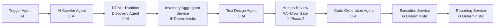
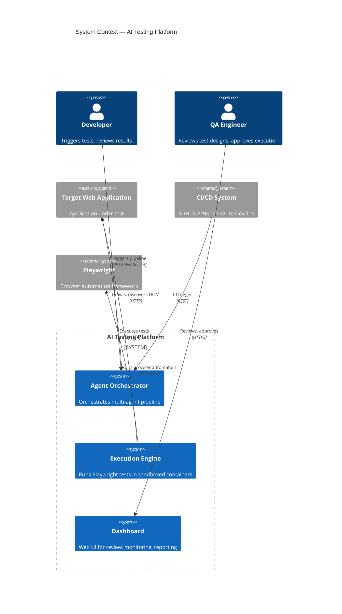

# Project Setup — Master Architecture Specification

> **Document ID:** SPEC-001  
> **Status:** Draft  
> **Version:** 1.0.0  
> **Author:** Architecture Team  
> **Last Updated:** 2026-07-21  
> **Domain:** AI Agentic Web Application Testing Platform

---

## Table of Contents

1. [Executive Summary](#1-executive-summary)
2. [Project Vision and Scope](#2-project-vision-and-scope)
3. [System Context and High-Level Architecture](#3-system-context-and-high-level-architecture)
4. [Architecture Principles](#4-architecture-principles)
5. [Technology Stack](#5-technology-stack)
6. [Repository Structure](#6-repository-structure)
7. [Development Methodology](#7-development-methodology)
8. [Project Phases and Roadmap](#8-project-phases-and-roadmap)
9. [Engineering Standards](#9-engineering-standards)
10. [Coding Standards](#10-coding-standards)
11. [Configuration Management](#11-configuration-management)
12. [Security Architecture](#12-security-architecture)
13. [Observability](#13-observability)
14. [Error Handling Strategy](#14-error-handling-strategy)
15. [Quality Attributes](#15-quality-attributes)
16. [Non-Functional Requirements](#16-non-functional-requirements)
17. [AI Agent Design Principles](#17-ai-agent-design-principles)
18. [Documentation Standards](#18-documentation-standards)
19. [Definition of Done](#19-definition-of-done)
20. [Future Roadmap](#20-future-roadmap)
21. [References](#21-references)

---

## 1. Executive Summary

This document is the master architecture specification for an **AI Agentic Web Application Testing Platform**. The platform automatically generates and executes end-to-end tests for any web application through a coordinated pipeline of specialised AI agents. It replaces manual test authoring with a deterministic, contract-driven, multi-agent workflow that produces executable Playwright tests from natural-language application descriptions.

The architecture follows **Specification-Driven Development (SDD)** , **Domain-Driven Design (DDD)** , and **Clean Architecture** principles. Every component has a single responsibility, communicates through versioned contracts, and produces deterministic outputs. The system is designed for horizontal scalability, cloud-native deployment, and continuous evolution through strictly governed extension points.

---

## 2. Project Vision and Scope

### 2.1 Vision

Eliminate manual end-to-end test authoring by creating an autonomous AI agent pipeline that understands any web application from its DOM structure, generates comprehensive test suites, executes them against live environments, and produces actionable quality reports — all without human intervention beyond initial review and approval.

### 2.2 In Scope

- Multi-agent orchestration for test generation
- DOM discovery and runtime introspection
- Playwright-based test execution
- Human-in-the-loop review gate
- Structured test reporting with confidence scoring
- Parallel test execution
- CI/CD integration
- Dashboard and observability

### 2.3 Out of Scope

- Mobile native application testing
- Desktop application testing
- API-only testing (non-UI)
- Manual test case management
- Production monitoring of target applications
- Load/stress testing (future capability)

### 2.4 Stakeholders

| Stakeholder | Concern |
|---|---|
| QA Engineers | Reliable test generation, minimal false positives |
| Developers | Fast feedback, CI integration, debuggable output |
| Engineering Managers | Coverage metrics, regression detection |
| Product Owners | Release confidence, quality gates |
| DevOps | Infrastructure, scalability, security |
| AI Engineers | Agent accuracy, determinism, cost optimisation |

---

## 3. System Context and High-Level Architecture

### 3.1 Platform Pipeline

**Design Principle:** AI Generates. Services Execute. Humans Approve.



**MVP Flow (Phase 1):** Test Design Agent → Code Generation Agent (Human Review bypassed)

**Phase 2+ Flow:** Test Design Agent → Human Review Workflow Gate → Code Generation Agent

### 3.2 Context Diagram



### 3.3 Container Diagram

```mermaid
C4Container
    title Container Diagram

    Container(api, "FastAPI Gateway", "Python, FastAPI", "API gateway, auth, rate limiting")
    Container(orchestrator, "Agent Orchestrator", "Python, LangGraph", "State machine, agent and service coordination")
    Container(crawler, "AI Crawler Agent", "Python, Playwright", "URL discovery, navigation")
    Container(dom, "DOM + Runtime Discovery Agent", "Python, Playwright", "DOM extraction, runtime analysis")
    Container(inventory, "Inventory Aggregator Service", "Python", "Element inventory, deduplication, normalization")
    Container(designer, "Test Design Agent", "Python, LangGraph", "Test scenario generation")
    Container(codegen, "Code Generation Agent", "Python, LangGraph", "Playwright code generation")
    Container(executor, "Execution Service", "Python, Playwright", "Sandboxed test execution")
    Container(reporter, "Reporting Service", "Python", "Report aggregation, storage")
    ContainerDb(postgres, "PostgreSQL", "PostgreSQL", "Contracts, tests, reports, audit")
    ContainerDb(redis, "Redis", "Redis", "Job queues, caching, rate limiting")
    Container(frontend, "Web Dashboard", "React, TypeScript", "Review, monitoring, configuration")

    Rel(api, orchestrator, "Triggers workflow")
    Rel(orchestrator, crawler, "Dispatch crawl")
    Rel(orchestrator, dom, "Dispatch DOM discovery")
    Rel(orchestrator, inventory, "Aggregate inventory")
    Rel(orchestrator, designer, "Design tests")
    Rel(orchestrator, codegen, "Generate code")
    Rel(orchestrator, executor, "Execute tests")
    Rel(orchestrator, reporter, "Generate report")
    Rel(crawler, target_app, "Crawls")
    Rel(dom, target_app, "Introspects")
    Rel(executor, target_app, "Executes")
    Rel(orchestrator, postgres, "Reads/Writes")
    Rel(orchestrator, redis, "Queue/Cache")
    Rel(frontend, api, "HTTPS")
```

---

## 4. Architecture Principles

### 4.1 Specification-Driven Development (SDD)

Every component shall be preceded by a formal specification. No code is written without an approved specification document. Specifications define inputs, outputs, contracts, error states, and quality criteria. Changes to specifications follow a formal review and versioning process.

### 4.2 Documentation First

Documentation precedes implementation. Every API, contract, configuration, and architectural decision must be documented before the corresponding code is written. Documentation is treated as a first-class deliverable with the same review rigour as code.

### 4.3 Contracts First

All inter-component communication is governed by strictly versioned, validated contracts. Contracts are authored as Pydantic models in the `contracts/` directory and serve as the single source of truth for data schemas. Any breaking change requires a contract version bump and migration plan.

### 4.4 AI First

The platform is designed from the ground up for AI agent consumption and production. Agent outputs are structured, deterministic, and machine-parseable. Agents are stateless, context-isolated, and communicate through well-defined contracts. Human intervention is reserved for approval gates, not operational flow.

### 4.5 Separation of Concerns

Each agent and service has exactly one domain responsibility. No component performs tasks outside its defined boundary. Cross-cutting concerns (logging, auth, observability) are handled by infrastructure middleware, not by domain logic.

### 4.6 Single Responsibility

Every module, class, function, and agent must have one and only one reason to change. This applies to agents, services, API endpoints, and configuration files.

### 4.7 Loose Coupling

Components communicate exclusively through versioned contracts and message passing. No direct service-to-service calls exist. The orchestrator coordinates flows via event-driven choreography. This enables independent deployment, scaling, and testing of each component.

### 4.8 High Cohesion

Related functionality (e.g., all DOM-related operations) is grouped within the same bounded context. Cross-context communication occurs only through the orchestrator or event bus.

### 4.9 Deterministic Outputs

Given identical inputs and contracts, every agent must produce identical outputs. Non-determinism (e.g., LLM temperature, timing) is explicitly managed, logged, and constrained to controlled ranges. Randomness that affects test output is recorded for reproducibility.

### 4.10 Stateless Services

All services are stateless. State is externalised to PostgreSQL (persistent) and Redis (volatile/cache). This enables horizontal scaling, zero-downtime deployments, and straightforward recovery.

### 4.11 Versioned Contracts

Every contract bears a semantic version. Producers and consumers are independently deployable as long as they honour a mutually agreed contract version. Contract version negotiation is handled at the orchestrator layer.

### 4.12 Event-Driven Architecture

Agent pipeline progression is event-driven. Agents emit events on completion, failure, or confidence below threshold. The orchestrator subscribes to these events and triggers downstream steps. This decouples agent scheduling from agent implementation.

### 4.13 Domain-Driven Design (DDD)

The system is decomposed into bounded contexts, each with its own ubiquitous language:
- **Crawl Context** — URL discovery, navigation, link extraction
- **DOM Context** — Element discovery, attribute extraction, runtime state
- **Inventory Context** — Element deduplication, classification, prioritisation
- **Test Design Context** — Scenario generation, step definition, oracle identification
- **Code Generation Context** — Playwright code synthesis, locator strategy
- **Execution Context** — Sandboxed test run, result collection
- **Reporting Context** — Aggregation, visualisation, trend analysis

### 4.14 Clean Architecture

Each bounded context follows Clean Architecture layers:

```
Domain Layer    — Entities, value objects, domain services, repository interfaces
Application Layer — Use cases, DTOs, ports (inbound/outbound interfaces)
Infrastructure Layer — External adapters, database implementations, HTTP clients
Interface Layer  — API endpoints, event handlers, CLI commands
```

Dependencies point inward. The domain layer depends on nothing external.

### 4.15 SOLID Principles

All object-oriented code must adhere to SOLID principles. Dependencies are injected through constructor injection. Interfaces are segregated by client need. Classes are open for extension, closed for modification.

### 4.16 Open-Closed Principle

Core agent behaviour is extended through composition of pluggable strategies, not by modifying agent source code. New locator strategies, assertion types, and reporting formats are added via extension points defined in contracts.

### 4.17 Dependency Injection

All external dependencies (databases, HTTP clients, AI models, file systems) are injected through constructor parameters. No service instantiates its own dependencies. This enables unit testing, context isolation, and configuration-driven behaviour.

### 4.18 Observability First

Every component exposes structured logs, metrics, and health endpoints by default. Observability is not retrofitted — it is designed into every service from inception. The observability contract is part of the service specification.

### 4.19 Security By Design

Security requirements are defined in the specification phase, not added after implementation. Every API endpoint, agent, and data store is evaluated against the STRIDE threat model. Secrets never appear in logs, code, or configuration files.

---

## 5. Technology Stack

### 5.1 Backend

| Technology | Purpose | Justification |
|---|---|---|
| Python 3.12+ | Primary language | AI ecosystem dominance, async support, type hints |
| FastAPI | API framework | Async-native, OpenAPI auto-generation, Pydantic integration |
| LangGraph | Agent orchestration | State machine-based DAG execution, agent lifecycle management |
| Pydantic v2 | Data validation | Contract enforcement, serialisation, JSON Schema generation |
| AsyncIO | Concurrency | Event-driven I/O for agent communication |
| httpx | HTTP client | Async HTTP, connection pooling, retry support |
| SQLAlchemy 2.0 | ORM | Async, repository pattern support, migration ecosystem |
| Alembic | Migrations | Declarative migration management |
| Pytest | Testing | Async support, fixtures, parameterisation |

### 5.2 AI / ML

| Technology | Purpose |
|---|---|
| OpenAI API / Anthropic API | LLM access for test design, code generation |
| LangChain | LLM abstraction, prompt templating |
| LangGraph | Agent state machines, multi-agent workflows |

### 5.3 Frontend

| Technology | Purpose |
|---|---|
| React 19 | UI framework |
| TypeScript 5+ | Type safety, developer experience |
| TailwindCSS 4 | Utility-first styling |
| Shadcn UI | Component library (Radix primitives) |
| React Router | Client-side routing |
| TanStack Query | Server state management |
| Zustand | Client state management |
| Vite | Build tooling |

### 5.4 Testing and Automation

| Technology | Purpose |
|---|---|
| Playwright | Browser automation, test execution |
| Pytest | Backend unit/integration tests |
| Vitest | Frontend unit tests |
| Playwright Test | E2E tests of the platform itself |

### 5.5 Storage

| Technology | Purpose |
|---|---|
| PostgreSQL 16 | Primary database (contracts, tests, reports, audit) |
| Redis 7 | Job queues, caching, rate limiting, session storage |
| S3 / MinIO | Test artifacts, screenshots, videos, logs |

### 5.6 Deployment

| Technology | Purpose |
|---|---|
| Docker | Containerisation |
| Docker Compose | Local development, CI environments |
| Kubernetes | Production orchestration (Phase 10) |
| Nginx / Traefik | Reverse proxy, TLS termination |

### 5.7 CI/CD

| Tool | Purpose |
|---|---|
| GitHub Actions | Primary CI/CD pipeline |
| Azure DevOps Pipelines | Secondary/enterprise CI/CD |
| Pre-commit Hooks | Local quality gates |

---

## 6. Repository Structure

```
repo-root/
├── backend/
│   ├── src/
│   │   ├── api/                 # FastAPI application
│   │   │   ├── routes/          # Endpoint definitions
│   │   │   ├── middlewares/     # Auth, logging, rate limiting
│   │   │   ├── dependencies/   # FastAPI dependency injection
│   │   │   └── exceptions/     # API error handlers
│   │   ├── core/               # Domain layer
│   │   │   ├── entities/       # Domain entities
│   │   │   ├── value_objects/  # Immutable value objects
│   │   │   ├── services/       # Domain services
│   │   │   └── ports/          # Repository interfaces
│   │   ├── application/        # Use cases, DTOs
│   │   │   ├── use_cases/      # Orchestrated workflows
│   │   │   └── dto/            # Data transfer objects
│   │   ├── infrastructure/     # External adapters
│   │   │   ├── database/       # SQLAlchemy models, repos
│   │   │   ├── cache/          # Redis adapters
│   │   │   ├── ai/             # LLM clients, prompt executors
│   │   │   ├── browser/        # Playwright integration
│   │   │   └── storage/        # S3/MinIO adapters
│   │   └── config/             # Configuration management
│   ├── tests/
│   │   ├── unit/
│   │   ├── integration/
│   │   └── e2e/
│   ├── alembic/                # Database migrations
│   ├── Dockerfile
│   └── pyproject.toml
│
├── frontend/
│   ├── src/
│   │   ├── app/                # Application root
│   │   ├── components/         # Reusable UI components
│   │   ├── features/           # Feature modules
│   │   ├── lib/                # Utilities, hooks
│   │   ├── api/                # API client layer
│   │   └── types/              # TypeScript definitions
│   ├── tests/
│   │   ├── unit/
│   │   └── e2e/
│   ├── Dockerfile
│   └── package.json
│
├── agents/
│   ├── crawler-agent/          # Crawler agent implementation
│   ├── dom-agent/              # DOM + Runtime Discovery agent
│   ├── test-designer-agent/    # Test design agent
│   ├── code-generator-agent/   # Code generation agent
│   └── reporting-service/      # Reporting service
│
├── contracts/                  # Versioned data contracts
│   ├── v1/
│   │   ├── crawl-contract.json
│   │   ├── dom-contract.json
│   │   ├── inventory-contract.json
│   │   ├── test-design-contract.json
│   │   ├── code-gen-contract.json
│   │   ├── execution-contract.json
│   │   └── report-contract.json
│   └── schemas/                # Shared JSON Schema definitions
│
├── specs/                      # Architecture specifications
│   ├── 001-project-setup.md    # This document
│   ├── 002-agent-contracts.md
│   ├── 003-crawler-agent.md
│   ├── 004-dom-agent.md
│   ├── 005-inventory-service.md
│   ├── 006-test-designer-agent.md
│   ├── 007-code-generator-agent.md
│   ├── 008-execution-engine.md
│   ├── 009-reporting-service.md
│   └── 010-dashboard.md
│
├── prompts/                    # AI agent prompt templates
│   ├── system/                 # System prompt templates
│   ├── user/                   # User prompt templates
│   └── examples/               # Few-shot examples
│
├── docs/
│   ├── adr/                    # Architecture Decision Records
│   ├── guides/                 # Developer guides
│   ├── api/                    # API documentation
│   └── operations/             # Runbooks, deployment guides
│
├── tests/
│   ├── integration/            # Cross-service integration tests
│   ├── performance/            # Performance/load tests
│   └── security/               # Security scans, SAST
│
├── scripts/
│   ├── setup/                  # Environment setup scripts
│   ├── ci/                     # CI helper scripts
│   └── maintenance/            # Database maintenance, data migration
│
├── config/
│   ├── development/            # Dev environment configs
│   ├── staging/                # Staging environment configs
│   └── production/             # Production environment configs
│
├── docker/
│   ├── docker-compose.yml      # Local development stack
│   ├── docker-compose.ci.yml   # CI stack
│   ├── Dockerfile.api
│   ├── Dockerfile.frontend
│   └── Dockerfile.agent        # Base agent image
│
├── artifacts/                  # Generated outputs (gitignored)
│   ├── tests/                  # Generated test files
│   ├── reports/                # Execution reports
│   ├── screenshots/            # Screenshots from execution
│   └── videos/                 # Video recordings from execution
│
├── logs/                       # Runtime logs (gitignored)
├── examples/                   # Example configurations, sample outputs
│
├── .github/
│   └── workflows/              # GitHub Actions CI/CD
│
├── .opencode/                  # AI agent configuration directory
│   ├── tasks/                  # Task definitions for AI agents
│   ├── rules/                  # Engineering rules for agents
│   └── agents.yml              # Agent capability registration
│
├── AGENTS.md                   # AI agent onboarding and conventions
├── CONTEXT.md                  # Domain context and vocabulary
├── pyproject.toml              # Python project metadata
├── package.json                # Node.js workspace root
├── tsconfig.json               # TypeScript configuration
├── .env.example                # Environment variable template
├── .pre-commit-config.yaml     # Pre-commit hook configuration
├── .gitignore
└── README.md
```

---

## 7. Development Methodology

### 7.1 Documentation First

No code is written before its documentation is drafted and reviewed. Documentation scope includes:
- **Specifications** — Architecture and design specifications (`docs/specs/`)
- **Contracts** — Data schemas and API contracts (`contracts/`)
- **ADRs** — Architecture Decision Records for significant decisions (`docs/adr/`)
- **Runbooks** — Operational procedures (`docs/operations/`)

### 7.2 Contracts First

Before implementing any service, its inbound and outbound contracts are defined, versioned, and published. Both producers and consumers implement against these contracts. Contract validation is the first test written.

### 7.3 Specification-Driven Development (SDD)

The development lifecycle is:

```
Requirement → Specification → Contract → Test → Implementation → Review → Release
```

1. A requirement is captured as a specification in `docs/specs/`
2. Data contracts are defined in `contracts/`
3. Tests are written against contracts and specifications
4. Implementation satisfies tests
5. Code review validates conformance to specification
6. Architecture review validates alignment with this document

### 7.4 Incremental Development

Each feature is delivered as a vertical slice through all layers. No layer is built in isolation. A minimal end-to-end flow is established early and extended iteratively.

### 7.5 Iterative Delivery

Development is organised in two-week iterations. Each iteration produces a demonstrable increment. The increment is deployed to a staging environment for stakeholder feedback.

### 7.6 Code Reviews

Every pull request requires:
- At least one peer review
- All CI checks passing
- No spec or contract drift
- Updated documentation (if applicable)
- Updated contracts (if applicable)

### 7.7 Architecture Reviews

Significant additions or modifications require architecture review before implementation begins. Architecture review evaluates:
- Alignment with principles in Section 4
- Contract compatibility
- Security implications
- Observability coverage
- Performance impact

### 7.8 AI-Assisted Development

AI agents are used during development for:
- Generating test code against contracts
- Validating specification adherence
- Generating documentation stubs
- Code review assistance
- Migration script generation

All AI-generated code must pass the same review and testing gates as human-written code.

---

## 8. Project Phases and Roadmap

### 8.1 Phase 1 — Documentation (Weeks 1-2)

- Author this master specification
- Define bounded contexts and ubiquitous language in `CONTEXT.md`
- Create ADR template and initial ADRs
- Establish documentation conventions

**Deliverable:** Complete `docs/` directory with master spec, ADR template, and domain context.

### 8.2 Phase 2 — Contracts (Weeks 3-4)

- Author all version 1 contracts in `contracts/v1/`
- Implement Pydantic models for all contracts
- Implement contract validation tests
- Publish contract documentation

**Deliverable:** All agent contracts defined, versioned, validated, and documented.

### 8.3 Phase 3 — Specifications (Weeks 5-6)

- Author detailed specifications for each agent (SPEC-002 through SPEC-009)
- Define agent interfaces, error states, retry policies
- Define human review gate protocols
- Define confidence scoring criteria

**Deliverable:** Agent-level specifications for all pipeline stages.

### 8.4 Phase 4 — Core Backend (Weeks 7-10)

- Repository scaffolding
- Database schema and migrations
- Redis integration
- FastAPI application skeleton
- Authentication and authorisation
- Configuration management
- Structured logging and metrics
- Docker Compose development stack

**Deliverable:** Running backend with auth, database, caching, and API gateway.

### 8.5 Phase 5 — AI Agents (Weeks 11-16)

- Crawler agent
- DOM + Runtime Discovery agent
- Inventory aggregator service
- Test designer agent (LLM model integration)

**Deliverable:** End-to-end flow from trigger → crawl → inventory → test design with human review.

### 8.6 Phase 6 — Playwright Generation (Weeks 17-20)

- Code generation agent (generates Playwright code from test designs)
- Locator strategy selector
- Assertion generator
- Code quality validator

**Deliverable:** Pipeline produces executable Playwright test files from application descriptions.

### 8.7 Phase 7 — Execution Engine (Weeks 21-24)

- Playwright execution sandbox
- Parallel test execution
- Result collection and aggregation
- Screenshot and video capture
- Retry strategy implementation
- Circuit breaker implementation

**Deliverable:** Running execution engine capable of executing generated tests against live applications.

### 8.8 Phase 8 — Dashboard (Weeks 25-28)

- React application with TailwindCSS and Shadcn UI
- Authentication UI
- Test design review interface
- Execution monitoring (real-time)
- History and trend views
- Configuration interface

**Deliverable:** Functional dashboard for human review, monitoring, and configuration.

### 8.9 Phase 9 — Reporting (Weeks 29-30)

- Reporting service implementation
- Report aggregation and storage
- HTML/PDF report generation
- CI/CD integration (GitHub Actions, Azure DevOps)
- Notification system (email, webhook, Slack)

**Deliverable:** Complete reporting pipeline with CI/CD integration.

### 8.10 Phase 10 — Optimisation (Weeks 31-34)

- Performance profiling and optimisation
- Kubernetes deployment manifests
- Horizontal scaling configuration
- Caching strategy optimisation
- Cold start reduction
- Cost optimisation for LLM calls
- Production readiness review

**Deliverable:** Production-ready, scalable, optimised platform.

---

## 9. Engineering Standards

### 9.1 Naming Conventions

#### 9.1.1 Folder Naming

- `kebab-case` for all directory names: `crawler-agent/`, `test-designer-agent/`
- Single word preferred where possible
- No plural directory names: use `agent/` not `agents/` for a single agent's directory

#### 9.1.2 File Naming

- Python files: `snake_case.py`
- TypeScript files: `camelCase.ts` (utilities), `PascalCase.tsx` (components)
- Specification files: `NNN-description.md`
- Contract files: `name-contract.v{N}.json`
- Configuration files: `name.{env}.yml`

#### 9.1.3 Class Naming

- Python: `PascalCase`
- TypeScript: `PascalCase`
- Interface (Python): `Protocol` suffix, e.g., `CrawlerProtocol`
- Interface (TypeScript): `I` prefix, e.g., `ICrawler`
- Abstract classes: `Abstract` prefix, e.g., `AbstractAgent`
- Repository classes: `{Entity}Repository` pattern

#### 9.1.4 API Naming

- RESTful resource-based endpoints: `/api/v1/crawls/{id}`
- `kebab-case` for resource names in URLs
- Plural for collection resources: `/api/v1/agents`
- Singular for singleton resources: `/api/v1/config`
- Query parameters in `snake_case`: `?page_size=20`

#### 9.1.5 JSON / Contract Naming

- `snake_case` for all JSON property names
- Enums in `UPPER_SNAKE_CASE`
- Type names in `PascalCase`

### 9.2 Versioning

#### 9.2.1 Semantic Versioning

All contracts, APIs, and specifications follow Semantic Versioning 2.0:

```
MAJOR.MINOR.PATCH
```

- **MAJOR** — Breaking change incompatible with existing consumers
- **MINOR** — Backward-compatible new functionality
- **PATCH** — Backward-compatible bug fix

#### 9.2.2 Contract Versioning

Contract version is part of the contract identifier:
- `crawl-contract.v1.json`
- `dom-contract.v2.json`

Breaking contract changes require:
1. New contract file in a new version directory
2. Migration guide
3. Deprecation notice on old version
4. Minimum one version overlap period

#### 9.2.3 API Versioning

API version is part of the URL path: `/api/v1/`, `/api/v2/`

### 9.3 Documentation

- All documentation in Markdown
- Mermaid for diagrams
- ADRs follow the template in `docs/adr/TEMPLATE.md`
- Specifications follow the template in `docs/specs/TEMPLATE.md`
- Maximum line length of 100 characters in markdown files

### 9.4 Commit Messages

```
<type>(<scope>): <subject>

<body>

<footer>
```

Types: `feat`, `fix`, `docs`, `spec`, `contract`, `refactor`, `test`, `chore`, `perf`, `ci`, `security`

Examples:
- `spec(agent): define crawler agent contract v1`
- `feat(crawler): implement URL discovery strategy`
- `contract(dom): add attribute extraction schema`

### 9.5 Branch Strategy

```
main                # Production-ready code
├── develop         # Integration branch
├── feature/*       # Feature branches
├── fix/*           # Bug fix branches
├── spec/*          # Specification branches
├── contract/*      # Contract branches
├── release/*       # Release preparation branches
└── hotfix/*        # Production hotfix branches
```

- Feature branches branch from `develop`
- Specification and contract branches branch from `develop`
- Release branches branch from `develop` and merge to `main` and `develop`
- Hotfix branches branch from `main` and merge to `main` and `develop`

---

## 10. Coding Standards

### 10.1 Python

- **Formatting:** Ruff with line length 100
- **Type hints:** Required for all function signatures and public class attributes
- **Linting:** Ruff (all rules enabled, pycodestyle, pydocstyle, pyflakes)
- **Type checking:** mypy strict mode
- **Docstrings:** Google Style for all public APIs and functions
- **Async:** Prefer `async def` for I/O-bound functions; use `asyncio` for concurrency
- **Imports:** Standard library → Third-party → Local (grouped with blank line separation)
- **Patterns:** Repository pattern for data access, Strategy pattern for pluggable behaviour, Factory pattern for object creation

### 10.2 TypeScript / React

- **Formatting:** Prettier with default config
- **Linting:** ESLint with TypeScript rules
- **Type checking:** `strict: true` in tsconfig
- **Component structure:** Feature-first organisation in `src/features/`
- **State:** Server state via TanStack Query, client state via Zustand stores
- **Styling:** TailwindCSS classes only; no styled-components or CSS modules
- **Imports:** Absolute imports using `@/` alias
- **Performance:** React.memo, useMemo, useCallback where profiling indicates benefit

### 10.3 FastAPI

- Path operations grouped by resource in separate route files
- Dependency injection for all shared dependencies (db sessions, auth, config)
- Request/response models are Pydantic models (imported from contracts)
- Exception handlers at the application level
- Middleware order: CORS → Auth → Logging → Rate Limit → Compression

### 10.4 Playwright

- Locator strategies prioritised by reliability: `getByRole` > `getByText` > `getByTestId` > `getByPlaceholder` > CSS > XPath
- Auto-waiting enabled by default
- Screenshots on failure for all test runs
- Trace viewer enabled for CI runs
- Video recording configurable per environment

### 10.5 Error Handling

- No bare `except:` statements
- Domain-specific exception hierarchy rooted in `AppError`
- All exceptions logged with structured context
- API errors returned as standardised JSON:
  ```json
  {
    "error": {"code": "VALIDATION_ERROR", "detail": "...", "correlation_id": "..."}
  }
  ```

### 10.6 Logging

- Structured JSON logging using the `structlog` library
- Log levels: `DEBUG`, `INFO`, `WARNING`, `ERROR`, `CRITICAL`
- Correlation ID propagated across service boundaries via HTTP headers
- No sensitive data logged (PII, secrets, tokens)
- Contextual fields: `service`, `agent_id`, `correlation_id`, `execution_id`, `duration_ms`

### 10.7 Dependency Injection

- Python: Constructor injection via dependency injection container (FastDepends)
- TypeScript: Constructor injection or hook-based injection
- No global singletons
- All external dependencies (DB, cache, AI client) configurable via config objects

### 10.8 Configuration

- Configuration loaded from environment variables
- Defaults in `config/default.py` (Python) or `config/default.ts` (TypeScript)
- Environment-specific overrides in `config/{environment}/`
- Secrets provided through environment variables or secret store, never in code

### 10.9 Validation

- Input validation at the API boundary (Pydantic)
- Business rule validation in domain services
- Contract validation at agent boundaries
- Zod schemas for frontend form validation

---

## 11. Configuration Management

### 11.1 Environment Variables

All configuration is exposed through environment variables. The canonical list is maintained in `.env.example` at the repository root. Environment variables are grouped by prefix:

| Prefix | Purpose | Example |
|---|---|---|
| `APP_` | Application configuration | `APP_ENV=production` |
| `DB_` | Database configuration | `DB_URL=postgresql://localhost:5432/...` |
| `REDIS_` | Redis configuration | `REDIS_URL=redis://localhost:6379` |
| `AI_` | AI provider configuration | `AI_OPENAI_API_KEY=sk-...` |
| `AGENT_` | Agent-specific configuration | `AGENT_TIMEOUT_MS=30000` |
| `JWT_` | Authentication configuration | `JWT_SECRET=...` |
| `LOG_` | Logging configuration | `LOG_LEVEL=INFO` |
| `OBSERV_` | Observability configuration | `OBSERV_OTLP_ENDPOINT=http://...` |

### 11.2 Configuration Files

Environment-specific configuration files are stored in `config/{environment}/`. These files are not committed for `production/` but templates are committed:

```
config/
├── development/
│   ├── docker-compose.override.yml
│   └── app.env
├── staging/
│   └── app.env.template
└── production/
    └── app.env.template
```

### 11.3 Secrets Management

- No secrets in code, configuration files, or environment variable templates
- Development secrets are generated locally and stored in `.env` (gitignored)
- CI/CD secrets managed through GitHub Secrets / Azure DevOps Variable Groups
- Production secrets managed through a vault solution (HashiCorp Vault / Azure Key Vault)
- Secrets are injected as environment variables at container runtime

### 11.4 Feature Flags

Feature flags are managed via a configuration file or Redis:

```json
{
  "feature_visual_regression": false,
  "feature_parallel_execution": true,
  "feature_auto_retry": true
}
```

Feature flags follow a standard lifecycle: `dev` → `beta` → `ga` → `deprecated` → `removed`.

### 11.5 Runtime Configuration

- Agent behaviour (timeout, retry count, confidence thresholds) configurable per execution
- Pipeline configuration (which agents to run, in what order) configurable per trigger
- Runtime configuration passed as part of the trigger contract payload

---

## 12. Security Architecture

### 12.1 Authentication

- JWT-based authentication for API access
- Access tokens short-lived (15 minutes), refresh tokens long-lived (7 days)
- API key authentication for CI/CD integrations
- OAuth 2.0 / OpenID Connect support for enterprise SSO (future)

### 12.2 Authorisation

- Role-based access control (RBAC):
  | Role | Permissions |
  |---|---|
  | `admin` | Full system access, configuration |
  | `engineer` | Trigger executions, review results |
  | `viewer` | View reports, dashboards |
  | `ci` | Trigger executions, fetch results (API key) |
- Permission enforcement at the API gateway layer

### 12.3 Secret Management

- Secrets encrypted at rest (AES-256)
- Secrets in transit encrypted (TLS 1.3)
- Secrets never logged
- Secrets rotated on a defined schedule
- LLM API keys scoped to minimal required permissions

### 12.4 Encryption

- TLS 1.3 for all external communication
- Database encryption at rest (PostgreSQL TDE or disk encryption)
- Test artifacts in S3 encrypted at rest (server-side encryption)
- No custom encryption implementations

### 12.5 Audit Logging

All security-relevant events are logged to an append-only audit log:
- Authentication attempts (success/failure)
- Authorisation failures
- Configuration changes
- Agent execution approvals/rejections
- Secret access events
- Data export/download events

### 12.6 Least Privilege

- Each service runs with the minimum IAM permissions required
- Database users scoped to specific schemas and tables
- Agent sandboxes have no network access except to the target application
- No service uses root or admin credentials

### 12.7 Input Validation

- All API input validated at the boundary (Pydantic)
- SQL injection prevention via parameterised queries (SQLAlchemy)
- XSS prevention via content sanitisation
- No `eval()` or dynamic code execution
- File upload size and type restrictions

### 12.8 Rate Limiting

- Per-user rate limits at the API gateway
- Per-IP rate limits on authentication endpoints
- Agent execution rate limits per target domain
- Burst allowance with token bucket algorithm

### 12.9 OWASP Principles

- A01: Broken Access Control — RBAC enforcement
- A02: Cryptographic Failures — TLS 1.3, AES-256
- A03: Injection — Parameterised queries, input validation
- A04: Insecure Design — Threat modelling in spec phase
- A05: Security Misconfiguration — Immutable containers
- A06: Vulnerable Components — Regular dependency scanning (Dependabot)
- A07: Auth Failures — JWT best practices
- A08: Data Integrity — Signed webhooks
- A09: Logging Failures — Audit logging
- A10: SSRF — Agent network restriction

---

## 13. Observability

### 13.1 Structured Logging

- JSON structured logging via `structlog` (Python) and `pino` (Node.js)
- Mandatory fields: `timestamp`, `level`, `service`, `correlation_id`, `message`
- Contextual fields: `execution_id`, `agent_id`, `target_url`, `duration_ms`
- Log shipping to central aggregator (Elasticsearch / Loki)

### 13.2 Metrics

- Prometheus metrics exposed on `/metrics` endpoint
- RED metrics (Rate, Errors, Duration) for all services
- Agent-specific metrics: executions, confidence scores, retry counts
- Business metrics: tests generated, tests passed, coverage percentage
- Infrastructure metrics: memory, CPU, connection pool usage

### 13.3 Tracing

- Distributed tracing via OpenTelemetry
- Trace context propagated via W3C Trace-Context headers
- Spans for: API requests, agent executions, LLM calls, database queries, external HTTP calls
- Trace sampling strategy: 100% for errors, 10% for successful requests

### 13.4 Monitoring

- Health check endpoint: `GET /health`
  - Returns overall status and individual dependency status
  - Used by orchestration layer for liveness/readiness probes
- Alerting rules for: error rate spikes, latency degradation, queue backlogs, failed agent executions
- Dashboard in Grafana for: pipeline health, agent performance, execution trends

### 13.5 Health Checks

```
GET /health → {
  "status": "healthy" | "degraded" | "unhealthy",
  "version": "1.0.0",
  "checks": {
    "database": {"status": "healthy", "latency_ms": 5},
    "redis": {"status": "healthy", "latency_ms": 2},
    "ai_provider": {"status": "healthy"},
  }
}
```

### 13.6 Telemetry

- Agent execution telemetry: start time, end time, duration, confidence score, token count, cost
- Pipeline telemetry: total duration, agent breakdown, human review time
- Usage telemetry: active users, executions per day, test generation rate

---

## 14. Error Handling Strategy

### 14.1 Error Categories

| Category | Description | Example |
|---|---|---|
| `VALIDATION_ERROR` | Input validation failure | Invalid contract, missing field |
| `CONTRACT_ERROR` | Contract violation | Unexpected response shape |
| `AGENT_ERROR` | Agent execution failure | LLM timeout, unexpected output |
| `INFRASTRUCTURE_ERROR` | Infrastructure failure | Database unreachable, Redis down |
| `TARGET_ERROR` | Target application error | 500, connection refused |
| `SECURITY_ERROR` | Security violation | Auth failure, rate limit exceeded |
| `FATAL_ERROR` | Unrecoverable error | Out of memory, disk full |

### 14.2 Recoverable Errors

Errors where retry is safe and likely to succeed:
- Network timeouts
- LLM temporary failures
- Rate limit responses (with backoff)
- Target application temporary errors

Retry strategy: Exponential backoff with jitter, maximum 3 retries.

### 14.3 Fatal Errors

Errors that abort the current execution and require human intervention:
- Contract violation
- Authentication failure on target application
- Persistent LLM failure
- Infrastructure unrecoverable

### 14.4 Retry Strategy

```
Attempt 1 → immediate
Attempt 2 → 1 second + jitter
Attempt 3 → 4 seconds + jitter
Attempt 4 → 16 seconds + jitter
Max retries: 3 (total 4 attempts)
```

Retry budget per execution: maximum 30 seconds aggregate retry time.

### 14.5 Circuit Breaker

- Circuit breaker for: database connections, AI provider calls, target application requests
- States: `CLOSED` (normal), `OPEN` (failing), `HALF_OPEN` (testing recovery)
- Threshold: 5 failures within 60 seconds → OPEN
- Reset timeout: 30 seconds → HALF_OPEN
- HALF_OPEN threshold: 3 successful requests → CLOSED

### 14.6 Timeout Strategy

| Operation | Timeout |
|---|---|
| API Request | 30 seconds |
| Agent execution | 5 minutes |
| LLM call | 2 minutes |
| Test execution (single) | 10 minutes |
| Full pipeline | 60 minutes |
| Database query | 10 seconds |

### 14.7 Graceful Degradation

- If AI provider unavailable → pipeline suspends, cached results served
- If database unavailable → last known configuration used, requests queued
- If Redis unavailable → fallback to in-memory cache with TTL
- If target application unavailable → clear error message, no retry

---

## 15. Quality Attributes

### 15.1 Scalability

- Horizontal scaling of all stateless services behind load balancer
- Database scaling via read replicas and connection pooling
- Agent execution scales independently of API layer
- Queue-based back-pressure for concurrent execution limits

### 15.2 Reliability

- At-least-once execution delivery (idempotent agents)
- Automatic retry with exponential backoff
- Circuit breakers for downstream dependencies
- Graceful degradation under partial failure
- State persistence in PostgreSQL for crash recovery

### 15.3 Availability

- Target: 99.9% availability for API and dashboard
- Zero-downtime deployments via rolling updates (Kubernetes)
- Health-check-based pod replacement
- Multi-AZ deployment (future)

### 15.4 Maintainability

- Clean Architecture layering in every service
- Single responsibility per module
- Comprehensive test coverage (unit > 90%, integration > 80%)
- Automated dependency updates (Dependabot)
- Strict adherence to coding standards

### 15.5 Extensibility

- Plugin architecture for agent types
- Strategy pattern for locator selection, assertion generation
- Contract versioning for backward compatibility
- Event hooks for custom integrations

### 15.6 Performance

- API response time p95 < 200ms
- Agent execution overhead < 10% of total execution time
- Database query p99 < 100ms
- Dashboard page load < 2 seconds

### 15.7 Testability

- Dependency injection enables unit testing without external services
- Contract-first design enables contract validation tests before implementation
- Agent outputs are deterministic for given inputs
- Playwright tests for the platform itself

### 15.8 Observability

- All components produce structured logs
- All components expose Prometheus metrics
- All components participate in distributed tracing
- All components expose health check endpoints

### 15.9 Security

- OWASP Top 10 mitigated by design
- Secrets never in code or logs
- TLS everywhere
- RBAC enforcement at API gateway
- Audit logging for security events

---

## 16. Non-Functional Requirements

### 16.1 Performance

| Metric | Target | Measurement |
|---|---|---|
| API response time (p95) | < 200ms | Prometheus histogram |
| Agent execution overhead | < 10% | Tracing span duration |
| Dashboard page load | < 2s | Lighthouse / Web Vitals |
| Report generation | < 5s | Execution timer |

### 16.2 Concurrency

| Metric | Target |
|---|---|
| Concurrent pipeline executions | 50 (Phase 10: 200) |
| Concurrent test executions per pipeline | 10 |
| Concurrent API connections | 500 |
| Database connection pool | 100 |

### 16.3 Latency

| Operation | Latency Target |
|---|---|
| API → Agent dispatch | < 100ms |
| Agent → AI provider round trip | < 10s |
| Agent → Agent handoff | < 50ms |
| Human review notification | < 5s |

### 16.4 Memory Usage

| Component | Memory Limit |
|---|---|
| API service | 512 MB |
| Agent service | 1 GB (LLM context) |
| Execution service | 2 GB (browser) |
| Dashboard | 256 MB |

### 16.5 Availability

| Tier | Availability | Downtime/Year |
|---|---|---|
| API & Dashboard | 99.9% | 8.76 hours |
| Agent execution | 99.5% | 43.8 hours |

### 16.6 Reliability

| Metric | Target |
|---|---|
| Pipeline completion rate | > 95% |
| Agent execution success rate | > 99% |
| Test generation success rate | > 90% |
| False positive rate | < 5% |

### 16.7 Response Time

| Endpoint | Target |
|---|---|
| GET /health | < 50ms |
| POST /api/v1/executions | < 500ms (queued) |
| GET /api/v1/executions/{id} | < 200ms |
| GET /api/v1/reports/{id} | < 500ms |

### 16.8 Throughput

| Metric | Target |
|---|---|
| Pipeline triggers per minute | 10 (Phase 10: 50) |
| Tests generated per hour | 1000 (Phase 10: 5000) |
| Tests executed per hour | 500 (Phase 10: 2500) |
| API requests per second | 100 |

---

## 17. AI Agent Design Principles

### 17.1 Independent Agents

Each agent is an independently deployable, self-contained service. Agents do not share memory, state, or runtime context. Communication occurs exclusively through versioned contracts via the orchestrator message bus.

### 17.2 Deterministic Outputs

Agents must produce identical outputs for identical inputs and contract versions. Non-determinism (LLM temperature, sampling parameters) is explicitly controlled and documented. All stochastic parameters are recorded in execution telemetry. Seeds are captured to enable reproduction.

### 17.3 Structured JSON

All agent outputs are structured JSON conforming to published contracts. Free-form text output is prohibited. Agents return validated, typed data structures. Schema validation is applied before any downstream consumption.

### 17.4 Versioned Contracts

Every agent consumes and produces versioned contracts. Contract versions are declared in agent metadata. The orchestrator negotiates compatible contract versions between producer and consumer agents.

### 17.5 Prompt Isolation

Prompts are isolated from agent code. Prompts live in the `prompts/` directory as versioned template files. No prompt content exists in agent source code. Prompt changes follow the same review and versioning process as contract changes.

### 17.6 Context Isolation

Each agent execution receives a clean context. No agent retains state between executions. Context is provided by the orchestrator as part of the execution contract and includes: `execution_id`, `target_url`, `contract_version`, `previous_agent_output`, `confidence_threshold`.

### 17.7 Retry Rules

Agent retry is governed by the retry policy in Section 14.4. Each retry attempt receives a fresh context and start time. Agents are idempotent — replaying an agent with the same context produces the same output.

### 17.8 Confidence Scoring

Every agent output includes a `confidence_score` (0.0–1.0). Scores below the configured threshold trigger the human review gate. Confidence scoring criteria are documented in each agent's specification.

### 17.9 Human Review

The human review gate is the only point where human intervention occurs. The pipeline blocks at the review gate until a human approves or rejects. Human review responses are logged as ADRs (Agent Decision Records). Rejected outputs trigger agent re-execution with additional context from the reviewer's feedback.

---

## 18. Documentation Standards

### 18.1 Markdown Conventions

- GitHub Flavored Markdown (GFM)
- ATX-style headings (`##`, `###`)
- Tables for structured data
- Fenced code blocks with language tags
- Mermaid for diagrams
- Maximum line length: 100 characters

### 18.2 Diagrams

Mermaid is the standard diagramming language. Supported diagram types:
- `flowchart` — Pipeline flows, agent sequences
- `C4Context` — System context diagrams
- `C4Container` — Container diagrams
- `C4Component` — Component-level diagrams
- `sequenceDiagram` — Agent interaction sequences
- `stateDiagram-v2` — State machines (agent lifecycle)
- `classDiagram` — Domain models

### 18.3 ADRs (Architecture Decision Records)

Each ADR follows this template:

```markdown
# ADR-NNN: Title

**Status:** Proposed | Accepted | Deprecated | Superseded
**Date:** YYYY-MM-DD
**Deciders:** [Names]

## Context
[Description of the problem, constraints, and forces]

## Decision
[Description of the chosen approach]

## Consequences
[Positive and negative outcomes]

## Alternatives Considered
[Summary of alternatives and why they were not chosen]
```

### 18.4 Specifications

Each specification follows this structure:
- Title and metadata header
- Table of contents
- Introduction / Scope
- Requirements
- Architecture / Design
- Contracts
- Interfaces
- Error states
- Quality criteria
- References

### 18.5 Contracts

Contracts are defined as:
1. **JSON Schema** — Published in `contracts/v{N}/`
2. **Pydantic models** — Python canonical representation
3. **TypeScript types** — Frontend type definitions

### 18.6 Architecture Documents

Architecture documents (this document and agent specifications) are living documents. They are updated when:
- A new component is added
- An existing component is significantly modified
- An ADR supersedes a prior architecture decision

### 18.7 References

Cross-references use relative paths:
- `[SPEC-001](./001-project-setup.md)`
- `[ADR-007](../adr/ADR-007-agent-retry-strategy.md)`
- `[Crawl Contract](../../contracts/v1/crawl-contract.json)`

---

## 19. Definition of Done

### 19.1 Documentation

- [ ] Specification written and reviewed
- [ ] All cross-references valid
- [ ] Diagrams up to date and render correctly
- [ ] Grammar and spelling checked
- [ ] Approved by technical lead

### 19.2 Contracts

- [ ] Contract published in `contracts/v{N}/`
- [ ] Pydantic model exists and validates
- [ ] TypeScript types generated and exported
- [ ] Contract validation tests passing
- [ ] Breaking changes have migration guide

### 19.3 Specifications

- [ ] All sections complete
- [ ] Error states documented
- [ ] Quality criteria defined
- [ ] Reviewed by architecture team
- [ ] Approved by project lead

### 19.4 Implementation

- [ ] Code adheres to specifications
- [ ] All contract validations pass
- [ ] Unit test coverage ≥ 90%
- [ ] Integration tests for all contract boundaries
- [ ] No known bugs (severity ≥ 3)
- [ ] Documentation updated (if applicable)

### 19.5 Testing

- [ ] Unit tests pass
- [ ] Integration tests pass
- [ ] Contract validation tests pass
- [ ] E2E tests pass (platform testing the platform)
- [ ] Performance tests meet thresholds
- [ ] Security scan passes (no high/critical findings)

### 19.6 Code Review

- [ ] Minimum one peer review
- [ ] All reviewer comments resolved
- [ ] Coding standards verified (linter pass)
- [ ] Type checking passes (mypy strict / tsc --strict)
- [ ] No commented-out code
- [ ] No TODOs without linked issue

### 19.7 Architecture Review

- [ ] Aligns with principles in Section 4
- [ ] Contracts compliant with versioning strategy
- [ ] Security reviewed (threat modelling)
- [ ] Observability reviewed (logs, metrics, traces, health)
- [ ] Performance impact assessed

---

## 20. Future Roadmap

### 20.1 Self-Healing Tests

Agents that detect flaky tests, analyse root causes, and automatically update locators or assertions to eliminate flakiness without human intervention.

### 20.2 Visual Regression

Integration of visual comparison engines (pixelmatch, Percy, or Playwright Screenshot comparison) for automatic visual regression detection as part of the test execution pipeline.

### 20.3 API Testing

Extension of the agent pipeline to support API testing alongside UI testing. Agents discover and analyse API endpoints, generate and execute API tests.

### 20.4 Mobile Testing

Extend execution engine to support mobile web testing (responsive viewports) and native mobile app testing via Appium or Playwright for mobile web.

### 20.5 Performance Testing

Integration of Lighthouse, Playwright performance APIs, and custom performance budgets. Agents generate performance test scenarios automatically.

### 20.6 Accessibility Testing

Integration of axe-core or similar accessibility testing tools. Agents identify accessibility violations and generate remediation reports.

### 20.7 AI Bug Analysis

Post-execution analysis agent that correlates test failures, groups by root cause, and produces a ranked list of suspected bugs in the target application.

### 20.8 Root Cause Analysis

Deep analysis agent that traces test failures back to specific DOM elements, network requests, or application state changes, providing actionable root cause attribution.

### 20.9 Autonomous Test Maintenance

Continuous monitoring agent that tracks changes in the target application's DOM and automatically updates test contracts and locators to match the current application state.

### 20.10 Multi-Framework Support

Extension beyond Playwright to support Cypress, Selenium, WebDriverIO, and other browser automation frameworks through a framework-agnostic intermediate representation.

---

## 21. References

| Reference | Description |
|---|---|
| [SPEC-001](./001-project-setup.md) | This document — Master Architecture Specification |
| [SPEC-002](./002-agent-contracts.md) | Agent Contracts Specification |
| [SPEC-003](./003-crawler-agent.md) | Crawler Agent Specification |
| [SPEC-004](./004-dom-agent.md) | DOM + Runtime Discovery Agent Specification |
| [SPEC-005](./005-inventory-service.md) | Inventory Aggregator Service Specification |
| [SPEC-006](./006-test-designer-agent.md) | Test Designer Agent Specification |
| [SPEC-007](./007-code-generator-agent.md) | Code Generator Agent Specification |
| [SPEC-008](./008-execution-engine.md) | Execution Engine Specification |
| [SPEC-009](./009-reporting-service.md) | Reporting Service Specification |
| [SPEC-010](./010-dashboard.md) | Dashboard Specification |
| [ADR Template](../adr/TEMPLATE.md) | Architecture Decision Record Template |
| [CONTEXT.md](../../CONTEXT.md) | Domain Context and Ubiquitous Language |
| [AGENTS.md](../../AGENTS.md) | AI Agent Onboarding and Conventions |
| Clean Architecture | Robert C. Martin, *Clean Architecture: A Craftsman's Guide* |
| Domain-Driven Design | Eric Evans, *Domain-Driven Design: Tackling Complexity in the Heart of Software* |
| Specification-Driven Development | Agile modelling practices adapted for AI agent systems |
| Semantic Versioning | [semver.org](https://semver.org/) |

---

*End of Specification SPEC-001*
