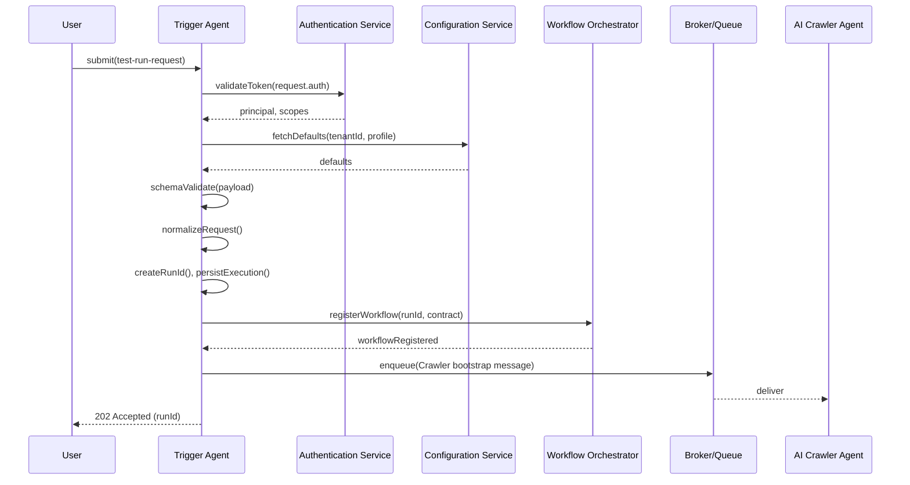
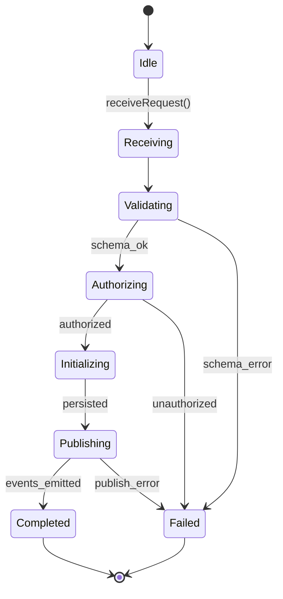
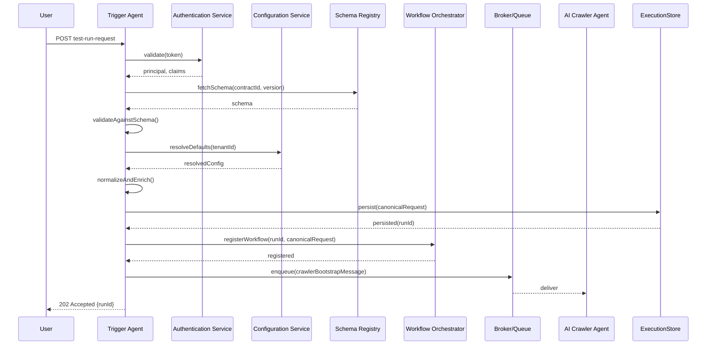

# Trigger Agent — Technical Specification

This document is the authoritative engineering specification for the Trigger Agent. It defines responsibilities, lifecycle, interfaces, validation, orchestration behaviours, observability and non-functional requirements. The specification is implementation-independent and serves as the single source of truth for design, implementation and automation by engineering teams and AI agents.

Use numbered sections. Do NOT include implementation code, API definitions, or operational runbooks in this document.

## 1. System Context

1.1 Role in the platform

- The Trigger Agent is the platform's control-plane ingress for test requests. It converts external intent into a validated, canonical execution request and bootstraps the workflow orchestration.
- The Trigger Agent does not perform crawling, DOM analysis, AI reasoning, code generation, execution or reporting. Its role is orchestration, validation, metadata and context initialization.

1.2 Interaction landscape

- Upstream: User interfaces, CI pipelines, scheduled jobs, or third-party systems that submit `test-run-request` artifacts.
- Downstream: Workflow Orchestrator (LangGraph control plane), Queue/Broker, Contract Registry, Configuration and Feature Flag services, Authentication/Authorization services, Telemetry and Audit stores.

1.3 Pipeline context

**MVP Pipeline:**

User → Trigger Agent → AI Crawler Agent → DOM + Runtime Discovery Agent → Inventory Aggregator Service → Test Design Agent → Code Generation Agent → Execution Service → Reporting Service

**Phase 2+ Pipeline (with Human Review):**

User → Trigger Agent → AI Crawler Agent → DOM + Runtime Discovery Agent → Inventory Aggregator Service → Test Design Agent → Human Review Workflow Gate → Code Generation Agent → Execution Service → Reporting Service

## 2. Purpose

2.1 Primary purpose

- Accept, validate and canonicalize incoming execution requests.
- Create and persist the execution run and canonical execution context.
- Emit the initial `test-run-request` contract to the registry/broker.
- Register the workflow with the orchestrator and enqueue the first agent (Crawler).

2.2 Non-functional goals

- Deterministic normalization of requests.
- Low-latency validation and run initialization.
- Strong auditability and traceability for every published run.

## 3. Input Contract — `test-run-request.json`

3.1 Contract role

- The Trigger Agent consumes an external `test-run-request` contract (incoming request). The agent must validate, normalize and produce a canonical, persisted `test-run-request` that downstream consumers accept as authoritative.

3.2 Important sections (semantic description)

- `requestId` (optional): client-supplied idempotency key. If provided, used for duplicate detection and de-dup semantics.
- `requestedBy`: principal identity submitting the request (user id or service id). Must map to authentication context.
- `tenantId`: logical tenancy identifier for multi-tenant isolation and quotas.
- `targets`: canonical list of target definitions; each includes `url`, `initialPath`, optional `headersRef` (secret reference) and optional `entrySelectorHints`.
- `scope`: enum describing crawl scope (full-site | domain-only | path-list | single-page). Impacts crawler behavior but not enforced by Trigger Agent.
- `runOptions`: object with execution parameters: `profile` (quick|standard|deep), `maxPages`, `maxDepth`, `concurrencyLimit`, `allowExternalLinks` (boolean), `scheduledAt` (RFC3339 timestamp optional), `priority`.
- `credentialsRef` (optional): reference to credentials in secret manager for authenticated crawling; Trigger Agent records reference but does not unwrap secrets.
- `contractVersion`: requested contract version; used for version compatibility checks.
- `metadata`: arbitrary key/value tags for routing, observability and business context.
- `featureFlags`: optional list of feature toggles that may influence execution profile.

3.3 Mandatory fields

- At least one `targets` entry with a valid `url`.
- `requestedBy` or present authentication context that resolves to a principal.
- `tenantId` when multi-tenancy is enabled.

3.4 Optional fields and semantics

- `requestId` — enables idempotency.
- `scheduledAt` — schedules execution for future time; Trigger Agent records and may queue accordingly.
- `credentialsRef` — secret reference; Trigger Agent persists pointer only.

3.5 Version validation and schema validation

- The Trigger Agent validates the incoming payload against the authoritative JSON Schema for `test-run-request` in the `contracts/` registry. If `contractVersion` is supplied, the agent verifies the requested version is supported; otherwise it uses the platform's default active contract version.
- Schema validation failures produce `ExecutionRejected` events with structured diagnostics.

3.6 Request normalization

- URL canonicalization: enforce `https` preference, remove fragments, normalize trailing slashes unless explicitly included, canonicalize hostnames (IDN normalization), and remove duplicate query param ordering.
- Target deduplication: collapse exact URL duplicates and coalesce hosts when `scope` indicates domain-level crawl.
- Defaulting: fill missing `runOptions` with platform defaults (profile=standard, priority=normal) from Configuration Service.
- Sanitization: redact or remove any fields that violate security or tenancy policies.

3.7 Validation flow summary

1. Authenticate principal.
2. Authorize principal for requested tenant and features.
3. Validate JSON Schema and contract version compatibility.
4. Normalize request and enrich with defaults.
5. Check idempotency and duplicate runs.
6. Persist canonical `test-run-request` and return/publish an `ExecutionCreated` event.

## 4. Output Contract — canonical `test-run-request.json`

4.1 Canonicalization

- The Trigger Agent transforms the incoming request into a canonical execution request which contains the original intent plus platform-owned fields. Downstream agents must treat this canonical contract as authoritative for the run lifecycle.

4.2 Additional fields added by Trigger Agent

- `runId` (GUID): unique run identifier assigned by the platform.
- `createdAt` (timestamp): creation time in RFC3339.
- `canonicalTargets`: normalized target list as consumed by crawler.
- `resolvedContractVersion`: specific schema version used for validation.
- `assignedPriority`: resolved priority after feature-flag and policy resolution.
- `executionContextId`: pointer to persisted execution context.
- `status`: initial value `Created`.
- `audit` metadata: `createdBy`, `createdByPrincipal`, `requestId` (if provided), `correlationId`.

4.3 Publication and persistence

- Persist canonical contract in the Execution Store and publish an `ExecutionCreated` event to the Event Bus. The canonical contract is indexed for query and used by the Orchestrator to register the workflow.

## 5. Responsibilities

The Trigger Agent is responsible for:

- Request validation (schema + semantic checks).
- Contract validation and version negotiation.
- Authentication and principal resolution.
- Authorization and quota checks.
- Run identifier generation and canonicalization.
- Creation and persistence of execution metadata and execution context.
- Workflow registration with the orchestrator.
- Emitting lifecycle events (`ExecutionRequested`, `ExecutionCreated`, `ExecutionQueued`, `ExecutionRejected`).
- Resolving configuration and feature flags for the run.
- Audit logging and telemetry initialization for each run.
- Duplicate request detection and idempotency semantics.
- Initial queue submission of first agent work item (Crawler bootstrap message).

## 6. Non-Responsibilities

The Trigger Agent must NEVER perform the following:

- Any form of crawling or page traversal.
- Any DOM analysis or runtime instrumentation.
- Any AI inference, prompting or model interaction.
- Any test-code generation (Playwright or otherwise).
- Direct execution of tests or interaction with browsers.
- Result aggregation, reporting or long-term artifact storage.
- De-referencing or handling of secret material (only store secret references).

## 7. Workflow (lifecycle)

7.1 High-level lifecycle

Receive Request → Validate Request → Validate Contract → Authenticate → Authorize → Load Configuration → Resolve Feature Flags → Generate Run Metadata → Create Execution Context → Persist Request → Publish Event → Register Workflow → Queue First Agent → Complete

7.2 Mermaid sequence diagram

## 8. Execution Context

8.1 Canonical execution context fields

- `runId` — platform-assigned GUID.
- `requestId` — client idempotency token (if supplied).
- `correlationId` — trace correlation token for cross-service tracing.
- `traceId` — distributed tracing root for this run.
- `initiator` — identity of the submitter (user/service id).
- `createdAt` — timestamp of creation.
- `environment` — resolved target environment (dev|staging|production).
- `targets` / `canonicalTargets` — normalized targets.
- `configuration` — resolved configuration snapshot used for this run.
- `featureFlags` — resolved feature flags and their effective values.
- `contractVersions` — resolved contract versions for the run.
- `agentVersions` — optional preferred versions for downstream agents.
- `securityContext` — tenant id, RBAC claims and secret refs (opaque pointers only).
- `executionMetadata` — estimated cost, priority, scheduling metadata.

8.2 Persistence and immutability

- The execution context is persisted as an immutable snapshot for auditability. Any subsequent runtime adjustments are recorded as new snapshots.

## 9. Validation Rules

9.1 JSON Schema validation

- The Trigger Agent validates the payload against the active contract schema from the Schema Registry. Validation errors include precise pointers to offending properties and severity codes.

9.2 Version compatibility

- If the payload declares `contractVersion` outside supported versions, reject with `ExecutionRejected` and a clear migration instruction.

9.3 Required field validation

- Enforce presence and types of mandatory fields (targets, requestedBy/authorization, tenantId when enabled).

9.4 URL validation

- Validate URL format, scheme (disallow unsupported schemes), host syntax, and disallow private IP ranges unless tenant policies allow internal targets. Reject loopback/localhost targets in production contexts by default.

9.5 Environment validation

- Ensure `environment` and `scheduledAt` are consistent with tenant policies and feature flags (e.g., disallow production targets from unapproved environments).

9.6 Duplicate request detection

- Use `requestId` and checksum of canonical targets + requestedBy to detect duplicates. If duplicate and existing run is active, return existing `runId` and idempotent response.

9.7 Target reachability validation

- Lightweight reachability checks are optional and policy-driven. By default the Trigger Agent does not perform deep reachability probes but may schedule an initial lightweight pre-flight attempt (HEAD request) if configured; results are advisory and do not block run creation unless configured as a hard policy.

9.8 Configuration validation

- Validate that requested `runOptions` conform to tenant quotas and platform limits; if limits are exceeded, reject or downgrade the request according to policy.

## 10. Authentication

10.1 Supported authentication methods

- API Key: bearer keys issued per client with scoped permissions.
- JWT: tokens issued by the platform's identity provider.
- OAuth 2.0: delegated authorization for third-party integrations.
- Service Accounts: long-lived credentials for system integrations.
- Anonymous: development-only mode controlled by a feature flag, audit logged heavily.

10.2 Token validation

- Validate tokens against the Authentication Service; fetch principal, roles, tenant claims and expiry. Fail fast on invalid or expired tokens.

## 11. Authorization

11.1 RBAC and permissions

- Map principals to roles and permissions. The Trigger Agent enforces `submit_execution`, `submit_for_tenant`, `schedule_execution` and `manage_runs` permissions.

11.2 Execution quotas

- Enforce tenant and principal quotas (requests per minute, concurrent runs, daily budgets). Quota checks are consultative with Configuration Service and enforced atomically where possible.

11.3 Tenant isolation and environment restrictions

- Ensure cross-tenant requests are rejected. Enforce environment restrictions (e.g., only privileged roles may target production systems).

## 12. Configuration

12.1 Environment variables and defaults

- The Trigger Agent reads platform-level defaults (runOptions defaults, max limits) from the Configuration Service. Minimal local environment variables used only for bootstrap and service discovery.

12.2 Runtime overrides

- Admin or feature-flag driven overrides may change default behaviours (e.g., enable pre-flight reachability checks for a tenant).

12.3 Feature flags and execution profiles

- Feature flags resolve at run time and are captured in the execution context snapshot. Execution profiles (quick|standard|deep) map to sets of runOptions tuned for cost and coverage.

## 13. Events

13.1 Emitted events (semantic definitions)

- `ExecutionRequested` — initial receipt of a request (pre-validation event for observability).
- `ExecutionRejected` — emitted when validation or authorization fails; includes diagnostics.
- `ExecutionCreated` — canonical execution created and persisted; includes `runId` and `executionContextId`.
- `ExecutionQueued` — first task for workflow enqueued and delivered to broker.
- `ConfigurationResolved` — snapshot of configuration and feature flags used for the run.

13.2 Event payload guidance

- Events include schema version metadata, `runId`, `requestId`, `trace_id`, `timestamp`, `producer` and `payload` with minimal necessary details. Events are immutable and append-only.

## 14. Error Handling

14.1 Categories

- Validation failures: schema or semantic rule violations.
- Authentication/Authorization failures: invalid token or insufficient privileges.
- Duplicate requests: idempotent handling.
- Configuration failures: inability to resolve configuration or quota exceedance.
- Internal errors: unexpected exceptions or infra failures.

14.2 Recovery strategy

- Validation / auth failures: return `ExecutionRejected` with diagnostics to caller and emit telemetry.
- Transient internal failures: retry initialization steps (limited retries) and emit an alert if persistent.
- Persistent failures: create a `Failed` run with rich diagnostics and route to incident workflow.

14.3 User feedback

- The Trigger Agent returns structured error responses for callers and emits `ExecutionRejected` events for downstream systems.

## 15. Retry Strategy

15.1 Retryable failures

- Transient configuration service timeouts, brief authentication timeouts, and temporary persistence store unavailability.

15.2 Non-retryable failures

- Schema validation errors, authorization denials, tenant policy violations, and malformed requests.

15.3 Retry policy

- Use exponential backoff with jitter for retryable operations. Maximum retries configurable; default 3 attempts for infra calls.

15.4 Idempotency

- All retryable operations must be idempotent; operations that create run state must be guarded by idempotency keys (`requestId`) or transactional deduplication in the Execution Store.

## 16. Observability

16.1 Structured logs

- Emit JSON structured logs with fields: `timestamp`, `service`, `component`, `runId`, `requestId`, `trace_id`, `level`, `message`, `meta`.

16.2 Metrics

- Expose Prometheus metrics: `trigger_requests_total`, `trigger_requests_rejected_total`, `trigger_validation_latency_seconds`, `trigger_init_latency_seconds`, `trigger_concurrent_runs`.

16.3 Tracing

- Propagate `trace_id` and `span_id` through all downstream calls. Start a trace at the Trigger Agent and inject context into events and queue messages.

16.4 Audit logs

- All create/modify actions and approval decisions (scheduling, cancellation) must be recorded in an append-only audit store with actor identity.

16.5 Health checks

- Liveness and readiness endpoints (implementation detail) must reflect the agent's ability to accept requests and reach its critical dependencies.

## 17. Security

17.1 Input validation and sanitization

- Strict schema validation and sanitization of free-form metadata. Disallow inline execution instructions that could escalate privileges.

17.2 Secret handling

- Trigger Agent stores only references to secrets (e.g., `credentialsRef`). Secrets are resolved on-demand by downstream agents with appropriate least-privilege retrieval.

17.3 Sensitive data masking

- Mask sensitive fields in logs and events (emails, tokens, secrets references) using deterministic redaction rules.

17.4 Rate limiting & abuse prevention

- Apply per-principal and per-tenant rate limits. Enforce quotas to prevent noisy tenants from exhausting control-plane resources.

17.5 Replay and request signing

- Support optional request signing for high-assurance integrations. Use idempotency checks and `requestId` TTLs to reduce replay attack risk.

## 18. Performance Requirements

Targets (examples; to be finalized with SRE and capacity planning):

- Maximum validation time: 200 ms (p95) under normal load.
- Maximum initialization latency (persist + register workflow): 500 ms (p95).
- Concurrent requests per instance: 200; cluster scalable to 2,000 sustained concurrent requests.
- Memory usage per instance: < 512 MB.
- Availability: 99.95% for control-plane endpoints.

## 19. Scalability

19.1 Horizontal scaling

- The Trigger Agent is stateless for request handling; scale horizontally behind a load balancer. Use autoscaling based on request rate and queue latency.

19.2 Queue-based offload

- Heavy-weight initialization or scheduled execution work is handed off to the orchestrator and queue to ensure immediate responsiveness to callers.

19.3 Load balancing

- Distribute incoming requests evenly; use sticky sessions only for administrative flows where necessary.

## 20. Dependencies

- Authentication Service (token validation and principal resolution).
- Configuration Service (defaults, tenant limits).
- Workflow Orchestrator (LangGraph control plane).
- Contract Registry / Schema Registry.
- Feature Flag Service.
- Audit Service and append-only store.
- Telemetry Service (metrics, logs, traces).
- Queue / Broker (Kafka, RabbitMQ, cloud pubsub).
- Execution Store (persistent execution metadata).

## 21. Internal Components

- Request Validator: schema and semantic validation engine.
- Contract Validator: schema registry client and version negotiation.
- Authentication Handler: token introspection and principal enrichment.
- Authorization Handler: RBAC and quota evaluation.
- Configuration Loader: resolves defaults and tenant overrides.
- Execution Context Builder: constructs the canonical context snapshot.
- Metadata Generator: runId, correlationId and trace initialization.
- Workflow Initializer: registers workflow and returns registration status.
- Event Publisher: emits lifecycle events to the Event Bus.
- Telemetry Manager: structured logging and metrics instrumentation.

## 22. Interfaces

22.1 External API (logical)

- Ingress for `test-run-request` payloads. The agent accepts requests, returns immediate acceptance/ rejection responses and emits events for downstream processing.

22.2 Internal service interfaces

- Auth: token introspection and principal metadata API.
- Config: defaults and tenant policy API.
- Registry: schema lookup API.
- Orchestrator: workflow registration API.
- Execution Store: transactional create/find run operations.

22.3 Queue interface

- Broker message schema for bootstrapping the Crawler includes `runId`, `executionContextId`, `canonicalTargets`, `resolvedContractVersion`, `priority` and `trace_id`.

22.4 Contract interface

- The Trigger Agent uses the canonical `test-run-request` schema for both input and output; schema evolution is managed via the Schema Registry workflow described in the master specification.

## 23. State Machine

23.1 Trigger Agent states

- `Idle` — ready to accept requests.
- `Receiving` — currently reading and accepting a request.
- `Validating` — performing schema and semantic validation.
- `Authorizing` — authenticating and authorizing the principal.
- `Initializing` — building execution context and persisting the run.
- `Publishing` — emitting events and enqueuing first tasks.
- `Completed` — success path, initial workflow started.
- `Failed` — terminal failure for this request with diagnostics.

23.2 Mermaid state diagram

## 24. Sequence Diagram (detailed)

## 25. Quality Attributes

- Reliability: deterministic behavior for validation and idempotency. Strong contract validation reduces downstream failures.
- Availability: stateless design and horizontal scaling to meet 99.95% control-plane SLA.
- Maintainability: modular internal components and clear separation of concerns for easy testing.
- Extensibility: configuration-driven defaults and feature flags enable backwards-compatible feature rollout.
- Observability: full tracing, structured logs and audit trails for compliance and debugging.
- Security: authentication, RBAC, secret references and input sanitization by default.
- Performance: low-latency validation and run initialization to minimise CI and automation wait times.

## 26. Acceptance Criteria

The Trigger Agent specification is accepted when:

1. Purpose and responsibilities are fully defined and unambiguous.
2. Input and output contract semantics are documented and validated against the registry workflow.
3. Lifecycle and state machine are defined with diagrams and observable hooks.
4. Validation, authentication and authorization behaviours are specified and testable.
5. Event schema and semantics for `ExecutionCreated` and related events are documented.
6. Non-responsibilities explicitly prevent implementation drift.
7. Performance and scalability targets are documented and agreed with SRE.

---

For implementation guidance, refer to the master specification and the contract lifecycle rules in `docs/specs/001-project-setup.md`.

## 27. Consumed and Produced Contracts

This section documents the contracts the Trigger Agent consumes and produces and the governance rules that apply to them.

| Contract | Direction | Purpose | Owner | Contract Version |
|---|---|---|---|---|
| `test-run-request.json` | Consumes / Produces | Input intent (client-submitted) and canonical execution request (platform-authoritative) used to bootstrap workflows | Contracts / API Governance Team (producer owner) and Trigger Agent (runtime producer of canonical artifact) | `x-contract-version` (resolved at run time) |

Notes:

- How the Trigger Agent consumes and produces `test-run-request.json`:
  - Consumption: the Trigger Agent accepts an incoming `test-run-request` payload from external callers. It performs schema validation, semantic validation, normalization and enrichment.
  - Production: after successful validation the Trigger Agent persists and publishes a canonical `test-run-request` artifact that includes platform-owned fields (`runId`, `createdAt`, `executionContextId`, `resolvedContractVersion`, etc.). Downstream agents and orchestrator treat the canonical artifact as authoritative for the run.

- Contract ownership:
  - The Contracts / API Governance Team is the canonical author and steward of the `test-run-request` schema. The Trigger Agent is the runtime publisher of canonical instances and is responsible for indicating which schema version was used to validate each run.

- Version negotiation:
  - Incoming requests may include `contractVersion`. The Trigger Agent validates that the requested version is supported. If unspecified, the Trigger Agent uses the platform's default `active` contract version fetched from the Schema Registry.
  - If negotiation is possible (minor version differences), the Trigger Agent accepts compatible versions according to the compatibility rules defined in the Schema Registry. For incompatible (MAJOR) versions, the Trigger Agent rejects the request unless explicit migration/adaptation rules exist.

- Compatibility rules:
  - Backwards-compatible (MINOR) changes are accepted; the Trigger Agent accepts payloads that validate against any compatible schema variant.
  - Breaking (MAJOR) changes require a new `contractVersion` and a migration plan. The Trigger Agent enforces MAJOR version boundaries and rejects incompatible payloads.

- Downstream consumers:
  - The canonical `test-run-request` produced by the Trigger Agent is consumed by the Workflow Orchestrator, Queue/ Broker, AI Crawler Agent and other downstream systems that bootstrap the run. Consumers must validate against the `resolvedContractVersion` field before processing.

## 28. Preconditions

These preconditions must hold for the Trigger Agent to accept and process a request.

- `test-run-request` contract exists and is reachable from the Schema Registry.
- Requested `contractVersion` (if supplied) is supported or negotiable.
- Authentication service is available and responsive.
- Configuration Service and Feature Flag Service are available for policy resolution.
- Workflow Orchestrator (LangGraph control plane) is reachable for registration.
- Queue / Broker is available for message publication.
- Tenant exists and is active (when multi-tenancy is enabled).
- Caller holds the required permissions to submit executions for the target tenant/environment.
- Clock synchronization (NTP) is available for consistent timestamps.

Examples of evaluated preconditions at runtime:

- Schema Registry lookup success for `test-run-request`.
- Quota and policy checks pass for `requestedBy` and `tenantId`.
- Feature flag resolution returns a valid profile mapping.

## 29. Postconditions

When the Trigger Agent completes a successful request processing flow the following postconditions hold.

- Canonical `test-run-request` artifact is created and persisted in the Execution Store.
- Execution context snapshot is persisted and immutable for the run.
- `runId` has been generated and is globally unique.
- `correlationId` and `trace_id` are initialized and associated with the run.
- Workflow is registered with the orchestrator and registration status recorded.
- `ExecutionCreated` event is published to the Event Bus.
- The first agent bootstrap message (Crawler) is queued for delivery.
- Audit log entry created linking actor, request, and outcome.
- Initial telemetry and metrics recorded for the run (validation latency, policy decisions).

If any postcondition cannot be satisfied (for example persistent persistence failure or queue publish failure), the Trigger Agent follows the Failure Decision Matrix (see next section) to determine retry, fallback or failure handling.

## 30. Failure Decision Matrix

The following decision table provides adjudication guidance for common failure scenarios encountered by the Trigger Agent. Actions should be implemented to be deterministic, auditable and observable.

| Failure Scenario | Category | Retryable | Action | Emitted Event | Final State |
|---|---|---:|---|---|---|
| Invalid JSON (malformed payload) | Validation | No | Reject request, return 4xx with diagnostic pointers | `ExecutionRejected` | `Failed` |
| Invalid Schema (fails contract validation) | Validation | No | Reject request, emit diagnostics with pointer to schema rules | `ExecutionRejected` | `Failed` |
| Unsupported Contract Version | Compatibility | No | Reject request or offer migration guidance; log and notify owner | `ExecutionRejected` | `Failed` |
| Authentication Failure (invalid credentials) | Security | No | Reject request, audit the attempt | `ExecutionRejected` | `Failed` |
| Authorization Failure (insufficient permissions) | Security / Policy | No | Reject request, include permission details in diagnostic | `ExecutionRejected` | `Failed` |
| Duplicate Request (idempotency detected) | Idempotency | No | Return existing `runId` and idempotent acceptance; emit duplicate detection metric | `ExecutionDuplicateDetected` | `Completed (existing)` |
| Configuration Failure (policy violation or quota exceeded) | Policy / Config | Conditional | If policy violation: reject; if transient resolution error: retry fetch with backoff | `ExecutionRejected` (policy) / `ExecutionConfigResolutionFailed` (transient) | `Failed` / `Pending` |
| Workflow Registration Failure (orchestrator unavailable) | Downstream Infra | Yes (transient) | Retry registration with exponential backoff; if persistent, mark run `PendingRegistration` and alert SRE | `ExecutionRegistrationFailed` | `PendingRegistration` / `Failed` |
| Queue Publish Failure (broker unavailable) | Downstream Infra | Yes | Retry publish with backoff; fallback to durable staging area; if persistent, mark run `Failed` and alert SRE | `ExecutionQueueFailed` | `Failed` |
| Persistence Failure (execution store write) | Storage | Yes (transient) | Retry transaction; if permanent, return 503 and surface diagnostics; create incident | `ExecutionPersistFailed` | `Failed` |
| Unexpected Exception (internal error) | Internal | Conditional | Retry guarded steps where safe; create `Failed` run with diagnostics and trigger incident workflow | `ExecutionFailed` | `Failed` |

Operational guidance:

- Retryable = Yes indicates the Trigger Agent should attempt a configurable set of retries with exponential backoff and jitter. Retries must remain idempotent.
- Conditional indicates branching behaviour based on diagnostic classification (transient vs policy). The agent must classify failures before deciding to retry.
- All failures emit structured telemetry and an event that records the failure category and diagnostic payload.

## 31. SLA / SLO

Operational objectives for the Trigger Agent (recommendations subject to SRE alignment):

- Availability (SLA): 99.95% for the Trigger Agent control-plane endpoints.
- Validation latency (SLO): 95th percentile ≤ 200 ms for schema and semantic validation under normal load.
- Initialization latency (SLO): 95th percentile ≤ 500 ms for persist + workflow registration under normal load.
- Workflow registration latency (SLO): 95th percentile ≤ 250 ms for orchestrator registration calls.
- Queue publish latency (SLO): 95th percentile ≤ 100 ms for enqueue of the first agent message.
- Error budget: 0.05% of the time window (monthly) for all error classes combined; sustained breaches trigger post-incident reviews and mitigation.
- Recovery objectives:
  - RTO (control-plane degraded): <= 15 minutes for automated failover and recovery procedures.
  - RPO (run creation): zero — successfully accepted runs must be durably persisted before returning success to callers.
- Scalability objectives:
  - Support per-instance concurrent request handling ≥ 200 (baseline), cluster-scalable to 2,000 concurrent requests.
  - Graceful degradation: when overloaded, return 429 with retry-after and maintain durability guarantees (persist to staging if direct persistence is unavailable).

Monitoring and alerting:

- Alert on SLO breach trends (validation latency, registration latency, queue latency) and sustained error-rate increases.
- Automate run-level diagnostics capture on any `ExecutionRejected` or `ExecutionFailed` event.

## 32. Assumptions

The Trigger Agent design and operational statements rely on the following assumptions. These should be validated during design and onboarding.

- Authentication service is highly available and supports token introspection and principal metadata.
- Configuration service and Feature Flag Service are available and provide low-latency responses for tenant lookups.
- Schema Registry / Contract Registry is the source of truth for contract schemas and is available for read operations at run time.
- Workflow Orchestrator (LangGraph control plane) is reachable and supports deterministic registration APIs.
- Queue / Broker is reliable for publish/subscribe semantics and supports durable storage or a DLQ for failed publishes.
- Clock synchronization (NTP) across services is maintained to support consistent timestamps for auditing and retention.
- Distributed tracing is supported across services and propagated by the Trigger Agent in events and queue messages.
- Persistent Execution Store is available and provides transactional deduplication semantics for idempotent run creation.
- Contract registry, feature flags and configuration snapshots are versioned and auditable.

---

These additions extend the Trigger Agent specification with operational governance, failure adjudication, and run-level guarantees to enable reliable production deployments while preserving the original architecture and responsibilities.

# 002-trigger-agent
