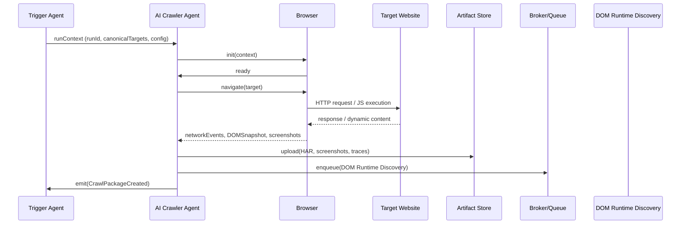
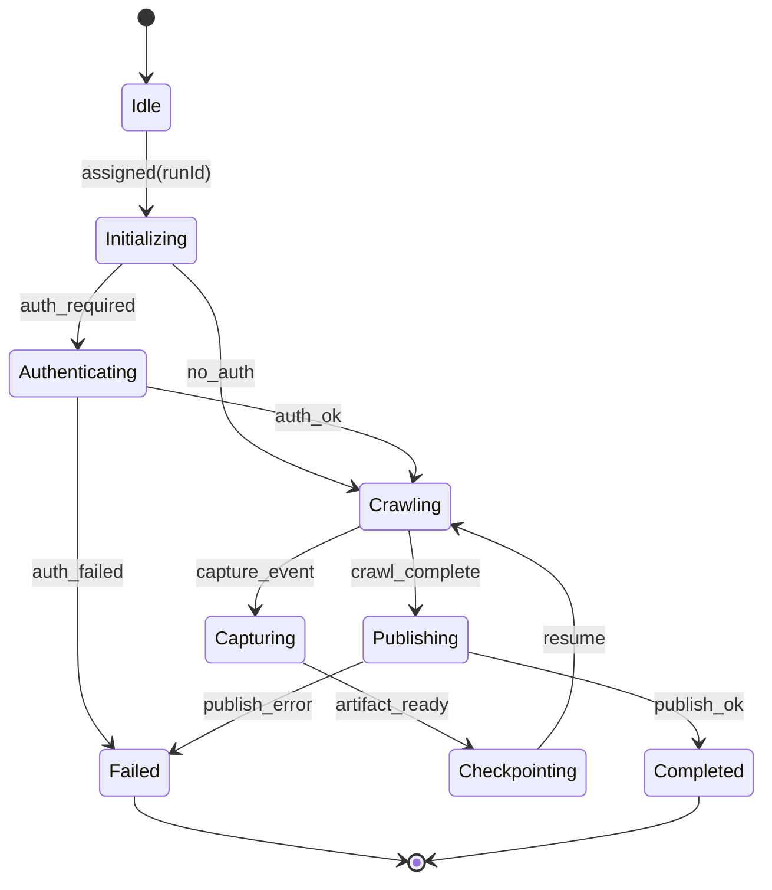
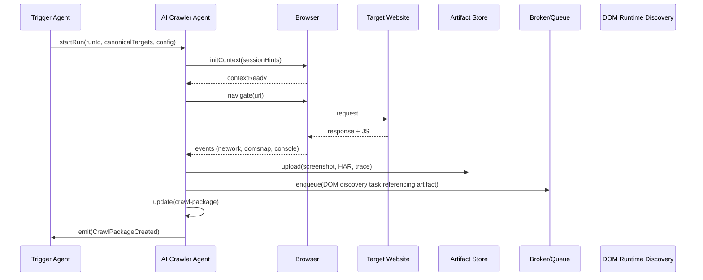
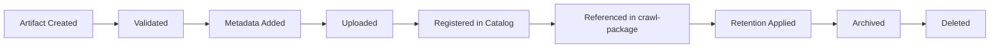
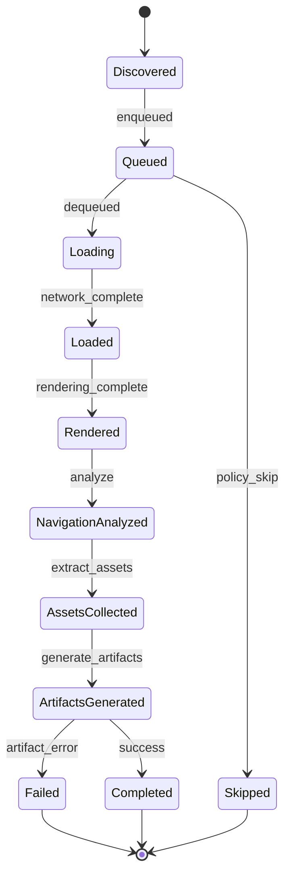

# AI Crawler Agent — Engineering Specification

This document is the authoritative engineering specification for the AI Crawler Agent. It defines the agent's responsibilities, lifecycle, orchestration behaviour, browser and session management, crawling and discovery strategies, contracts, artifacts, security, observability, and operational requirements.

This specification is implementation-independent and intended as the single source of truth for architects, engineers, SREs and AI agents that will implement, operate, and extend the crawler.

Use numbered sections. Do NOT include implementation code, API endpoints, pseudocode, or framework-specific instructions. Where useful, diagrams are rendered using Mermaid.

## 1. System context

1.1 Role in the platform

- The AI Crawler Agent is the first runtime discovery component in the pipeline. It receives a validated execution request and execution context from the Trigger Agent and discovers the navigational and runtime surface of the target application.
- Outputs produced by the Crawler are consumed by the DOM + Runtime Discovery Agent, the Inventory Aggregator Service and downstream Test Design and Code Generation agents.

1.2 Interaction landscape

- Upstream: `test-run-request` canonical contract produced by the Trigger Agent; configuration snapshot and feature flags.
- Downstream: `crawl-package.json` contract, Artifact Store, Workflow Orchestrator, Queue/Broker, DOM + Runtime Discovery Agent.

## 2. Purpose

2.1 Primary purpose

- Discover pages, navigation structures, routing behaviour, redirects, authentication and session flows, assets, and runtime metadata sufficient for detailed DOM analysis by subsequent agents.

2.2 Scope and boundaries

- The Crawler focuses on navigation and surface discovery. It captures runtime evidence (screenshots, HAR, traces) but does not perform in-depth DOM semantic analysis or test generation.

## 3. Consumed Contracts

The Crawler consumes canonical runtime artifacts and configuration snapshots. Key consumed contracts:

- `test-run-request.json` (canonical)
  - Purpose: authoritative run intent and canonical targets.
  - Owner: Contracts / API Governance Team (schema); Trigger Agent (publisher of canonical instances).
  - Version compatibility: crawler reads `resolvedContractVersion` from the canonical artifact and validates schema compatibility for any direct consumption of fields.
  - Validation: the crawler validates that the execution context includes `canonicalTargets`, `featureFlags` and `configuration` before starting.

- `executionContext` (snapshot)
  - Purpose: runtime configuration snapshot and feature flag resolution for the run.
  - Owner: Configuration Service (provider) and Trigger Agent (producer of the snapshot pointer).
  - Validation: ensure the snapshot is present and immutable for the run.

- `configuration snapshot` and `featureFlags`
  - Purpose: policy-driven parameters (rate limits, concurrency, profiles).
  - Owner: Configuration and Feature Flag teams.

Operational guidance:

- The crawler must treat consumed artifacts as authoritative but defensive: it must validate presence of required fields and fail fast with clear diagnostics if critical values are missing.

## 4. Produced Contracts

Primary produced contract:

- `crawl-package.json`
  - Purpose: canonical discovery artifact capturing discovered entry points, page graph, redirects, authentication flows, route maps, initial assets, and pointers to artifacts (HAR, screenshots, traces).
  - Owner: Agents Team (producer) and Contracts / API Governance Team (schema steward).
  - Version: `x-contract-version` metadata included with every published package.
  - Schema validation: each published `crawl-package` must validate against the active JSON Schema and include an example payload for downstream consumers.
  - Publication: publish to Artifact Store and register metadata in the Contract Registry; emit `CrawlPackageCreated` event with `runId` and `artifactRef`.
  - Downstream consumers: DOM + Runtime Discovery Agent, Inventory Aggregator, Test Design Agent, Reporting Service.

## 5. Responsibilities

The AI Crawler Agent must implement the following responsibilities deliberately and idempotently:

- Browser initialization and lifecycle management.
- Session creation and cookie/state management for authenticated flows.
- Authentication flow execution and credential handoff (secrets are referenced, not inlined by the crawler).
- Navigation discovery: links, menus, forms, SPA routes, redirect chains.
- Internal link discovery and domain scoping.
- External link handling according to policy.
- Redirect handling and redirect chain capture.
- Route discovery and SPA routing observation (history API, hash routing).
- Dynamic navigation detection (client-side rendering, lazy-loaded content).
- Infinite scrolling and pagination discovery strategies.
- Asset discovery (images, scripts, CSS, fonts, API endpoints observed via XHR/Fetch).
- Media discovery (video/audio endpoints and streaming signals).
- JavaScript execution to surface runtime routes and client-side navigation traps.
- Network request collection and request/response metadata capture.
- Request interception for header injection and simulated credentials handling.
- Performance timings and resource timing collection.
- Screenshot capture (configurable viewport set) and lightweight video where supported.
- HAR generation and upload to Artifact Store.
- Browser trace generation (if available from runtime) and upload.
- Crawl statistics, discovery metadata and coverage metrics.
- Checkpoint creation and resume points for long-running crawls.
- Artifact packaging and publication (crawl-package and linked artifacts).

The crawler must record provenance for each discovery item: which browser context, which navigation, and which script or event triggered the discovery.

## 6. Non-Responsibilities

The crawler must NOT:

- Perform in-depth DOM semantic analysis or extract application business logic; that is the DOM + Runtime Discovery Agent's responsibility.
- Generate Playwright tests or assert application correctness.
- Make irreversible destructive actions (no destructive POSTs or mutations unless explicitly permitted and recorded).
- De-reference or permanently store secrets; credentials are referenced via secret pointers only.
- Perform remediation, reporting, or triage beyond emitting artifacts and events.

## 7. Browser management

7.1 Browser startup and engine

- The crawler uses an instrumented browser engine (headless/headed) capable of producing HARs, traces and screenshots. The implementation should support interchangeable engines; the spec avoids mandating a specific runtime.

7.2 Browser pools and isolation

- Maintain a browser pool to amortize startup cost. Pools are logically separated by tenant, sensitivity and resource profile.
- Use context-level isolation for sessions (incognito/isolated contexts) to host multiple simultaneous sessions per browser process.

7.3 Context creation and reuse

- Create browser contexts per logical session to ensure cookie and storage isolation.
- Context reuse is permitted for repeated operations within the same session when security policies allow.

7.4 Multi-tab strategy

- Use multiple tabs to parallelize discovery for low-risk pages; prefer single-tab exploration for session-sensitive flows to retain sequential event ordering.

7.5 Crash recovery and resource cleanup

- Detect browser process crashes and restart with recovery from last checkpoint. Ensure orphaned contexts and processes are cleaned up.

7.6 Browser shutdown

- Graceful shutdown drains active navigations, checkpoints state and releases resources. Forced shutdown is used only for unrecoverable failures.

## 8. Session management

8.1 Authentication flows

- Support scripted login flows (form submission, OAuth redirects) using credential references. Credentials remain in secret stores; crawler obtains ephemeral access tokens via a secrets proxy or vault at run time when permitted.

8.2 Cookie and storage state

- Persist session cookies and storage state into `sessionState` artifacts. When session refresh is required, capture and checkpoint prior to refresh.

8.3 CSRF tokens and JWTs

- Capture anti-forgery tokens and JWTs observed during navigation and record them as ephemeral session metadata (not persisted as raw secrets).

8.4 Session expiration and refresh

- Detect session expiry and attempt configured refresh strategies (re-login or session renewal). If refresh fails, mark session and discovered resources as requiring human attention.

8.5 Multi-user sessions

- Support parallel sessions for different user personas via separate browser contexts and session artifacts.

8.6 Session isolation

- Strictly isolate sessions to prevent cross-contamination of cookies, localStorage and IndexedDB.

## 9. Crawling strategy

9.1 Strategy overview

- The crawler supports configurable strategies: breadth-first, depth-first, hybrid, priority-based and risk-based crawling. Strategy selection is driven by the execution profile in the execution context.

9.2 Breadth-first (BFS)

- Useful for surface coverage where discovering shallow navigational breadth is prioritized. Good for smoke discovery.

9.3 Depth-first (DFS)

- Useful when exploring deep user flows and multi-step processes (checkout, account setup).

9.4 Hybrid and adaptive crawling

- Combine BFS and DFS using dynamic heuristics (page novelty, risk score, authentication requirements). Adapt strategy in-flight based on observed discovery density and time budgets.

9.5 Priority and risk-based crawling

- Assign priorities to targets based on feature flags, business-critical routes, historical change frequency or vulnerability risk scores.

9.6 Incremental and resume crawling

- Support resuming previous crawls using checkpoints and delta detection to only visit changed or new pages.

9.7 Partial and targeted crawling

- Allow targeted crawl modes (single-page, path-list) for quick iterations or focused discovery.

## 10. Discovery strategy

10.1 Static navigation discovery

- Parse initial markup and extract declared links, menus, sitemaps and `link`/`nav` structures for prioritized visits.

10.2 Dynamic navigation discovery

- Execute page scripts to discover client-side generated navigation (SPAs, lazy-loaded menus) and monitor history API mutations.

10.3 Shadow DOM and web components

- Detect Shadow DOM roots and capture shadow host locations; surface these as discovery hints for DOM Runtime Discovery.

10.4 SPA routing and hash routing

- Observe `pushState`, `replaceState` and `hashchange` events; capture virtual routes and route param patterns.

10.5 Interactive UI patterns

- Menu discovery, sidebar and breadcrumb navigation, tabbed interfaces, drawers, dialogs, accordions, and other interactive containers are explored using controlled interaction sequences to reveal hidden navigation.

10.6 Infinite scroll and pagination

- Detect infinite scroll patterns via intersection observers; apply cautious paging steps with limits to avoid endless loops.

10.7 Dialogs, popups and modals

- Interact with modal flows conservatively, capturing resulting navigation or state transitions and then closing modals via configured dismissal strategies.

## 11. URL management

11.1 Canonicalization and normalization

- Normalize URLs (scheme, host normalization, percent-encoding, trailing slashes), and record canonical URL candidates via `rel=canonical` when present.

11.2 Duplicate detection

- Use normalized URL and content fingerprint heuristics to detect duplicates. Avoid re-visiting duplicates unless configuration requires revalidation.

11.3 Fragment handling and query parameters

- Decide fragment handling policy based on `scope`. Normalize query parameters by ordering and pruning tracking parameters (configurable allow/deny list).

11.4 Relative URL resolution

- Resolve relative links against the base URL and the effective document base.

11.5 Redirect chain and loop detection

- Capture redirect chains, detect loops, and apply maximum redirect thresholds to prevent infinite redirect cycles.

11.6 Scoping rules

- Enforce allowed domains, blocked domains, and cross-origin rules per tenant policy.

11.7 Maximum depth and page count limits

- Enforce `maxDepth` and `maxPages` from run options; stop or stage for continuation when limits reached.

## 12. Crawl policies

12.1 robots.txt and site policies

- Respect `robots.txt` and site-defined crawl controls unless overridden by tenancy policy; record any deviations with explicit approval metadata.

12.2 Rate limiting and concurrency

- Respect global and per-host rate limits configured in the execution context; dynamically throttle concurrency to avoid server overload.

12.3 Backoff and timeouts

- Exponential backoff for transient failures with jitter; configurable per-host timeout and retry policies.

12.4 User agent and headers

- Use a configurable and descriptive user-agent string for the platform. Support header injection via `headersRef` when allowed.

12.5 MIME types and file size limits

- Only download and process allowed MIME types; enforce maximum response size thresholds to avoid resource exhaustion.

## 13. Network observation

13.1 HTTP request/response capture

- Capture request and response headers, status codes, response bodies (subject to size and privacy policies), and timing metrics.

13.2 XHR, Fetch and GraphQL

- Intercept and record AJAX and GraphQL requests and responses for runtime API surface discovery.

13.3 WebSockets and SSE

- Monitor WebSocket endpoints and Server-Sent Events for long-lived connections; record handshake details and message patterns where feasible.

13.4 TLS and certificate observation

- Record TLS negotiation properties and certificate metadata for compliance and risk assessment.

## 14. Artifacts

The crawler must produce deterministic, versioned artifacts and register them with the Artifact Store.

- Screenshots: full-page and region-specific screenshots; metadata includes viewport, device emulation and timestamp.
- HAR files: full network capture in HAR format, subject to redaction policies.
- Browser traces: trace files capturing timeline and CPU/network events when supported by the engine.
- Console logs: captured browser console output with severity levels.
- Video: optional short recordings for critical flows (login, checkout) where supported and permitted.
- Crawl statistics: page counts, route counts, asset counts, error summaries, timing percentiles.
- Crawl-package.json: canonical discovery artifact referencing all generated artifacts.

Artifact hygiene and retention:

- Artifacts must be tagged with `runId`, `tenantId` and `contractVersion`. Retention and access policies applied via Artifact Store configuration.

## 15. Checkpoints

15.1 Checkpoint creation

- Periodically snapshot crawl queue, visited set, browser session state and in-flight artifacts to enable resumption after failures or planned interruptions.

15.2 Resume and recovery

- Resume from the latest consistent checkpoint. Validate checkpoint integrity before resuming live navigations.

15.3 Partial execution and staged crawls

- Support staged crawls: complete a subset of the domain and publish intermediate `crawl-package` artifacts for downstream agents to begin their work.

15.4 Crash recovery

- On crash, surface latest checkpoint reference in failure diagnostics and place run in `PendingRecovery` state until operator or automated recovery completes.

## 16. Execution flow

16.1 High-level flow

Receive Context → Initialize Browser → Authenticate (if needed) → Initialize Crawl Queue → Discover URLs → Visit Page → Collect Metadata & Assets → Generate Artifacts → Update Crawl Package → Queue New URLs → Repeat → Finalize Crawl Package → Publish Contract

16.2 Mermaid sequence diagram

## 17. Validation

17.1 Input validation

- Validate canonical `test-run-request` presence and required fields before starting.

17.2 Output validation

- Validate `crawl-package.json` against its schema prior to publication. Ensure artifact references are reachable.

17.3 Artifact validation

- Validate HAR integrity, screenshot format, and trace completeness. Verify that required metadata (viewport, timestamps, runId) is present.

17.4 Configuration validation

- Validate that `runOptions` values (concurrency, maxDepth) do not violate tenant or global platform limits.

## 18. Error handling

18.1 Categories

- Navigation failures: timeouts, 4xx/5xx responses, content mismatches.
- Browser crashes or worker failure.
- Authentication failures: invalid credentials, MFA, unexpected redirects.
- Network failures: DNS, TLS errors, connection resets.
- JavaScript exceptions — runtime errors that prevent navigation or script execution.
- Infinite redirects or redirect loops.
- Artifact generation failures (HAR, trace upload).

18.2 Recovery strategies

- For navigation failures: retry with adjusted timeouts or a different user-agent; record diagnostics.
- For browser crashes: restart browser, reload last checkpointed session, resume queue.
- For authentication failures: attempt configured re-login strategies up to configured retry count; otherwise mark session as requiring human review.
- For artifact failures: attempt re-generation; if persistent, publish partial package with diagnostics.

18.3 Escalation and human review

- If repeated failures are classified as high-impact (authentication, session corruption, site blocks), create an incident and route to human-in-the-loop review with detailed artifacts and timestamps.

## 19. Retry strategy

19.1 Navigation retry

- Configurable retry policy per navigation: small number of retries with exponential backoff. Retries must be idempotent relative to the crawler's visited set and mutation heuristics.

19.2 Authentication retry

- Limited re-attempts for credential refresh or re-login flows, with checkpointing prior to attempts to prevent state loss.

19.3 Browser restart

- After a crash or repeated navigation failures, restart browser and resume from last checkpoint.

19.4 Maximum retries and idempotency

- Global maximum retry budget per run and per navigation to bound cost. All retries are guarded by idempotency checks and deduplication.

## 20. Observability

20.1 Logs

- Structured logs with fields: `timestamp`, `service`, `component`, `runId`, `url`, `navigationId`, `level`, `message`, `meta`.

20.2 Metrics

- Expose Prometheus metrics: `crawler_pages_visited_total`, `crawler_navigation_errors_total`, `crawler_active_browsers`, `crawler_checkpoint_latency_seconds`, `crawler_artifact_upload_latency_seconds`.

20.3 Tracing

- Propagate `trace_id` from the Trigger Agent and create spans for browser init, navigation, artifact generation and upload.

20.4 Browser-level telemetry

- Record browser process metrics (memory, CPU, open file descriptors), viewport metrics and per-navigation timings.

20.5 Audit logs

- Append-only audit records for authenticated actions, session creation, credential usage (pointer only) and any policy overrides.

## 21. Security

21.1 Credential and secret handling

- Never persist secrets in logs or artifacts. Use secret references and ephemeral retrieval from a vault service with least-privilege access.

21.2 Session protection

- Protect session artifacts; store sessionState references with access control. Rotate ephemeral tokens and ensure short TTLs where possible.

21.3 PII handling

- Redact or anonymize PII in artifacts according to tenant privacy policies before storing or sharing.

21.4 Sandboxing and safe crawling

- Run browser processes in constrained sandboxes; limit network access to target hosts and allowlist control-plane endpoints only.

21.5 Rate limiting and abuse prevention

- Enforce aggressive rate-limiting for untrusted tenants and back-off when remote servers respond with signs of rate limiting.

## 22. Performance targets

Example performance SLOs (to be validated with SRE):

- Pages per minute per crawler instance: 30–120 depending on page complexity and artifact generation.
- Maximum browser memory per process: 1.5 GB (p95) under baseline workload.
- Concurrent browsers per host: depends on host size; recommend initial baseline 4–8 concurrent Chromium processes per medium instance.
- Concurrent pages per crawler: 8–32 depending on resource budget and strategy.
- Maximum crawl duration per run: configurable; default 2 hours for standard profile.

## 23. Scalability

23.1 Horizontal scaling

- Scale crawler workers horizontally; each worker hosts a browser pool and processes assigned run queues.

23.2 Distributed crawling

- Distribute target sets across workers using work partitioning (domain hashing, target sharding) and allow work stealing to balance load.

23.3 Browser pools and resource isolation

- Maintain pools with tenant and profile isolation. Enforce resource quotas at pool and tenant level.

23.4 Queue-based crawling and backpressure

- Use queue depth and worker health metrics for autoscaling. Propagate backpressure indicators to the Trigger Agent for graceful degradation.

## 24. Dependencies

- Browser Engine (Chromium-compatible runtime).
- Workflow Orchestrator (LangGraph control plane).
- Artifact Store (object storage with metadata catalog).
- Authentication Service and Secret Vault.
- Configuration and Feature Flag Service.
- Contract Registry / Schema Registry.
- Telemetry and Tracing Services.
- Queue / Broker for work distribution.

## 25. Internal components

- Browser Manager: lifecycle of processes and contexts.
- Session Manager: authentication flows and session state persistence.
- Navigation Manager: orchestrates navigation, retries and dynamic interactions.
- URL Manager: canonicalization, deduplication and queue management.
- Network Monitor: intercepts and records network activity.
- Artifact Manager: generates, validates and uploads artifacts.
- Checkpoint Manager: creates and restores checkpoints.
- Retry Manager: enforces retry budgets and backoff.
- Contract Builder: constructs `crawl-package` and validates schema compliance.
- Telemetry Manager: metrics, logs and traces.

## 26. State machine

26.1 Canonical states

- `Idle` — awaiting run assignment.
- `Initializing` — preparing browser and contexts.
- `Authenticating` — performing login flows where required.
- `Crawling` — active discovery loop.
- `Capturing` — artifact generation for a navigation.
- `Checkpointing` — persisting checkpoint snapshots.
- `Publishing` — finalizing and publishing `crawl-package`.
- `Completed` — successful completion.
- `Failed` — terminal failure requiring human or automated recovery.

26.2 Mermaid state diagram

## 27. Sequence diagram (detailed)

## 28. Quality attributes

- Reliability: robust checkpointing and recovery policies to minimize lost work.
- Availability: resilient design with pool-level redundancy and health checks.
- Maintainability: modular components and clear contract boundaries for testing and replacement.
- Extensibility: plugin points for new discovery heuristics, adaptors and artifact formats.
- Security: least-privilege secret handling, sandboxing and artefact redaction.
- Observability: end-to-end tracing, per-navigation telemetry and audit trails.
- Performance: predictable throughput given resource profiles and strategy choices.

## 29. Acceptance criteria

The AI Crawler Agent specification is accepted when:

1. Purpose and responsibilities are clearly defined and unambiguous.
2. Consumed and produced contracts are described with ownership and versioning rules.
3. Browser lifecycle and session management behaviour are specified.
4. Crawling and discovery strategies and policies are defined and configurable.
5. Artifacts and checkpoint semantics are defined and validated.
6. Error handling, retries and recovery strategies are specified.
7. Observability and security requirements are specified and testable.
8. Performance and scalability targets are documented and achievable by SRE.

---

This specification is the authoritative engineering blueprint for the AI Crawler Agent. Implementation teams should produce ADRs for any deviations from this specification and publish contract schema changes through the contract lifecycle process documented in `docs/specs/001-project-setup.md`.

## 30. Consumed and Produced Contracts

This section consolidates the canonical contracts the crawler consumes and produces, and the governance expectations for contract ownership, validation and publication.

| Contract | Direction (Consumes / Produces) | Purpose | Owner | Contract Version | Downstream Consumer | Cover |
|---|---:|---|---|---|---|---|
| `test-run-request.json` | Consumes | Authoritative run intent and canonical targets for the execution | Trigger Agent / Contracts Team | x-contract-version (referenced in run) | Crawler, Execution Orchestrator | Run-level intent, target list, metadata |
| `execution-context` (execution-context) | Consumes | Resolved runtime configuration snapshot for the run | Configuration Service / Trigger Agent | snapshot:v1 | Crawler | Execution-time configuration and policy resolution |
| `configuration snapshot` | Consumes | Policy-driven parameters (rate limits, concurrency, profiles) | Configuration Team | snapshot:v1 | Crawler | Platform and tenant-level policy parameters |
| `feature flags` | Consumes | Feature toggles and behavior flags resolved for the run | Feature Flag Service | flags:v1 | Crawler | Runtime feature gating and heuristics |
| `crawl-package.json` | Produces | Canonical discovery artifact referencing discovered pages, routes and artifacts | AI Crawler Agent / Contracts Team | x-contract-version | DOM Runtime Discovery, Inventory Aggregator, Test Design | Discovery surface, artifact references |

Contract governance notes:

- **Contract ownership:** Each contract has a single stewarding team (Owner) responsible for schema evolution, examples, and consumer/provider compatibility testing. Operational producers and primary consumers are named in the table.
- **Version negotiation:** Every canonical artifact MUST include `x-contract-version` (or equivalent) and an optional `resolvedContractVersion` pointer where needed. Consumers must read the declared version and apply schema compatibility checks prior to ingestion.
- **Schema validation:** Producers MUST validate outgoing artifacts against the active JSON Schema. Consumers MUST validate incoming artifacts and fail fast with clear diagnostics when required fields are missing or when incompatible versions are detected.
- **Backward compatibility:** Schema changes MUST follow a compatibility policy (minor additive changes allowed without consumer update; breaking changes require version bump and migration guidance). Contract stewards must publish a change log and compatibility matrix with each breaking change.
- **Publication workflow:** New or changed contract schemas are published through the Contract Registry / Schema Registry. Changes proceed through provider/consumer contract tests, CI gating, and a controlled rollout (canary consumers, version negotiation) before being declared active.

## 31. Preconditions

The crawler must verify a set of preconditions before beginning a run. Preconditions are platform-guardrails that prevent wasted work and ensure safe operation.

- **Browser engine available:** An instrumented browser runtime is provisioned and reachable in the execution environment.
- **Execution Context exists:** A resolved `execution-context` snapshot is provided for the run and references are valid.
- **Authentication credentials resolved:** Required credential pointers can be resolved via the configured secrets proxy or vault and are permitted by tenancy policy.
- **Configuration snapshot loaded:** Tenant and global configuration (rate limits, quotas, policies) are present and consistent with runOptions.
- **Queue available:** Work queue / broker is reachable and able to accept/route tasks for downstream consumers.
- **Artifact store available:** Object storage and metadata catalog are reachable for artifact upload and registration.
- **Target URL validated:** Target host(s) are within allowed scope and pass initial URL validation and scoping rules.
- **Crawl Package initialized:** An initial crawl-package placeholder or manifest exists to collect produced artifacts and discovery metadata.
- **Feature Flags resolved:** Feature flag state for the run is resolved and included in the execution snapshot.
- **Browser pool healthy:** A healthy browser pool or process quota is available to meet the run's concurrency profile.

## 32. Postconditions

On successful completion (or defined terminal states), the crawler must ensure the following postconditions are met so downstream agents can proceed reliably.

- **Crawl Package finalized:** The `crawl-package.json` aggregate is complete and reflects the pages visited and artifacts produced.
- **Crawl Package validated:** The final package validates against the active schema and includes artifact references.
- **Crawl Package published:** The package and linked artifacts are uploaded and registered in the Artifact Store and Contract Registry as appropriate.
- **Browser terminated safely:** Browser processes and contexts are drained and terminated per platform shutdown policy.
- **Session destroyed:** Session state is either checkpointed and marked for secure deletion or explicitly destroyed where required.
- **Screenshots uploaded:** Required screenshots are present in the Artifact Store and referenced from the package.
- **HAR uploaded:** HAR files (or redacted equivalent) are uploaded and validated.
- **Trace uploaded:** Browser trace artifacts are generated and uploaded where supported and enabled.
- **Statistics generated:** Crawl statistics and coverage metrics are produced and included in the package metadata.
- **Metadata completed:** All required metadata fields (`runId`, `tenantId`, `contractVersion`, timestamps) are present and consistent across artifacts.
- **DOM Discovery queued:** Work items referencing discoverable DOM artifacts are enqueued for the DOM + Runtime Discovery Agent.
- **Audit log written:** An append-only audit record captures the run lifecycle and any policy overrides.
- **Metrics published:** Per-run metrics and health indicators are emitted to telemetry sinks.

## 33. Failure Decision Matrix

The following decision matrix standardizes the enterprise reaction to common failure scenarios. Fields: `Failure Scenario`, `Category`, `Retryable` (Yes/No), `Recovery Action`, `Event` (logical), and `Final State` (agent-level state).

| Failure Scenario | Category | Retryable | Recovery Action | Event | Final State |
|---|---|---:|---|---|---|
| Browser Crash | Runtime | Yes | Restart browser process, restore last checkpoint, resume queue | `BrowserCrashed` | `Retrying` / `PendingRecovery` |
| Navigation Timeout | Network/Runtime | Yes | Retry navigation with increased timeout or alternate user-agent; record diagnostics | `NavigationTimeout` | `Retrying` / `PartialProgress` |
| Authentication Failure | Auth | Maybe | Attempt configured re-login flow (checkpoint first); if persistent, escalate for human review | `AuthenticationFailure` | `Failed` / `HumanReview` |
| Session Expired | Auth | Yes | Attempt session refresh or re-login; checkpoint before changes | `SessionExpired` | `Retrying` / `PendingRecovery` |
| CAPTCHA Encountered | Anti-bot | No | Stop automated flow; mark run requiring human resolution; publish artifacts for triage | `EncounteredCAPTCHA` | `HumanReview` |
| robots.txt Block | Policy | No | Respect robots policy; record blocked targets and continue with remaining scope | `RobotsBlock` | `CompletedWithBlockedTargets` |
| SSL Certificate Failure | Network/Security | Maybe | Optionally retry with explicit override if tenancy policy permits; otherwise escalate | `SSLCertFailure` | `Failed` / `HumanReview` |
| DNS Failure | Network | Yes | Retry with backoff; if persistent, mark host unreachable and continue | `DNSFailure` | `Retrying` / `PartialProgress` |
| Infinite Redirect | Runtime | No | Detect loop; stop navigation, record redirect chain and mark target as failed | `RedirectLoop` | `Failed` |
| HTTP 5xx | Server | Yes | Retry with exponential backoff up to retry budget; if persistent, throttle or skip | `HTTP5xx` | `Retrying` / `PartialProgress` |
| JavaScript Exception | Runtime | Maybe | Attempt page reload and re-evaluate; capture console errors and artifacts for triage | `JavaScriptError` | `Retrying` / `Failed` |
| Artifact Upload Failure | Storage | Yes | Retry upload; if persistent, store locally (ephemeral) and escalate for storage recovery | `ArtifactUploadFailure` | `Retrying` / `PendingStorageRecovery` |
| HAR Generation Failure | Artifact | Yes | Attempt re-generation with alternate trace settings; publish partial artifacts if available | `HARGenerationFailure` | `Retrying` / `CompletedWithPartialArtifacts` |
| Trace Generation Failure | Artifact | Yes | Attempt re-generation or fall back to lightweight traces; record diagnostic | `TraceGenerationFailure` | `Retrying` / `CompletedWithPartialArtifacts` |
| Storage Failure | Infrastructure | Maybe | Reduce parallelism, pause uploads, alert SRE, place run in `PendingRecovery` | `StorageFailure` | `PendingRecovery` |
| Queue Failure | Infrastructure | Maybe | Retry enqueue operations, failover to alternate broker, alert SRE | `QueueFailure` | `PendingRecovery` |
| Unexpected Exception | Unknown | Maybe | Capture diagnostics, checkpoint if possible, escalate to human review if persistent | `UnexpectedException` | `Failed` / `HumanReview` |

Notes:

- The matrix is prescriptive for common cases; implementation may extend it with local flow-specific actions but must preserve the event names and final-state semantics shown above.
- Retry policies are bounded by global retry budgets and per-navigation idempotency safeguards.

## 34. Crawl Policy Matrix

The platform exposes configurable crawl policies. The table below documents defaults and whether the policy is configurable at run time.

| Policy | Default | Configurable | Description |
|---|---:|---:|---|
| Maximum Pages | 1000 | Yes | Upper bound on distinct pages to visit during a run. |
| Maximum Depth | 10 | Yes | Maximum link-following depth from the initial target set. |
| Maximum Redirects | 10 | Yes | Maximum redirects followed for a single navigation before failing. |
| Navigation Timeout | 30s | Yes | Per-navigation network and rendering timeout before a retry/fail. |
| Retry Count | 3 | Yes | Number of retries for transient failures before escalation. |
| Concurrent Tabs | 4 | Yes | Number of tabs per browser context used to parallelize discovery. |
| Concurrent Browsers | 4 | Yes | Number of browser processes to run concurrently per worker. |
| Rate Limit | 5 reqs/sec per-host | Yes | Default per-host request rate limit; subject to tenancy overrides. |
| robots.txt | Respect | Yes | Whether to respect `robots.txt` by default or apply tenancy overrides. |
| Allowed Domains | Tenant scope | Yes | Domain allow-list used to enforce scoping rules. |
| Blocked Domains | none | Yes | Explicit domain deny-list for the run. |
| Allowed MIME Types | text/html, application/json, image/*, text/css, application/javascript | Yes | MIME types permitted for download and processing. |
| Blocked MIME Types | application/octet-stream, executable/* | Yes | MIME types excluded from processing. |
| Maximum File Size | 10 MB | Yes | Maximum response body size to store and process. |
| Maximum Crawl Duration | 2 hours | Yes | Maximum end-to-end duration for a standard profile run. |

## 35. Discovery Priority Model

The crawler applies a discovery priority model to maximize actionable coverage early in a run. Priority order (high → low):

- Authentication Pages
↓
- Navigation Structure (menus, sitemaps, route maps)
↓
- Business Pages (landing pages, commerce/catalog pages)
↓
- Forms (login, signup, checkout flows)
↓
- Tables (data listings, results pages)
↓
- Dialogs and Modals
↓
- Tabs and Sectioned Views
↓
- Drawers and Overlays
↓
- Assets (images, scripts, CSS) required to reproduce rendering
↓
- External Links (outbound references and third-party domains)

Rationale: Authentication pages are discovered first because they gate access to deeper content. Understanding navigation structure early builds the scaffolding for targeted exploration. Business pages and interactive flows are prioritized thereafter because they provide the highest value for downstream test design and risk assessment. Lower-priority items (assets, external links) are important for fidelity but are deprioritized to conserve budget and time.

## 36. Artifact Lifecycle

Every artifact produced by the crawler follows a deterministic lifecycle to ensure provenance, validation and retention.

- Artifact Created
- Validated
- Metadata Added
- Uploaded
- Registered
- Referenced inside `crawl-package`
- Retention Applied
- Archived
- Deleted

Artifacts MUST be tagged with `runId`, `tenantId`, `contractVersion` and creation timestamps. The Artifact Manager is responsible for applying redaction and PII handling policies prior to registration.

Mermaid flow diagram of the artifact lifecycle:

Retention and archival policies are applied at the Artifact Store layer and follow tenancy-specific compliance rules. Artifacts that contain sensitive data require redaction or shorter retention by default.

## 37. Page Crawl State Machine

This page-level state machine describes the lifecycle of a single page visit, distinct from the agent-level state model.

- Discovered
- Queued
- Loading
- Loaded
- Rendered
- Navigation Analyzed
- Assets Collected
- Artifacts Generated
- Completed
- Skipped
- Failed

Mermaid state diagram:

Notes: The state model emphasizes idempotency and observable transitions. Each transition should emit an event with `runId`, `pageId`, and `navigationId` for traceability.

## 38. SLA / SLO

Operational objectives for the crawler service. These targets should be agreed with SRE and product owners and reviewed periodically.

- **Availability:** 99.9% service availability (monthly SLA for control-plane and worker health).
- **Pages per minute:** 60 pages/minute percrawler-instance (p50 under standard profile). Scale by worker pool for throughput.
- **Maximum page load time:** p95 ≤ 10s (network+rendering) for successful navigations under standard profile.
- **Maximum browser startup time:** p95 ≤ 15s for a cold browser process startup.
- **Maximum artifact upload latency:** p95 ≤ 30s for individual artifact uploads to the Artifact Store.
- **Maximum crawl completion latency:** 2 hours for standard profile runs (configurable by profile).
- **Checkpoint frequency:** every 5 minutes or every 50 pages (whichever occurs first) for long-running crawls.
- **Recovery Time Objective (RTO):** 15 minutes for automated recovery actions to restore worker capacity.
- **Recovery Point Objective (RPO):** 5 minutes maximum data loss window (checkpoint granularity).
- **Error Budget:** 0.1% of successful pages per month allocated to transient failures; breaches trigger incident review and mitigation.

## 39. Assumptions

This specification makes the following platform and operational assumptions which architects and implementers must validate for their environment.

- Browser engine available and maintained by the platform.
- Artifact Store (object storage + metadata catalog) available and reachable.
- Queue / Broker availability for work distribution and event propagation.
- Schema Registry / Contract Registry available for contract versioning and validation.
- Execution context delivered to the Crawler has been validated by upstream control plane (Trigger Agent).
- Authentication and Secret management services are operational and reachable.
- Target application(s) are reachable from the crawler execution environment.
- DNS resolution is available and reliable for target hosts.
- TLS is supported by target hosts and platform trusts required CAs.
- Network connectivity is sufficiently stable for artifact upload and streaming telemetry.
- Cluster clocks are synchronized (NTP) for consistent timestamps and trace correlation.
- Distributed tracing systems are available to propagate `trace_id` across agents.

## 40. Related Specifications

This specification is part of the platform's canonical engineering specification set. Relevant artifacts and how they relate:

- [docs/specs/001-project-setup.md](docs/specs/001-project-setup.md) — Master project setup and governance; describes contract lifecycle, registry and platform-wide policies referenced throughout this crawler spec.
- [docs/specs/002-trigger-agent.md](docs/specs/002-trigger-agent.md) — Trigger Agent authoritative specification; provides the `test-run-request.json` and run orchestration model that initiates crawler runs.
- [docs/specs/004-dom-runtime-discovery.md](docs/specs/004-dom-runtime-discovery.md) — DOM + Runtime Discovery Agent spec; primary downstream consumer of `crawl-package.json` artifacts produced by the crawler.
- [docs/contracts/crawl-package.json](docs/contracts/crawl-package.json) — Canonical contract schema for the produced crawl package; consumer teams should validate against this schema.
- [docs/contracts/test-run-request.json](docs/contracts/test-run-request.json) — Canonical contract schema for run requests; the Trigger Agent produces instances consumed by the crawler.

How this spec fits: The AI Crawler Agent is the discovery frontier of the execution pipeline. It consumes validated run intent and an execution snapshot from the Trigger and configuration services, produces a versioned `crawl-package` with discoverable artifacts, and enqueues follow-up work for DOM analysis and test design agents. The contracts and publication workflows defined here are intentionally aligned with the platform-level lifecycle in [docs/specs/001-project-setup.md](docs/specs/001-project-setup.md).

# 003-ai-crawler-agent
