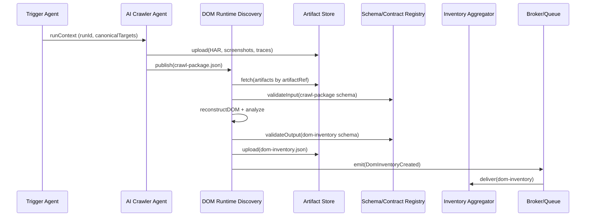
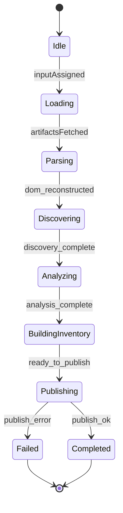
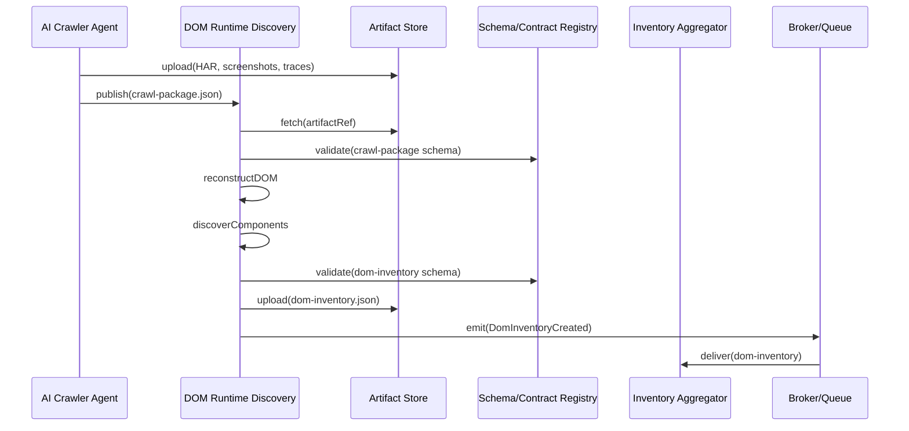
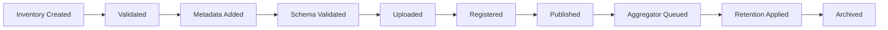

# DOM + Runtime Discovery Agent — Engineering Specification

This document is the authoritative engineering specification for the DOM + Runtime Discovery Agent. It defines how runtime browser artifacts are transformed into a semantic, structured understanding of the target application surface. The document is implementation-independent and intended as the single source of truth for architects, engineers, SREs and AI agents that will implement, operate, and extend the DOM + Runtime Discovery Agent.

Use numbered sections. Do NOT include implementation code, API endpoints, pseudocode, or framework-specific instructions. Diagrams are rendered with Mermaid where useful.

## 1. System context

1.1 Role in the platform

- The DOM + Runtime Discovery Agent (DOM Discovery) consumes runtime artifacts produced by the AI Crawler Agent and produces the canonical `dom-inventory.json` contract, representing a semantic model of pages, components, elements, relationships, states, accessibility signals and runtime events.
- The DOM Discovery Agent is a downstream consumer of `crawl-package.json` and upstream provider for the Inventory Aggregator Service, Test Design Agent, Code Generation Agent, and reporting/analytics services.

1.2 Interaction landscape

- Upstream: `crawl-package.json`, HARs, Browser Traces, Screenshots, Console Logs, Execution Context, Configuration Snapshot, Feature Flags.
- Downstream: `dom-inventory.json`, events to Queue/Broker, metadata registration in the Artifact Catalog and Schema/Contract Registry.

## 2. Primary purpose

2.1 Primary purpose

- Convert runtime artifacts into a structured, machine-consumable DOM inventory that captures DOM hierarchy, interactive elements, forms, tables, components, accessibility metadata, runtime states, relationships, and semantic hints useful for downstream agents and human review.

2.2 Scope and boundaries

- The DOM Discovery Agent performs analysis and enrichment of runtime artifacts to produce the semantic inventory. It does not perform crawling, browser lifecycle management, authentication, test generation, or execution of remediation.

## 3. Consumed Contracts

The DOM Discovery Agent consumes platform artifacts and configuration artifacts. Each consumed contract is validated and versioned. Key consumed contracts:

- `crawl-package.json` — canonical discovery manifest with pages, URLs and artifact references (HAR, screenshots, traces). Purpose: source of truth for which pages and artifacts to analyze. Validation: must include runId, artifact references and page pointers. Owner: AI Crawler Agent / Contracts Team. Version compatibility: read `x-contract-version` and validate against schema before processing. Publication source: Artifact Store and Contract Registry.

- HAR files — network capture for each page / navigation. Purpose: reveal network requests, API endpoints, resource timing and header metadata. Validation: well-formed HAR schema, timestamps, origin matching. Owner: Crawler / Artifact Store. Version compatibility: standard HAR versions.

- Browser Trace — browser runtime trace capturing timeline events, script execution, task durations. Purpose: support performance and dynamic behaviour analysis. Validation: trace completeness and timestamps. Owner: Crawler / Browser Manager.

- Screenshots — visual evidence of page state and viewport rendering. Purpose: visual validation, layout analysis and perceptual checks. Validation: format, viewport metadata and timestamps. Owner: Crawler / Artifact Store.

- Console Logs — captured browser console messages. Purpose: surface runtime errors and warnings. Validation: structured log schema with severity and timestamps. Owner: Crawler / Browser Manager.

- Execution Context — resolved runtime configuration snapshot (tenant policy, runOptions). Purpose: drive analysis parameters and policy decisions. Validation: presence and immutability for the run. Owner: Trigger Agent / Configuration Service.

- Configuration Snapshot & Feature Flags — platform and tenant level configuration that might alter discovery heuristics. Purpose: set priorities, limits and feature gates. Validation: schema compliance. Owner: Configuration Team / Feature Flag Service.

For every consumed artifact the agent MUST validate provenance (runId, artifactRef) and schema compatibility before performing analysis. Invalid or incompatible artifacts are rejected per the platform validation policy and routed to error handling.

## 4. Produced Contract

Primary produced contract: `dom-inventory.json` — the canonical, versioned semantic representation of discovered pages and components.

4.1 Purpose

- Encapsulate the DOM structure, component model, interactive element model, state machine observations, accessibility signals, validation rules, and artifact references for each page in a machine-consumable format.

4.2 Ownership

- Owner: DOM Runtime Discovery Team (primary producer) with Contracts Team stewarding the schema.

4.3 Version and schema

- Each `dom-inventory` MUST include `x-contract-version` and `producerVersion`. The schema must be registered in the Schema/Contract Registry and include example payloads and changelogs.

4.4 Publication

- The `dom-inventory.json` artifact is uploaded to the Artifact Store, registered in the metadata catalog, and a `DomInventoryCreated` event is emitted with `runId` and `artifactRef`.

4.5 Validation

- The agent MUST validate the generated inventory against the active JSON Schema prior to publication. Validation failures must be classified as blocking or non-blocking (partial inventory) according to the contract policy.

4.6 Downstream Consumers

- Inventory Aggregator, Test Design Agent, Reporting and Analytics, Human Review consoles, and any contract consumers defined by the Contracts Registry.

## 5. Responsibilities

The DOM Discovery Agent must implement the following responsibilities in a deterministic and idempotent manner:

- DOM parsing and runtime inspection: reconstruct DOM trees from page snapshots and runtime event streams.
- Shadow DOM traversal and slot resolution.
- Accessibility inspection (ARIA roles, labels, names, landmarks, heading structure).
- Component discovery: identify reusable and business components (cards, product tiles, navigation widgets).
- Interactive element discovery: buttons, inputs, selects, links, menus, and their interaction affordances.
- Form discovery and validation rule extraction.
- Table discovery and semantic header association.
- Navigation discovery: menus, routes, breadcrumbs and wizard flows.
- Frame and iframe analysis including cross-document relationships.
- Event discovery and mapping of event sources to handlers inferred from traces and console logs.
- State discovery: visible/hidden, enabled/disabled, checked, selected, focused, loading states, error/success states.
- Relationship discovery: parent-child, ownership and dependency graphs between components and elements.
- Layout and rendering analysis using screenshot metadata and bounding box computation.
- Mutation observation analysis: reconcile DOM deltas over time to surface dynamic behaviours.
- Semantic classification: map components/pages to business meaning and workflow hints.
- Inventory generation: assemble structured `dom-inventory.json` with provenance and coverage metrics.
- Contract validation and publication: ensure produced inventory complies with schema and publish to Artifact Store and Registry.

## 6. Non-Responsibilities

The DOM Discovery Agent MUST NOT perform the following:

- Crawling or navigation — this is the responsibility of the AI Crawler Agent.
- Browser lifecycle management (startup, shutdown, pool management).
- Authentication flows or credential handling.
- Test generation, test execution or code generation.
- Policy enforcement beyond conservative scope checks derived from the execution context.
- High-level reporting beyond publishing inventory artifacts and metrics.

## 7. DOM Discovery

7.1 DOM Tree

- Reconstruct the document tree, node types, attributes, computed properties and inline styles as available from DOM snapshots and runtime traces.

7.2 Shadow DOM

- Traverse shadow roots, resolve slotting, and surface host-to-shadow relationships in the inventory with clear provenance.

7.3 Slots and Templates

- Identify template elements and slot content; resolve insertion points and repeated template instances.

7.4 Custom Elements & Web Components

- Detect custom elements by tag and prototype; capture lifecycle hints and observed properties/attributes.

7.5 Virtual DOM & Hydration

- Reconcile differences between server-rendered DOM and client-side hydration by analyzing hydration markers, mutation deltas and trace events.

7.6 Detached Nodes

- Detect nodes created and detached during runtime and record their provenance; include them in an adjunct section of the inventory for diagnostics.

7.7 Mutation Observation

- Use mutation sequences and trace events to reconstruct significant dynamic transformations and annotate the inventory with temporal deltas.

## 8. Element Discovery

The agent must identify and normalize common interactive elements, including but not limited to:

- Buttons, anchors (links), inputs (text, email, password, number), checkboxes, radio groups, select elements, textarea, labels.
- Menus, menuitems, listboxes, tab lists, accordions, dialogs, modals and overlays.
- Links and navigation elements with route hints or SPA route mutations.
- File upload controls and drag-and-drop zones.
- Media elements: video, audio, canvas, SVG elements.

For each element the inventory should capture: locator strategy (semantic), text label, ARIA properties, bounding box, visible state, enabled/disabled, required flags, validation constraints, event handlers observed, and artifact references (screenshot crops, event traces).

## 9. Component Discovery

Component discovery assembles elements into higher-order, reusable components and records their relationships and metadata.

9.1 Reusable and Business Components

- Detect clusters of DOM nodes that are repeated across pages (list items, product cards) and label them as reusable components.
- Identify business components by heuristic signals (class names, data attributes, semantic text, API patterns) and annotate with business hints.

9.2 Layout and Navigation Components

- Identify layout containers (headers, footers, sidebars), navigation components (menus, breadcrumbs) and interactions between them.

9.3 Nested and Shared Components

- Record component composition, embedding relationships, and shared resource usage.

9.4 Component Metadata

- For each component capture: type, variants, props/attributes observed, event contract (input/output), accessibility signals and location(s) where observed.

## 10. Form Analysis

The DOM Discovery Agent must provide exhaustive form metadata.

10.1 Input discovery

- Identify inputs, labels, placeholder text, help text and programmatic associations via `for` attributes or ARIA.

10.2 Validation rules

- Extract client-side validation constraints (required, pattern, minlength, maxlength) and infer server-side validation hints from observable API responses.

10.3 Dependencies and Conditional Fields

- Identify conditional visibility and dependencies between inputs (show/hide, enable/disable) driven by runtime events.

10.4 Hidden/Readonly/Disabled fields

- Catalog fields that are hidden, read-only, or disabled and indicate how they were observed (initial DOM, runtime mutation, conditional logic).

10.5 Semantic input types and autocomplete hints

- Record input `type` attributes and common `autocomplete` hints to improve mapping between form fields and identity/data models.

## 11. Table Analysis

Table discovery must capture structural and behavioral semantics.

11.1 Headers, Rows and Columns

- Map header cells to column semantics, identify row templates, and associate data cells with header semantics.

11.2 Sorting, Filtering and Pagination

- Detect client-side sorting controls, filter widgets, and pagination controls, and surface them as part of the component contract.

11.3 Expandable and Nested Rows

- Model expandable rows, nested tables and virtualized lists with references to the controlling components.

11.4 Virtual Tables

- Annotate virtualization strategies (windowing) and record implications for coverage metrics and event-driven row rendering.

## 12. Navigation Analysis

12.1 Menus and Sidebars

- Extract hierarchical menus, active state indicators and visibility rules.

12.2 Breadcrumbs and Route Maps

- Map breadcrumbs into route sequences and associate route parameters observed via history API or path templates.

12.3 SPA Navigation and Redirects

- Detect `pushState`/`replaceState` patterns and hash routing; capture redirect chains and virtual route activation.

12.4 Dialog and Wizard Flows

- Identify multi-step flows (wizards), modal-driven paths and their entry/exit conditions.

## 13. State Discovery

Capture observed runtime states and the transitions between them.

- Hidden, Visible, Disabled, Readonly, Expanded, Collapsed, Loading, Selected, Focused, Hovered, Checked, Error, Success, Warning.

For each state record the cause (user interaction, script, network) and the associated timestamp and artifact evidence.

## 14. Event Discovery

The agent must correlate observed runtime events with elements and components.

- Click, Change, Input, Blur, Focus, Submit, Keyboard, Mouse, Touch, DragDrop, Clipboard, Custom Events.

Collect event metadata: event source, handler inference (if available), propagation path, and any observed side-effects (network calls, DOM mutations).

## 15. Accessibility Analysis

Accessibility inspection is a first-class outcome of the DOM inventory.

15.1 ARIA and Roles

- Record ARIA roles, properties and relationships; detect conflicting or missing roles.

15.2 Labels and Names

- Resolve programmatic names, associated labels, and implicit naming patterns.

15.3 Keyboard Navigation and Tab Order

- Compute expected tab order, focusability, and keyboard actionability of interactive controls.

15.4 Landmarks and Heading Hierarchy

- Surface landmark regions and heading structures to support navigation and outline analysis.

15.5 Contrast and Perceptual Metadata

- Surface contrast metadata (where available from screenshots) and flag potential accessibility concerns; include evidence references.

15.6 Accessibility Tree

- Provide a normalized accessibility tree representation where supported by runtime artifacts.

## 16. Layout Analysis

16.1 Structural containers

- Detect containers, sections, grid and flex layouts, panels and cards; annotate responsive breakpoints observed via viewport variants.

16.2 Responsive behaviour

- Record variations in layout and component visibility across viewport sizes where multiple screenshots or emulations exist.

16.3 Viewport and clipping

- Capture viewport metrics and clipping impacts on element visibility and interactionability.

## 17. Relationship Discovery

Discover relationships that matter to behaviour and test design.

- Parent-Child, Sibling, Ownership, Dependency, Visibility dependency, Validation dependency, Navigation dependency, State dependency.

Each relationship entry should include provenance (how inferred) and confidence score.

## 18. Dynamic Analysis

The agent must reconcile runtime dynamics to reflect an accurate inventory.

- Mutation Observer analysis: reconcile sequences of DOM deltas into semantic operations.
- Lazy loading and infinite scroll detection and modeling.
- AJAX/Fetch/GraphQL updates mapping to UI changes.
- Realtime and pub/sub updates mapping to state transitions.
- SPA rendering strategies and heuristics for detecting route activation.

## 19. Semantic Analysis

Map low-level DOM artefacts to high-level business meaning.

- Page purpose classification (e.g., landing, listing, product, account, checkout).
- Component purpose inference (e.g., product card, search widget, recommendation block).
- Workflow hints and user journey segmentation based on navigation sequences.
- Semantic tagging and taxonomy assignment for components and pages.

## 20. DOM Inventory

Describe the canonical structure and expected contents of `dom-inventory.json`.

20.1 Pages

- Page-level metadata: `pageId`, `url`, `title`, `runId`, timestamps, viewport.

20.2 Components

- Component catalog with `componentId`, type, instances, variants, props and observed events.

20.3 Elements

- Element catalog with locators, ARIA, attributes, bounding boxes, computed state and event metadata.

20.4 Relationships

- Directed graphs representing ownership, dependency and navigation relations.

20.5 States

- Observed state snapshots and state transition logs with timestamps and provenance.

20.6 Metadata

- Schema version, producerVersion, coverage metrics, confidence scores and provenance traces.

20.7 Accessibility

- Accessibility findings, normalized accessibility tree and evidence references.

20.8 Events

- Captured event traces mapped to elements and components.

20.9 Validation

- Validation results for component and page-level checks.

20.10 Artifacts and statistics

- References to screenshots, HARs and traces; coverage and completeness metrics.

## 21. Execution flow

High-level flow:

Receive `crawl-package` → Load runtime artifacts → Reconstruct DOM → Discover components → Discover elements → Discover relationships → Analyze accessibility → Generate metadata → Build `dom-inventory` → Validate → Publish

Mermaid sequence diagram:

## 22. Validation

22.1 Input validation

- Validate `crawl-package.json` presence, artifact references and execution context before analysis.

22.2 DOM validation

- Validate reconstructed DOM for structural soundness and required metadata fields.

22.3 Component validation

- Validate component models against known patterns and raise flags for low-confidence inferences.

22.4 Inventory validation

- Validate `dom-inventory` against JSON Schema; classify failures as blocking or partial per contract policy.

22.5 Artifact validation

- Validate HAR completeness, screenshot metadata, and trace timestamp alignment prior to using them as inputs.

## 23. Error handling

23.1 Error categories

- Invalid or corrupt artifacts, detached nodes, shadow DOM traversal failures, mutation inconsistencies, accessibility extraction failures, incomplete dynamic rendering, and schema validation errors.

23.2 Recovery strategy

- For recoverable errors attempt local re-processing with conservative heuristics; for unrecoverable or repeated issues emit a `DomInventoryPartial` with diagnostics and escalate according to policy.

23.3 Human review and triage

- For high-impact failures (e.g., missing critical pages, or systemic artifact corruption) route artifacts and diagnostics to Human Review workflows.

## 24. Retry strategy

- Implement bounded retries for transient failures (artifact fetch, transient parse failure) with exponential backoff and idempotency guarantees.
- Allow partial inventory publication when non-critical parts fail, annotated with coverage metrics and error metadata.
- Checkpoint intermediate analysis artifacts to allow resumption without repeating costly computations.

## 25. Observability

25.1 Logs

- Structured logs including: `timestamp`, `service`, `component`, `runId`, `pageId`, `componentId`, `level`, `message`, `meta`.

25.2 Metrics

- Prometheus-style metrics: `dom_pages_analyzed_total`, `dom_components_detected_total`, `dom_inventory_published_total`, `dom_analysis_errors_total`, `dom_inventory_generation_latency_seconds`.

25.3 Tracing

- Propagate `trace_id` and emit spans for artifact fetch, DOM reconstruction, component analysis and inventory publication.

25.4 Coverage and accessibility metrics

- Expose metrics for DOM coverage, element coverage, accessibility compliance rate, and confidence distributions.

## 26. Security

26.1 PII and sensitive fields

- Detect and redact PII in artifacts and inventory; do not persist raw sensitive tokens. Apply tenancy-specific redaction rules before publishing.

26.2 Runtime isolation

- Execute analysis in isolated environments with limited network access to prevent exfiltration from supplied artifacts.

26.3 Artifact protection and access control

- Apply artifact-level ACLs and metadata-driven access policies in the Artifact Store.

26.4 Data retention

- Respect retention policies and enforce shorter retention for sensitive inventory entries per tenant compliance settings.

## 27. Performance

Define measurable objectives and constraints for DOM analysis.

- DOM processing time: p95 ≤ 2s per 1k nodes under baseline hardware for in-memory analysis.
- Maximum nodes per page: support pages with up to 200k nodes (graceful degradation via sampling or partial analysis).
- Maximum components: support up to 10k component instances per page for inventory extraction.
- Memory usage: bounded by worker profile and subject to per-worker limits; provide streaming analysis to avoid unbounded heaps.
- Inventory generation latency: p95 ≤ 30s for standard page complexity.

## 28. Scalability

- Parallel page analysis: distribute pages across worker pools for horizontal scale.
- Distributed analysis: support sharding of large runs and recombining sub-inventories into a global inventory.
- Worker pools: autoscale based on queue depth and analysis latency.
- Queue processing: use backpressure and priority queues to ensure critical pages are analyzed earlier.

## 29. Dependencies

- AI Crawler Agent (artifact producer)
- Artifact Store (object storage + catalog)
- Schema/Contract Registry (schema hosting and validation)
- Telemetry and Tracing systems
- Configuration and Feature Flag services
- Queue / Broker for event propagation and downstream delivery

## 30. Internal components

- DOM Parser: reconstructs DOM and normalizes node models.
- Component Analyzer: clusters nodes into reusable components and infers component contracts.
- Accessibility Analyzer: extracts ARIA tree and accessibility signals.
- Relationship Engine: computes ownership and dependency graphs.
- Event Analyzer: maps observed events to elements and side-effects.
- State Analyzer: assembles state snapshots and transitions.
- Layout Analyzer: computes bounding boxes and layout relationships.
- Semantic Analyzer: assigns page and component semantic labels.
- Inventory Builder: assembles `dom-inventory.json` with provenance and metrics.
- Contract Builder: validates and prepares the artifact for publication.
- Telemetry Manager: emits logs, metrics and traces.

## 31. State machine

31.1 Canonical states

- `Idle` — awaiting input artifact.
- `Loading` — fetching artifacts from the Artifact Store.
- `Parsing` — reconstructing DOM and extracting raw nodes.
- `Discovering` — element and component discovery.
- `Analyzing` — accessibility, layout and semantic analysis.
- `BuildingInventory` — assembling inventory and computing metrics.
- `Publishing` — validating and uploading `dom-inventory.json`.
- `Completed` — successful publish.
- `Failed` — terminal failure requiring operator or automated recovery.

Mermaid state diagram:

## 32. Sequence diagram

Detailed flow between components:

## 33. Quality attributes

- Reliability: deterministic processing with checkpointing and partial-inventory publication for resilience.
- Maintainability: modular analyzers and well-defined contract boundaries.
- Scalability: horizontal worker pools and shardable analysis units.
- Security: PII redaction, artifact ACLs and runtime isolation.
- Observability: extensive logs, metrics and tracing for per-page visibility.
- Performance: bounded processing latencies with graceful degradation strategies.
- Extensibility: plugin points for new analyzers and semantic models.

## 34. Acceptance criteria

The DOM + Runtime Discovery Agent specification is accepted when:

1. Responsibilities and boundaries are unambiguous and documented.
2. Consumed and produced contracts are described with ownership, versioning and validation rules.
3. DOM discovery and element/component discovery models are fully specified.
4. Accessibility, semantic analysis and layout behaviour are defined and testable.
5. Inventory schema (`dom-inventory.json`) shape and validation requirements are defined and registered.
6. Error handling, retry, checkpointing and partial-publish behaviours are specified.
7. Observability, performance and security requirements are specified and measurable.
8. State machine and sequence diagrams are included and aligned with platform events.

---

This specification is the authoritative engineering blueprint for the DOM + Runtime Discovery Agent. Implementation teams should produce ADRs for any deviations from this specification and publish contract schema changes through the contract lifecycle process documented in `docs/specs/001-project-setup.md`.

## 35. Consumed and Produced Contracts

This section consolidates the contracts consumed by the DOM + Runtime Discovery Agent and the contract it produces. Each contract entry declares direction, purpose, owner, versioning reference and common downstream consumers.

| Contract | Direction | Purpose | Owner | Contract Version | Downstream Consumer |
|---|---:|---|---|---|---|
| `crawl-package.json` | Consumes | Source manifest of pages and artifact references for analysis | AI Crawler Agent / Contracts Team | x-contract-version (declared in package) | DOM Discovery |
| HAR (per-page) | Consumes | Network capture to infer API surface, resource timing and request/response metadata | AI Crawler Agent / Artifact Store | HAR spec v1+ | DOM Discovery, Performance Analysis |
| Browser Trace | Consumes | Runtime timeline for script execution and task timing | AI Crawler Agent / Browser Manager | trace:v1 | DOM Discovery, Performance Analysis |
| Screenshots | Consumes | Visual evidence used for layout analysis and perceptual checks | AI Crawler Agent / Artifact Store | image/* (with viewport metadata) | DOM Discovery, Human Review |
| Console Logs | Consumes | Runtime warnings and errors for event and semantic inference | AI Crawler Agent / Browser Manager | logs:v1 | DOM Discovery, Error Triage |
| Execution Context | Consumes | Resolved runtime configuration snapshot and runOptions | Trigger Agent / Configuration Service | snapshot:v1 | DOM Discovery |
| Configuration Snapshot | Consumes | Tenant and platform policies influencing analysis heuristics | Configuration Team | snapshot:v1 | DOM Discovery |
| Feature Flags | Consumes | Feature toggles that alter discovery behaviour | Feature Flag Service | flags:v1 | DOM Discovery |
| `dom-inventory.json` | Produces | Canonical semantic inventory of pages, components, elements and states | DOM Runtime Discovery Team / Contracts Team | x-contract-version | Inventory Aggregator, Test Design, Reporting |

Contract governance guidance:

- **Contract ownership:** Each contract MUST have a named steward responsible for schema evolution and compatibility testing. The steward coordinates provider/consumer tests across teams.
- **Version negotiation:** Consumers MUST read `x-contract-version` (or equivalent) from incoming artifacts and consult the Schema/Contract Registry for compatibility rules prior to ingestion.
- **Schema validation:** All inputs are validated against their authoritative schemas. The DOM Discovery Agent MUST fail-fast on missing mandatory fields and classify schema issues as blocking or non-blocking per contract policy.
- **Backward compatibility:** Schema changes follow the platform compatibility policy. Additive, non-breaking changes are allowed without immediate consumer changes; breaking changes require explicit version bump, migration guidance and coordinated rollout.
- **Publication workflow:** Produced `dom-inventory.json` artifacts are uploaded to the Artifact Store, registered in the metadata catalog and published to the Contract Registry with `producerVersion` and changelog. A `DomInventoryCreated` event is emitted to the broker with `runId` and `artifactRef`.

## 36. Preconditions

The DOM Discovery Agent must verify and enforce the following preconditions before analysis begins:

- **Crawl Package exists:** A valid `crawl-package.json` with page and artifact references is present.
- **Artifact Store available:** Object storage and catalog are reachable for artifact fetch and upload.
- **Schema Registry available:** Schema/Contract Registry is reachable to validate input and output schemas.
- **Execution Context validated:** The execution snapshot has been validated by upstream control plane and includes run-level parameters.
- **Runtime artifacts available:** HARs, traces and screenshots referenced in the crawl package are present and accessible.
- **Browser artifacts complete:** For each target page, required artifacts (HAR + at least one screenshot) exist unless allowed by policy to proceed partial.
- **Configuration snapshot loaded:** Tenant and global configuration are loaded and applied to analysis heuristics.
- **Feature Flags resolved:** Resolved feature flag state for the run is present in the execution context.
- **Inventory initialized:** A draft inventory manifest exists as a container for incremental discovery outputs.
- **Queue available:** Broker/Queue is reachable to emit downstream events and to receive follow-up tasks.

## 37. Postconditions

On successful analysis or defined terminal states the following postconditions should hold:

- **DOM Inventory completed:** `dom-inventory.json` contains discovered pages, components, elements and state snapshots.
- **DOM Inventory validated:** The produced inventory validates against the active schema (or is classified as partial with diagnostics).
- **Schema validation completed:** All schema checks for output have been executed and pass or are logged as acceptable partials.
- **Inventory uploaded:** The inventory artifact is uploaded to the Artifact Store and accessible by consumers.
- **Inventory registered:** Inventory metadata (producerVersion, runId, coverage metrics) is registered in the catalog.
- **Aggregator queued:** Inventory is enqueued or pushed to the Inventory Aggregator for consolidation.
- **Metadata completed:** Coverage, confidence and provenance metadata are present and consistent.
- **Accessibility report generated:** Normalized accessibility findings are attached or produced for downstream consumption.
- **Coverage metrics generated:** Coverage and completeness metrics are emitted and attached to inventory metadata.
- **Audit log written:** Append-only audit entry for the run and inventory publication exists.
- **Metrics published:** Operational and discovery metrics are emitted to telemetry sinks.

## 38. Failure Decision Matrix

The enterprise decision matrix standardizes responses to common failure scenarios. Columns: `Failure Scenario`, `Category`, `Retryable`, `Recovery Action`, `Event`, `Final State`.

| Failure Scenario | Category | Retryable | Recovery Action | Event | Final State |
|---|---|---:|---|---|---|
| Missing Crawl Package | Input | No | Abort analysis, emit diagnostic and route to upstream (Trigger/Crawler) | `MissingCrawlPackage` | `Failed` |
| Corrupt HAR | Artifact | Maybe | Attempt re-fetch, validate alternate HARs, emit partial inventory if non-blocking | `CorruptHAR` | `Retrying` / `PartialInventory` |
| Missing Screenshot | Artifact | Maybe | Proceed with reduced layout analysis; flag coverage gap and continue | `MissingScreenshot` | `PartialInventory` |
| Invalid Browser Trace | Artifact | Maybe | Re-validate timestamps, attempt fallback lightweight trace analysis | `InvalidBrowserTrace` | `PartialInventory` |
| DOM Reconstruction Failure | Processing | Maybe | Retry reconstruction with relaxed heuristics; if persistent, emit `DomInventoryPartial` and escalate | `DomReconstructionFailure` | `PartialInventory` / `HumanReview` |
| Shadow DOM Failure | Processing | Maybe | Log shadow traversal failure, include diagnostics, attempt alternative traversal strategies | `ShadowDOMFailure` | `PartialInventory` |
| Detached Nodes | Data | Yes | Reconcile via mutation history; include detached node section in inventory for diagnostics | `DetachedNodes` | `PartialInventory` |
| Mutation Failure | Processing | Maybe | Reprocess mutation sequence with alternate reconciliation logic; checkpoint state | `MutationFailure` | `Retrying` / `PartialInventory` |
| Accessibility Parser Failure | Processing | Maybe | Attempt alternative parser or degrade to heuristic checks; mark accessibility section as partial | `AccessibilityParserFailure` | `PartialInventory` |
| Semantic Classification Failure | Analysis | Maybe | Fall back to conservative taxonomy (unknown); emit low confidence classification | `SemanticClassificationFailure` | `PartialInventory` |
| Schema Validation Failure | Output | No | Block publication; record diagnostics and route to human review unless non-blocking per policy | `SchemaValidationFailure` | `Failed` / `HumanReview` |
| Artifact Upload Failure | Infrastructure | Yes | Retry upload with backoff, persist locally ephemeral copy and escalate storage incident if persistent | `ArtifactUploadFailure` | `Retrying` / `PendingRecovery` |
| Inventory Build Failure | Processing | Maybe | Retry build with reduced feature set; emit diagnostics and partial outputs if available | `InventoryBuildFailure` | `Retrying` / `PartialInventory` |
| Queue Failure | Infrastructure | Maybe | Retry enqueue, failover to alternate broker, alert SRE | `QueueFailure` | `PendingRecovery` |
| Unexpected Exception | Unknown | Maybe | Capture diagnostics, checkpoint state, emit partial inventory if possible, escalate | `UnexpectedException` | `Failed` / `HumanReview` |

Notes: Recovery actions must respect idempotency and retry budgets. Partial inventories must be clearly marked with coverage and diagnostic metadata.

## 39. Analysis Pipeline

The DOM analysis pipeline is a sequence of deterministic stages that transform raw artifacts into the canonical `dom-inventory.json`.

Pipeline stages (high-level):

- Artifacts (HAR, traces, screenshots, console logs)
- DOM Parser
- DOM Reconstruction
- Component Analyzer
- Element Analyzer
- Relationship Engine
- Accessibility Analyzer
- Layout Analyzer
- Semantic Analyzer
- Inventory Builder
- Validator
- Publisher

Mermaid flow diagram:

```mermaid
flowchart LR
  A[Artifacts] --> B[DOM Parser]
  B --> C[DOM Reconstruction]
  C --> D[Component Analyzer]
  D --> E[Element Analyzer]
  E --> F[Relationship Engine]
  F --> G[Accessibility Analyzer]
  G --> H[Layout Analyzer]
  H --> I[Semantic Analyzer]
  I --> J[Inventory Builder]
  J --> K[Validator]
  K --> L[Publisher]
```

## 40. Inventory Lifecycle

The lifecycle of `dom-inventory.json` follows a defined sequence to ensure provenance and compliance.

- Inventory Created
- Validated
- Metadata Added
- Schema Validated
- Uploaded
- Registered
- Published
- Inventory Aggregator Queued
- Retention Applied
- Archived

Mermaid diagram:

Retention, archival and deletion policies are applied by the Artifact Store in accordance with tenant-compliant retention rules.

## 41. Confidence Model

The DOM Discovery Agent assigns confidence scores to inferences to communicate reliability to downstream consumers. Confidence levels: `High`, `Medium`, `Low`, `Unknown`.

Scoring considerations per capability:

- Component Discovery: repetition frequency, consistent DOM patterns, attribute heuristics.
- Relationship Discovery: deterministic parent-child links vs. inferred dependencies from event traces.
- Semantic Classification: explicit semantic cues (labels, data attributes) vs. heuristic inference.
- Accessibility Analysis: explicit ARIA/semantic markup vs. heuristic fallback and screenshot evidence.
- Business Meaning: direct textual cues and API correlations vs. contextual inference.
- Workflow Detection: trace-backed navigation sequences vs. short-lived interactions.
- Event Discovery: observed event traces and network side-effects vs. inferred handler patterns.
- State Discovery: explicit state attributes and event traces vs. inferred transient states.

Downstream consumption:

- Downstream agents must treat confidence as a first-class metadata signal; e.g., only generate tests from elements marked `High` or `Medium` confidence unless user explicitly allows low-confidence derivations.
- Confidence scores must be propagated in `dom-inventory.json` per component/element and used to compute aggregate coverage and risk metrics.

## 42. Discovery Coverage Model

Coverage metrics quantify completeness of discovery across multiple dimensions. Core metrics:

- Pages: number of targeted pages discovered vs. expected.
- Components: unique components discovered vs. estimated total.
- Elements: total interactive elements discovered.
- Forms: number of forms discovered vs. expected.
- Tables: table coverage and header completeness.
- Navigation: percentage of navigation paths observed.
- Relationships: fraction of edges discovered in the dependency graph.
- Accessibility: proportion of accessibility checks executed vs. total applicable checks.
- Semantic Classification: fraction of components/pages assigned a semantic label.

Conceptual calculations:

- **Coverage %** = (discovered elements of type X / expected or targeted elements of type X) * 100. `expected` may be derived from sitemaps, prior inventories or heuristic estimates.
- **Completeness %** = (fields populated / required fields) per inventory entity.
- **Confidence %** = weighted average of per-entity confidence scores, weighted by entity importance (configurable).

Coverage metrics MUST be emitted with every inventory and stored as part of inventory metadata to guide re-crawl and targeted discovery.

## 43. Semantic Classification Model

The semantic classification model maps discovered artifacts into a hierarchical taxonomy to support downstream reasoning.

Hierarchy example:

- Application
↓
- Business Domain (e.g., e-commerce, account)
↓
- Business Area (e.g., catalog, checkout)
↓
- Page (e.g., product detail, cart)
↓
- Component (e.g., product card, payment widget)
↓
- Element (e.g., add-to-cart button, price label)
↓
- State (e.g., empty, populated, error)

Semantic classification supports downstream AI agents by providing:

- Contextual priors for test design (what workflows to prioritize).
- Business-aware grouping for reporting and change detection.
- Labelled datasets for ML models that require business taxonomy alignment.

Classifications include confidence scores and provenance traces linking back to evidence (textual cues, API correlation, user flows).

## 44. SLA / SLO

Operational objectives to be agreed with SRE and product owners:

- **Availability:** 99.9% service availability for the DOM Discovery control plane and worker processing (monthly).
- **Pages analyzed per minute:** 30–120 pages/min per worker pool depending on complexity (p50 baseline = 60/min).
- **Maximum DOM nodes:** support processing pages up to 200k nodes with graceful degradation.
- **Maximum Components:** inventory generation for pages with up to 10k components.
- **Maximum Inventory Size:** support inventory artifacts up to 250 MB (compressed) per page where necessary.
- **Maximum Analysis Time:** p95 ≤ 30s per standard complexity page; high-complexity pages are allowed extended profiles.
- **Maximum Memory Usage:** per-worker memory p95 ≤ 4GB under baseline workload.
- **Inventory Generation Latency:** p95 ≤ 60s end-to-end (from artifact fetch to publish) for standard pages.
- **Recovery Time Objective (RTO):** 15 minutes for automated recovery actions to restore processing capacity.
- **Recovery Point Objective (RPO):** 5 minutes of rework at most (checkpoint granularity).
- **Error Budget:** 0.1% failed or incomplete inventories per month allocated to transient operational issues.

## 45. Assumptions

This specification assumes:

- Crawler successfully completed and produced required artifacts.
- Artifacts are available and accessible in the Artifact Store.
- Artifact Store operational and performant.
- Schema Registry operational and reachable for schema validation.
- Execution Context has been validated by upstream control plane.
- Network connectivity to Artifact Store and Schema Registry is available.
- Configuration and feature flag snapshots are present and loadable.
- Telemetry and tracing systems are operational to support observability.
- Queue/Broker is available for downstream event delivery.
- Cluster clocks are synchronized for consistent timestamps and trace correlation.

## 46. Related Specifications

Reference and how this specification fits in the platform:

- [docs/specs/001-project-setup.md](docs/specs/001-project-setup.md) — Platform governance, contract lifecycle and schema registry guidance referenced by this spec.
- [docs/specs/002-trigger-agent.md](docs/specs/002-trigger-agent.md) — Trigger Agent spec producing `test-run-request.json` and orchestration that leads to crawl and discovery.
- [docs/specs/003-ai-crawler-agent.md](docs/specs/003-ai-crawler-agent.md) — AI Crawler Agent spec producing `crawl-package.json` and runtime artifacts consumed by DOM Discovery.
- [docs/specs/005-inventory-aggregator.md](docs/specs/005-inventory-aggregator.md) — Inventory Aggregator spec that consolidates `dom-inventory.json` artifacts and exposes aggregated views.
- [docs/contracts/crawl-package.json](docs/contracts/crawl-package.json) — Canonical contract for crawled artifacts and page references.
- [docs/contracts/dom-inventory.json](docs/contracts/dom-inventory.json) — Canonical schema reference for produced inventory (consumer teams should validate against this schema).

How it fits: The DOM + Runtime Discovery Agent is the semantic bridge between runtime evidence (produced by the Crawler) and higher-level product workflows (inventory aggregation, test design, reporting). The `dom-inventory.json` contract is the canonical output that downstream agents and human reviewers consume to derive actionable artefacts.

