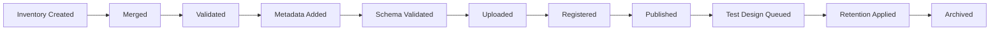
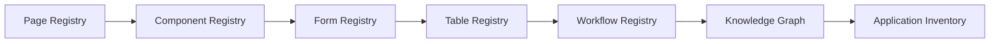
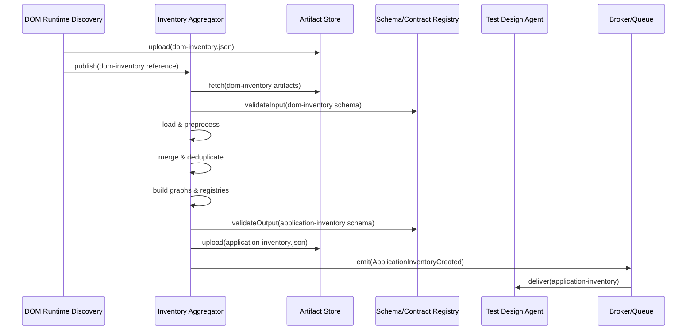
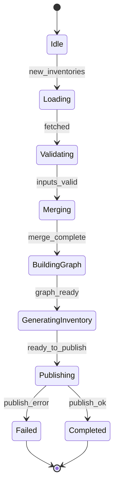
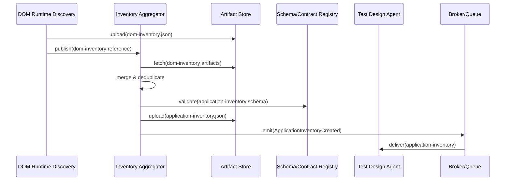

# Inventory Aggregator Service — Engineering Specification

This specification is the authoritative engineering blueprint for the Inventory Aggregator Service. Implementation teams should produce ADRs for any deviations from this specification and publish contract schema changes through the contract lifecycle process documented in `docs/specs/001-project-setup.md`.

**Note:** The Inventory Aggregator is a **deterministic service**, not an AI agent. It performs data processing, merging, deduplication, and normalization without AI inference. It consumes structured artifacts from the DOM + Runtime Discovery Agent and produces the canonical Application Inventory.

## 34. Consumed and Produced Contracts

This section consolidates the contracts consumed by the Inventory Aggregator and the contract it produces, including governance guidance for ownership, version negotiation, validation and publication.

| Contract | Direction | Purpose | Owner | Contract Version | Downstream Consumer |
|---|---:|---|---|---|---|
| `dom-inventory.json` | Consumes | Page-level semantic inventory containing components, elements, states and provenance | DOM Runtime Discovery Team | x-contract-version / producerVersion | Inventory Aggregator |
| Execution Context | Consumes | Run-level parameters and tenant metadata guiding aggregation rules | Trigger Agent / Configuration Service | snapshot:v1 | Inventory Aggregator |
| Configuration Snapshot | Consumes | Tenant/platform configuration affecting merging thresholds and policies | Configuration Team | snapshot:v1 | Inventory Aggregator |
| Feature Flags | Consumes | Runtime toggles that modify aggregation heuristics and enrichment | Feature Flag Service | flags:v1 | Inventory Aggregator |
| `application-inventory.json` | Produces | Canonical application-level knowledge model and registries | Inventory Aggregation Team / Contracts Team | x-contract-version / producerVersion | Test Design, Human Review, Code Gen, Reporting |

Contract governance guidance:

- **Contract ownership:** Each contract MUST have a named steward responsible for schema evolution, compatibility testing and publishing migration guidance.
- **Version negotiation:** Consumers MUST inspect `x-contract-version` and `producerVersion` and consult the Schema/Contract Registry for compatibility rules before ingestion.
- **Schema validation:** Inputs are validated against authoritative schemas. The Aggregator MUST fail-fast on missing mandatory fields and classify schema issues as blocking or non-blocking per policy.
- **Backward compatibility:** Schema changes follow platform policy; additive changes are preferred. Breaking changes require version bumps, consumer notifications, consumer-provider contract tests and a controlled rollout.
- **Publication workflow:** Produced `application-inventory.json` artifacts are uploaded to the Artifact Store, registered in the metadata catalog and published to the Contract Registry. A `ApplicationInventoryCreated` event is emitted with `applicationId` and `artifactRef`.

## 35. Preconditions

The Aggregator must verify the following preconditions before starting an aggregation job:

- **DOM inventories validated:** Required `dom-inventory.json` artifacts exist and pass basic schema and provenance checks.
- **Artifact Store available:** Object storage/catalog reachable for fetch and upload.
- **Schema Registry available:** Schema/Contract Registry reachable for input/output validation.
- **Merge Engine initialized:** Merge engine and deduplication parameters are available and loaded.
- **Configuration loaded:** Tenant and platform configuration for aggregation is present.
- **Feature Flags resolved:** Feature toggles influencing heuristics are resolved for the run.
- **Aggregation job initialized:** Job metadata (applicationId, runRefs, policy) created and checkpointed.
- **Worker available:** Processing worker(s) allocated to the job.
- **Queue available:** Broker reachable for emitting downstream events and consuming follow-ups.

## 36. Postconditions

After successful aggregation or defined terminal states, the following postconditions should hold:

- **Application Inventory generated:** `application-inventory.json` is produced and includes registries, graphs and metadata.
- **Knowledge Graph completed:** Knowledge graph constructed and validated for consistency.
- **Registries completed:** Page, Component, Form, Table, Event and Accessibility registries are populated.
- **Coverage calculated:** Coverage and completeness metrics are computed and attached to metadata.
- **Confidence calculated:** Per-entity and aggregate confidence scores computed and annotated.
- **Metadata completed:** Provenance, change history and source references present.
- **Schema validated:** Output passes schema validation or is flagged for human review where partial publication allowed.
- **Inventory uploaded:** Artifact uploaded to Artifact Store and accessible by consumers.
- **Inventory registered:** Metadata and changelog registered in the catalog/registry.
- **Test Design notified:** Downstream consumers (Test Design Agent) are enqueued or notified.
- **Metrics published:** Aggregation metrics and knowledge metrics emitted to telemetry sinks.

## 37. Failure Decision Matrix

Enterprise decision matrix: `Failure Scenario`, `Category`, `Retryable`, `Recovery Action`, `Event`, `Final State`.

| Failure Scenario | Category | Retryable | Recovery Action | Event | Final State |
|---|---|---:|---|---|---|
| Missing Inventory | Input | No | Abort job or skip affected partition; notify upstream and human review | `MissingInventory` | `Failed` / `Partial` |
| Duplicate Conflict | Data | Maybe | Apply deterministic conflict resolution (confidence, recency); flag for human override if unresolved | `DuplicateConflict` | `Resolved` / `HumanReview` |
| Merge Failure | Processing | Maybe | Retry merge with reduced features; fall back to partial aggregation and emit diagnostics | `MergeFailure` | `Retrying` / `Partial` |
| Graph Cycle | Consistency | No | Detect and isolate cyclic subset; attempt automated resolution rules; escalate if systemic | `GraphCycleDetected` | `Partial` / `HumanReview` |
| Invalid Relationship | Data | Maybe | Validate and drop relationship if low confidence; flag high-impact invalid relations | `InvalidRelationship` | `Partial` |
| Knowledge Graph Failure | Processing | Maybe | Retry graph build; restore from last checkpoint and re-run affected partitions | `KnowledgeGraphFailure` | `Retrying` / `Partial` |
| Coverage Failure | Metrics | Maybe | Recompute coverage, re-fetch sources; if persistent, mark coverage as degraded | `CoverageFailure` | `Partial` |
| Registry Failure | Processing | Maybe | Retry registry write, use alternate storage, alert SRE | `RegistryFailure` | `PendingRecovery` |
| Confidence Failure | Analysis | Maybe | Recompute confidence using alternate weights; mark affected entries as low confidence | `ConfidenceFailure` | `Partial` |
| Schema Validation Failure | Output | No | Block publication; persist diagnostics and route to human review unless allowed partial | `SchemaValidationFailure` | `Failed` / `HumanReview` |
| Artifact Upload Failure | Infrastructure | Yes | Retry upload with backoff; persist local copy and escalate storage incident if persistent | `ArtifactUploadFailure` | `Retrying` / `PendingRecovery` |
| Queue Failure | Infrastructure | Maybe | Retry enqueue; failover to alternate broker and alert SRE | `QueueFailure` | `PendingRecovery` |
| Unexpected Exception | Unknown | Maybe | Capture diagnostics, checkpoint and escalate; attempt partial outputs if possible | `UnexpectedException` | `Failed` / `HumanReview` |

Notes: Recovery actions must preserve idempotency and respect retry budgets. Partial application inventories must clearly indicate coverage gaps and diagnostic traces.

## 38. Aggregation Pipeline

High-level pipeline stages that transform page inventories into the application inventory:

- DOM Inventories (input)
- Inventory Loader
- Merge Engine
- Deduplication Engine
- Knowledge Graph Builder
- Registry Builder
- Coverage Engine
- Confidence Engine
- Metadata Builder
- Validator
- Publisher

Mermaid flow diagram:

```mermaid
flowchart LR
  A[DOM Inventories] --> B[Inventory Loader]
  B --> C[Merge Engine]
  C --> D[Deduplication Engine]
  D --> E[Knowledge Graph Builder]
  E --> F[Registry Builder]
  F --> G[Coverage Engine]
  G --> H[Confidence Engine]
  H --> I[Metadata Builder]
  I --> J[Validator]
  J --> K[Publisher]
```

## 39. Application Inventory Lifecycle

Lifecycle of `application-inventory.json`:

- Application Inventory Created
- Merged
- Validated
- Metadata Added
- Schema Validated
- Uploaded
- Registered
- Published
- Test Design Queued
- Retention Applied
- Archived

Mermaid diagram:

## 40. Confidence Aggregation Model

Confidence aggregation moves from low-level element confidence to application-level scores.

Example flow:

- Element Confidence
↓
- Component Confidence (weighted aggregation of elements)
↓
- Page Confidence (aggregate of component confidences and coverage)
↓
- Workflow Confidence (aggregate of pages in a workflow)
↓
- Application Confidence (weighted aggregation across workflows/pages)

Model notes:

- **Weighted aggregation:** combine confidences using configurable weights (e.g., element importance, component frequency, page priority).
- **Propagation:** high-confidence elements raise component confidence; low-confidence elements reduce it.
- **Inheritance:** component confidence may inherit from prominent instances observed across pages.
- **Normalization:** normalize scores to a common scale (0–100 or 0.0–1.0) for comparison and thresholds.
- **Downstream usage:** downstream agents must respect confidence thresholds (e.g., require `High` or `Medium` for automated generation tasks) and expose configurable tolerances for human review.

## 41. Deduplication Strategy

Deduplication is critical to producing stable registries and reducing noise.

Approaches:

- **Exact duplicates:** detect identical `dom-inventory` fingerprints and collapse to a single instance.
- **Semantic duplicates:** detect pages/components with equivalent semantic payloads (titles, business labels, structural similarity) even when DOM differs.
- **Structural duplicates:** detect similar node trees using tree-edit distances, normalization and template extraction.
- **URL normalization:** canonicalize URLs (scheme, host normalization, parameter ordering, remove tracking params) prior to dedupe.
- **Parameterized pages:** detect route templates and collapse parameterized instances into a single canonical template with example instances.
- **Component fingerprinting:** compute stable fingerprints for components based on structure, attribute patterns and repeated occurrence.
- **Similarity scoring:** compute composite similarity scores (structural, semantic, visual signatures) and apply thresholds for grouping.
- **Conflict resolution:** deterministic rules: prefer higher-confidence source, most-complete instance, or tenancy-authoritative source.
- **Canonical selection:** choose canonical representative per group via ruleset and record lineage and justification.
- **Human override:** allow human operators to mark canonical selections and persist overrides.

Impact on downstream agents:

- Deduplication reduces duplicate test targets, improves signal-to-noise for ML models and focuses human review on canonical instances. It must be deterministic and auditable to support reproducibility.

## 42. Registry Dependency Model

Registries are constructed in dependency order to ensure referential integrity.

Example build sequence:

- Page Registry
↓
- Component Registry
↓
- Form Registry
↓
- Table Registry
↓
- Workflow Registry
↓
- Knowledge Graph
↓
- Application Inventory

Mermaid diagram:

## 43. SLA / SLO

Operational objectives for the Aggregator:

- **Availability:** 99.9% service availability for aggregation control plane and worker processing.
- **Maximum Pages:** baseline support 50k pages per aggregation job with sharding.
- **Maximum Components:** support up to 1M component instances across an application.
- **Maximum Registries:** support tens of registry types and thousands of entries per registry.
- **Maximum Graph Nodes:** support millions of nodes with partitioned stores.
- **Maximum Graph Edges:** support millions of edges with partitioned stores.
- **Aggregation Throughput:** typical throughput 100–1000 pages/minute across pool (configurable by profile).
- **Aggregation Latency:** p95 ≤ 2 minutes for standard applications; large jobs use incremental processing.
- **Memory Usage:** per-worker p95 ≤ 8GB under baseline workloads; scale via sharding.
- **Recovery Time Objective (RTO):** 15 minutes for automated recovery.
- **Recovery Point Objective (RPO):** 5 minutes maximum data loss window.
- **Error Budget:** 0.1% failed or incomplete aggregations per month allocated to transient faults.

## 44. Assumptions

This specification assumes:

- DOM Discovery completed and produced validated `dom-inventory.json` artifacts.
- DOM inventories are present and accessible in the Artifact Store.
- Artifact Store and Schema Registry are operational and reachable.
- Configuration snapshots and feature flags are available for the run.
- Telemetry and tracing systems are operational and integrated into the pipeline.
- Queue/Broker is available for event delivery and downstream notification.
- Processing workers are available and schedulable for aggregation jobs.
- Cluster clocks are synchronized to enable consistent provenance and trace correlation.

## 45. Related Specifications

Reference and how this specification fits into the platform:

- [docs/specs/001-project-setup.md](docs/specs/001-project-setup.md) — Platform governance, contract lifecycle and schema registry guidance referenced by this spec.
- [docs/specs/002-trigger-agent.md](docs/specs/002-trigger-agent.md) — Trigger Agent spec that initiates runs and provides execution context.
- [docs/specs/003-ai-crawler-agent.md](docs/specs/003-ai-crawler-agent.md) — AI Crawler Agent spec producing crawl artifacts consumed upstream.
- [docs/specs/004-dom-runtime-discovery-agent.md](docs/specs/004-dom-runtime-discovery-agent.md) — DOM Discovery spec producing `dom-inventory.json` artifacts consumed by the Aggregator.
- [docs/specs/006-test-design-agent.md](docs/specs/006-test-design-agent.md) — Test Design Agent that consumes the `application-inventory.json` output.
- [docs/contracts/dom-inventory.json](docs/contracts/dom-inventory.json) — Canonical schema reference for `dom-inventory.json`.
- [docs/contracts/application-inventory.json](docs/contracts/application-inventory.json) — Canonical schema reference for `application-inventory.json` (consumer teams should validate against this schema).

How it fits: The Inventory Aggregator is the canonical knowledge builder, transforming page-level inventories into an application-wide knowledge model that drives test design, human review, code generation and analytics. It centralizes deduplication, enrichment and graph-building responsibilities and exposes a single authoritative `application-inventory.json` contract for downstream consumers.

# 005-inventory-aggregator

Use numbered sections. Do NOT include implementation code, API endpoints, pseudocode, or framework-specific instructions. Diagrams are rendered using Mermaid where useful.

## 1. System context

1.1 Role in the platform

- The Inventory Aggregator Service is a deterministic service (not an AI agent) that consumes `dom-inventory.json` artifacts produced by the DOM + Runtime Discovery Agent and produces a canonical `application-inventory.json` that represents the platform's unified understanding of an application.
- The Inventory Aggregator Service is the authoritative knowledge builder used by Test Design Agent, Human Review Workflow, Code Generation Agent, Reporting Service and Analytics.

1.2 Interaction landscape

- Upstream: DOM + Runtime Discovery Agent, Artifact Store, Schema/Contract Registry, Configuration and Feature Flag services.
- Downstream: Test Design Agent, Human Review consoles, Code Generation Agent, Inventory Consumers via the Inventory Aggregator API (or event-driven delivery) and the Artifact Catalog.

## 2. Primary purpose

2.1 Primary purpose

- Consolidate page-level inventories into a coherent application model: application inventory, knowledge graph, component and form registries, relationship and navigation graphs, coverage and confidence metrics.

2.2 Scope and boundaries

- The Inventory Aggregator Service performs semantic merging, deduplication, enrichment and graph construction using deterministic algorithms. It does NOT use AI inference. It does not parse DOMs, execute browsers, or generate tests or code. It operates on validated `dom-inventory.json` artifacts and produces versioned, validated application-level artifacts.

## 3. Consumed Contracts

The Inventory Aggregator Service consumes a small set of canonical inputs. Each input is validated and versioned prior to aggregation.

- `dom-inventory.json` — page-level semantic inventories. Purpose: source of page-level semantic nodes, component instances, relationships and accessibility findings. Owner: DOM Runtime Discovery Team. Validation: schema validation against `dom-inventory` schema. Versioning: consumer reads `x-contract-version` and `producerVersion`. Publication source: Artifact Store / Contract Registry.

- Execution Context — run-level parameters and tenant-level metadata. Purpose: guide aggregation policies, tenant scoping and retention rules. Owner: Trigger Agent / Configuration Service.

- Configuration Snapshot — platform and tenant configuration affecting deduplication, merging thresholds and enrichment rules. Owner: Configuration Team.

- Feature Flags — runtime toggles that alter aggregation heuristics and enrichment steps. Owner: Feature Flag Service.

For each consumed contract the Aggregator MUST validate provenance (runId, artifactRef), schema compatibility and freshness before use. Invalid inputs are routed to error handling and do not block unrelated aggregation units.

## 4. Produced Contract

Primary produced contract: `application-inventory.json` — the canonical application-wide knowledge model.

4.1 Purpose

- Represent the consolidated application inventory including page registry, component registry, knowledge graph, navigation graph, registries for forms/tables/events, coverage and confidence metrics, and artifact references.

4.2 Ownership

- Owner: Inventory Aggregation Team (producer) with Contracts Team stewarding the schema.

4.3 Schema and Version

- Each produced artifact MUST include `x-contract-version`, `producerVersion` and provenance (`sourceRuns`, `sourceArtifactRefs`). The schema is registered in the Schema/Contract Registry with examples and change logs.

4.4 Publication

- The `application-inventory.json` artifact is uploaded to the Artifact Store, registered in the metadata catalog, and a `ApplicationInventoryCreated` event is emitted with `applicationId` and `artifactRef`.

4.5 Validation

- The Aggregator MUST validate the output against the active schema before publication. Validation failures are blocking except where partial-inventory publication is explicitly allowed by policy.

4.6 Downstream consumers

- Test Design Agent, Human Review, Code Generation Agent, Reporting, Analytics, Security Scanning and any consumer registered in the Contract Registry.

## 5. Responsibilities

The Inventory Aggregator must implement the following responsibilities deterministically and idempotently:

- Load and validate `dom-inventory.json` artifacts.
- Merge page-level inventories into a global `Page Registry` with deduplication and canonical page selection.
- Cluster and deduplicate component instances into a `Component Registry` and track lineage.
- Build relationship and navigation graphs (Relationship Graph & Navigation Graph).
- Construct a Knowledge Graph representing nodes (pages/components/forms/events) and edges (ownership, dependency, navigation, event flows).
- Discover and register workflows and wizard flows in a `Workflow Registry`.
- Produce registries: Form Registry, Table Registry, Event Registry, Accessibility Registry.
- Aggregate coverage, confidence, accessibility and semantic metrics into a Coverage Registry and statistics payload.
- Enrich inventory entries with metadata (producer provenance, lastObserved, change history).
- Provide queryable indices and API-friendly summaries to downstream consumers.
- Validate application inventory against schema and publish artifacts to the Artifact Store and Contract Registry.

## 6. Non-Responsibilities

The Aggregator MUST NOT:

- Parse raw DOM snapshots or perform browser instrumentation (DOM parsing is the DOM Discovery Agent's responsibility).
- Perform live crawling or navigation.
- Execute tests or generate executable test code.
- Execute application workflows or perform stateful interactions against the target application.

## 7. Application model

The Aggregator's canonical model includes:

- Application: top-level entity representing the system under test.
- Business Domain: logical domain grouping (e.g., commerce, account, reporting).
- Business Area: sub-domain or vertical within a domain.
- Page: canonical page node with `pageId`, canonical URL, variants and instances.
- Component: reusable component type with `componentId`, variants, props and instances.
- Element: interactive element cataloged by locator, semantics and accessibility.
- Relationship: directed edges expressing ownership, dependency, navigation or validation.
- Event: action traces, triggers and observed side-effects.
- State: canonical state models and transitions observed across pages/components.
- Workflow: sequences of pages/components and state transitions representing business flows.

Each entity carries metadata: provenance, confidence, coverage and last-observed timestamps.

## 8. Page aggregation

8.1 Page Registry

- Maintain a registry of canonical pages and their observed instances. Each entry includes canonical URL, parameterization, instance fingerprints and coverage metrics.

8.2 Duplicate detection

- Use fingerprinting (structural, semantic and URL template analysis), similarity thresholds and provenance heuristics to detect duplicate or variant pages.

8.3 Canonical page selection

- Select a canonical representative per duplicate group using rules (business priority, completeness, canonical URL patterns, human overrides).

8.4 Dynamic, parameterized and virtual pages

- Record parameterized route templates and virtual pages derived from client-side routing; capture routing parameters and example instances.

8.5 Landing and authenticated pages

- Tag pages with access characteristics (public, authenticated) and record required credentials or persona associations where inferred.

## 9. Component aggregation

9.1 Component Registry

- Cluster component instances into canonical component types. Record variants, prop sets and observed templates.

9.2 Duplicate detection and lineage

- Detect duplicate component definitions across pages and record lineage (where a component was first observed and its propagation across the app).

9.3 Shared, reusable and business components

- Classify components as UI primitives, layout components, shared patterns or business components (e.g., product card, search widget) using heuristic and semantic cues.

9.4 Variants, inheritance and composition

- Record component variants, composition relationships and inheritance semantics when evident.

## 10. Relationship graph

10.1 Relationship types

- Parent-Child (structural containment)
- Dependency (data or behavioral dependency)
- Visibility dependency (visibility gating)
- Validation dependency (field validation chaining)
- Navigation (page-to-page link)
- Composition (component-of relationships)
- Communication (event/handler links)

10.2 Semantics and confidence

- Each edge is annotated with provenance, confidence score and applicable constraints (temporal, persona-specific).

## 11. Knowledge graph

11.1 Nodes and edges

- Nodes: pages, components, forms, tables, events, workflows, data models.
- Edges: relationships defined in section 10, enriched with metadata and weights.

11.2 Graph traversal and queries

- Support queries for impact analysis, change propagation, workflow extraction and test target selection.

11.3 Knowledge enrichment

- Enrich nodes with business taxonomy, usage metrics, vulnerability signals and historical change data.

## 12. Workflow discovery

12.1 Workflow types

- Business workflows (checkout, sign-up, onboarding)
- Navigation workflows (menus → pages → forms)
- Wizard/multi-step flows
- Authentication and approval flows

12.2 Workflow extraction

- Extract workflows by analyzing navigation sequences, event chains and state transitions across inventories; annotate with confidence and required personas.

## 13. Navigation graph

13.1 Graph structures

- Page graph (nodes=pages, edges=navigations), Route graph (parameterized routes), Menu graph (menu hierarchies) and Breadcrumb graph.

13.2 SPA routes and deep links

- Normalize pushState/hash routes into route templates and capture deep link patterns with parameter examples.

## 14. Form registry

14.1 Shared forms and templates

- Deduplicate form definitions and build form templates capturing fields, validation rules, dependencies and representative examples.

14.2 Field registry and validation

- Provide a field registry mapping semantic field types to observed inputs and their validation constraints.

## 15. Table registry

15.1 Table metadata

- Catalog table schemas, headers, column semantics, sorting/filtering controls, pagination strategies and virtualization patterns.

15.2 Shared table templates

- Detect repeated table templates and expose them as registry entries with variants.

## 16. Event registry

16.1 Event types

- User events, system events, DOM events, custom application events, network-triggered events.

16.2 Event relationships

- Map events to source elements, handlers and downstream effects (network calls, DOM deltas).

## 17. Accessibility registry

17.1 Accessibility summary

- Aggregate accessibility findings across pages and components: ARIA coverage, roles, label completeness, heading hierarchy and contrast issues.

17.2 Violations and remediation hints

- Surface common violation patterns and provide evidence links to artifacts and example instances.

## 18. Coverage model

18.1 Coverage dimensions

- Application coverage, page coverage, component coverage, workflow coverage, accessibility coverage and semantic coverage.

18.2 Calculation concepts

- Coverage % computed vs. expected targets (sitemaps, prior inventories, heuristics). Completeness % computed per-entity as filled-required-fields / total-required-fields. Confidence % aggregated as weighted average of per-entity confidence.

18.3 Use of coverage

- Coverage guides re-crawl priorities, human review focus and test design scope.

## 19. Application inventory

Describe the canonical structure of `application-inventory.json` (high-level):

- Application metadata: `applicationId`, `name`, `environments`, `producerVersion`, `runReferences`.
- Page registry: canonical pages with instances, canonical URL templates and coverage metrics.
- Component registry: component types, variants, instances and lineage.
- Knowledge graph: nodes and edges with metadata and confidence.
- Navigation graph: page and route graphs.
- Workflow registry: discovered workflows with steps, personas and confidence.
- Relationship graph: dependency and ownership edges.
- Form registry, Table registry, Event registry.
- Accessibility registry and aggregated findings.
- Coverage, statistics and confidence summaries.
- Artifact references: links to `dom-inventory` sources, screenshots, HARs, traces.

## 20. Execution flow

High-level flow:

Receive `dom-inventory` artifacts → Validate inputs → Load and preprocess → Merge & deduplicate → Build registries → Build graphs & knowledge model → Calculate coverage & confidence → Generate metadata & statistics → Validate `application-inventory` → Publish artifact

Mermaid sequence diagram:

## 21. Validation

21.1 Input validation

- Validate `dom-inventory.json` presence, schema compatibility and provenance prior to ingestion.

21.2 Inventory validation

- Validate merging results for structural integrity and required registry fields.

21.3 Graph validation

- Validate graph consistency (no orphan nodes, consistent edge directions, acyclicity where required) and perform integrity checks.

21.4 Coverage validation

- Ensure coverage metrics are consistent with observed inputs and flag anomalous regression in coverage.

21.5 Schema validation

- Validate `application-inventory.json` against registered schema before publication. Blocking failures require human-review path.

## 22. Error handling

22.1 Failure categories

- Missing inventories, duplicate conflicts, graph inconsistency, invalid relationships, schema failures, partial aggregation and infra failures.

22.2 Recovery and partial aggregation

- Support partial aggregation in presence of non-critical failures, annotate outputs with diagnostics and coverage gaps, and escalate blocking errors to Human Review.

22.3 Conflict resolution

- For conflicting entity definitions employ deterministic rules: prefer higher-confidence source, most-recent observation, or tenant-specified authoritative sources. Record decisions in lineage metadata.

## 23. Retry strategy

- Bounded retries for transient failures (artifact fetch, schema registry downtime) with exponential backoff.
- Maintain idempotency via run-level markers and artifact fingerprints to avoid duplicate merges.
- Support resumable aggregation using incremental checkpoints and persisted intermediate graph states.

## 24. Observability

24.1 Logs

- Structured logs with `timestamp`, `service`, `component`, `applicationId`, `runId`, `level`, `message`, `meta`.

24.2 Metrics

- Aggregation metrics: `aggregator_inventories_processed_total`, `aggregator_merge_latency_seconds`, `aggregator_graph_nodes_total`, `aggregator_graph_edges_total`, `aggregator_partial_outputs_total`, `aggregator_errors_total`.

24.3 Tracing

- Propagate `trace_id` from upstream and emit spans for key phases: fetch, merge, dedupe, graph build, validate, publish.

24.4 Knowledge metrics

- Coverage metrics, confidence distributions, registry sizes and change-rate metrics for downstream monitoring and SLOs.

## 25. Security

25.1 PII and sensitive metadata

- Redact or tag PII and sensitive fields carried in inventories. Enforce tenant-specific redaction and retention policies prior to publishing aggregated artifacts.

25.2 Registry protection

- Apply access controls and ACLs to registries and the application inventory; record access events in audit logs.

25.3 Knowledge graph protection

- Limit graph export of sensitive relationships and provide masked views for lower-privilege consumers.

25.4 Retention and compliance

- Enforce retention policies, encrypted-at-rest artifacts and tenant-specific compliance modes.

## 26. Performance

Define objectives and constraints:

- Aggregation latency: p95 ≤ 2 minutes for typical applications (hundreds of pages); large apps may use incremental aggregation.
- Maximum pages: support up to 50k pages per aggregation job with sharding.
- Maximum components: support up to 1M component instances across an application with sharding and partitioning.
- Maximum graph size: support knowledge graphs with millions of edges through partitioned storage.
- Memory & processing throughput: scale via worker pools and streaming processing to avoid single-node memory limits.

## 27. Scalability

- Distributed aggregation: shard by application, domain or page hash and recombine subgraphs.
- Worker pools: horizontally scale ingestion, merge and graph builders.
- Incremental aggregation: process deltas and remerge affected partitions rather than full rebuild.
- Streaming aggregation: support near-real-time updates for frequent small changes.

## 28. Dependencies

- DOM + Runtime Discovery Agent (producer of `dom-inventory.json`)
- Artifact Store (object storage, metadata catalog)
- Schema/Contract Registry
- Telemetry and Tracing systems
- Configuration and Feature Flag services
- Queue/Broker for event delivery

## 29. Internal components

- Inventory Loader: fetches and validates `dom-inventory` artifacts.
- Merge Engine: canonicalizes fields and merges inventories into a working dataset.
- Deduplication Engine: detects duplicate pages/components and selects canonical representatives.
- Knowledge Graph Builder: constructs nodes and edges from merged records.
- Relationship Engine: computes derived relationships and validates consistency.
- Registry Builder: builds Page, Component, Form, Table, Event and Accessibility registries.
- Coverage Engine: computes coverage and completeness metrics.
- Confidence Engine: computes per-entity confidence scores and aggregates them.
- Metadata Builder: assembles provenance, change history and producer metadata.
- Contract Builder: validates and prepares `application-inventory.json` for publication.
- Telemetry Manager: emits logs, metrics and traces.

## 30. State machine

30.1 Canonical states

- `Idle` — awaiting new inventories.
- `Loading` — fetching and validating inventories.
- `Validating` — input schema and provenance validation.
- `Merging` — deduplication and merge operations.
- `BuildingGraph` — knowledge graph construction.
- `GeneratingInventory` — assembly of `application-inventory.json`.
- `Publishing` — schema validation and artifact publication.
- `Completed` — successful publish.
- `Failed` — terminal or human-review required.

Mermaid state diagram:

## 31. Sequence diagram

Detailed flow between platform components:

## 32. Quality attributes

- Reliability: deterministic merges, checkpointing and partial outputs for resilience.
- Maintainability: modular merge and graph builders with clear contracts.
- Scalability: sharding, streaming and incremental aggregation.
- Security: PII redaction, registry ACLs and tenant isolation.
- Observability: end-to-end tracing, per-application metrics and change-rate monitoring.
- Performance: bounded aggregation latencies and graceful degradation.
- Extensibility: plugin points for enrichment and custom classifiers.

## 33. Acceptance criteria

The Inventory Aggregator specification is accepted when:

1. Responsibilities and boundaries are clearly defined and unambiguous.
2. Consumed and produced contracts are specified with ownership, versioning and validation rules.
3. Page and component aggregation models and deduplication strategies are documented.
4. Knowledge graph structure and registry formats are specified and testable.
5. Coverage, confidence and accessibility aggregation models are defined.
6. Validation, error handling, checkpointing and partial-publish behaviours are specified.
7. Observability, performance, security and scalability targets are specified and measurable.
8. State machine and sequence diagrams are included and aligned with platform events.

---

This specification is the authoritative engineering blueprint for the Inventory Aggregator. Implementation teams should produce ADRs for any deviations from this specification and publish contract schema changes through the contract lifecycle process documented in `docs/specs/001-project-setup.md`.
# 005-inventory-aggregator
