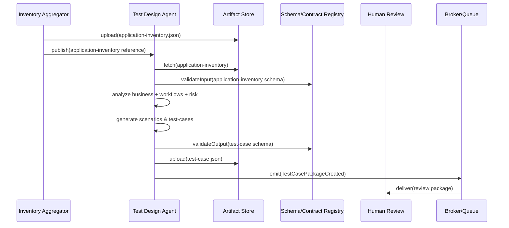
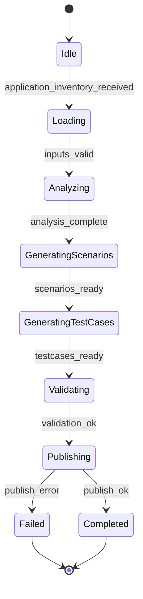
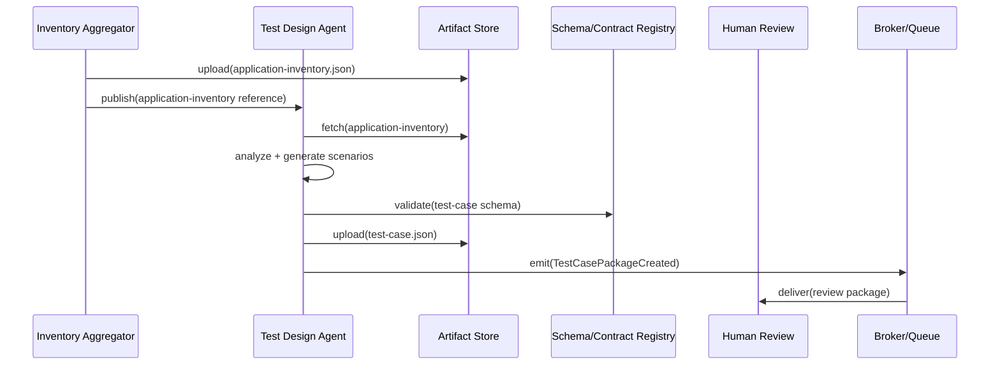
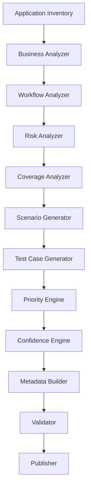
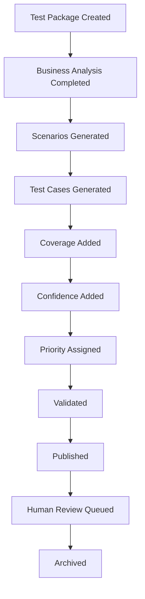

# Test Design Agent — Engineering Specification

This document is the authoritative engineering specification for the Test Design Agent. It defines how the platform transforms the consolidated application knowledge model into business-aware, reviewable test scenarios and test-case artifacts. This specification is implementation-independent and intended as the single source of truth for architects, implementers, SREs and reviewers of the test design capability.

Use numbered sections. Do NOT include implementation code, API endpoints, pseudocode, or framework-specific instructions. Diagrams are rendered using Mermaid where useful.

## 1. System context

1.1 Role in the platform

- The Test Design Agent consumes `application-inventory.json` produced by the Inventory Aggregator Service and produces structured, reviewable test-case artifacts (`test-case.json`) and review packages for human validation.
- It is the bridge between machine-discovered knowledge and human-reviewed test intent; downstream systems include Human Review Workflow (Phase 2), Code Generation Agent, Test Execution orchestration and reporting.

1.2 Interaction landscape

- Upstream: Inventory Aggregator Service, Artifact Store, Schema/Contract Registry, Business Rules, Risk Policies, Test Strategy configuration.
- Downstream: Human Review Workflow (Phase 2), Code Generation Agent, Test Execution orchestration, Reporting Service and Analytics, Artifact Catalog.

## 2. Primary purpose

2.1 Primary purpose

- Consume application knowledge and synthesize business-aware test scenarios, prioritized test cases, coverage and confidence metadata suitable for review and subsequent code generation.

2.2 Scope and boundaries

- The Test Design Agent designs and prioritizes tests; it does not execute tests, generate executable code, interact with browsers or perform crawling. It produces versioned, schema-validated `test-case.json` artifacts and review packages.

## 3. Consumed Contracts

Key consumed contracts and their expectations:

- `application-inventory.json` — canonical application knowledge model. Purpose: source of pages, components, workflows, registries and confidence metrics. Owner: Inventory Aggregation Team. Validation: schema validation; versioning via `x-contract-version` / `producerVersion`. Publication: Artifact Store / Contract Registry.

- Execution Context — run-level parameters, tenant and environment metadata guiding test scope and profiles.

- Configuration Snapshot — platform and tenant configuration influencing prioritization thresholds, scenario breadth and generation profiles.

- Feature Flags — runtime toggles that may alter generation heuristics or enable/disable specific scenario classes.

- Business Rules, Risk Policies, Test Strategy — external policy inputs defining business-critical paths, risk tolerances and test strategy templates (owner: Product / QA leadership).

For each consumed contract the Test Design Agent MUST validate provenance, schema compatibility and freshness before use. Invalid inputs are handled by error paths and do not block unrelated generation units.

## 4. Produced Contract

Primary produced contract: `test-case.json` — structured test case artifacts representing scenarios and individual test cases.

4.1 Purpose

- Represent human-reviewable test scenarios and test cases with preconditions, steps, expected results, assertions, metadata, coverage and confidence information.

4.2 Ownership

- Owner: Test Design Team (producer) with Contracts Team stewarding the `test-case` schema and versioning.

4.3 Version and schema

- Each `test-case.json` MUST include `x-contract-version`, `producerVersion` and provenance fields linking to source `application-inventory` artifacts and run identifiers.

4.4 Publication

- The `test-case.json` artifact is uploaded to the Artifact Store, registered in the metadata catalog, and a `TestCasePackageCreated` event is emitted with `runId` and `artifactRef`.

4.5 Validation

- The agent MUST validate `test-case.json` against the active schema prior to publication. Validation failures are blocking unless partial generation is explicitly permitted by policy.

4.6 Downstream consumers

- Human Review, Code Generation Agent (for converting reviewed tests to code), Test Execution orchestration, Reporting and Analytics.

## 5. Responsibilities

The Test Design Agent must implement the following responsibilities deterministically and idempotently:

- Business understanding: interpret business taxonomy and priorities from `application-inventory` and business rules.
- Workflow understanding: extract and represent user journeys and critical paths.
- Risk analysis: apply risk policies to prioritize scenarios and identify high-value test targets.
- Coverage analysis: translate coverage models into test requirements and identify gaps.
- Test prioritization: produce a prioritized list of scenarios and test cases based on business priority, risk and coverage.
- Test scenario generation: produce human-readable business scenarios and acceptance criteria.
- Test case generation: translate scenarios into test-case artifacts with preconditions, ordered steps, expected results and assertions.
- Boundary and negative testing: derive edge cases and negative paths from component and data models.
- Accessibility testing: include accessibility-focused scenarios and checks where applicable.
- Regression planning: identify stable vs. volatile scenarios for regression suites.
- State transition analysis: analyze stateful workflows to produce state transition test cases.
- Dependency analysis: surface external integrations and API dependencies to include in test scope.
- Metadata generation: attach traceability, tags, priority, confidence, and coverage metadata to each test case.
- Confidence scoring: compute per-scenario/test-case confidence and propagate to artifacts.
- Contract publication: validate and publish `test-case.json` artifacts and emit events for downstream consumption.

## 6. Non-Responsibilities

The Test Design Agent MUST NOT:

- Execute tests or interact with test execution environments.
- Generate executable test code (that is the Code Generation Agent's responsibility after Human Review).
- Perform DOM parsing, crawling or browser lifecycle management.
- Conduct automated review decisions without human-in-the-loop approval where policy mandates.

## 7. Business understanding

The agent must extract and represent business concepts from the `application-inventory` and provided business rules:

- Business domains and areas.
- Business workflows and critical paths.
- Primary user journeys and personas.
- Business priorities and risk surfaces (payments, authentication, checkout, data privacy flows).

This understanding drives scenario selection, prioritization and test scope.

## 8. Test strategy model

The agent must support multiple test strategy templates and label generated scenarios accordingly:

- Smoke and Sanity
- Regression
- Functional and Integration
- Acceptance
- Accessibility
- Security placeholders (identify scope; implementation executed externally)
- Performance placeholders (identify scenarios for load testing)
- Data Validation
- Workflow Validation

Strategy choice influences scenario breadth, step granularity and acceptance criteria.

## 9. Test scenario generation

Scenario classes generated include:

- Business scenarios: end-to-end high-level user journeys.
- Workflow scenarios: multi-step flows and wizard sequences.
- CRUD scenarios: create/read/update/delete flows for data models.
- Navigation scenarios: route activation and deep-link behaviors.
- Error and recovery scenarios: server/API failures, stale data.
- Authentication and authorization scenarios: persona-based access checks.
- Approval and escalation scenarios.

Each scenario includes a concise business description, preconditions, trigger events, postconditions and acceptance criteria.

## 10. Test case generation

Test cases derived from scenarios must include structured fields:

- Preconditions: environment, data and persona setup required.
- Steps: ordered, idempotent actions expressed in business-oriented steps.
- Expected results: explicit assertions and acceptance criteria mapped to observable artifacts.
- Validation points: checks against state, API responses, UI elements and accessibility signals.
- Dependencies: external services, test data, personas and credentials.
- Priority and confidence: per-case metadata.
- Coverage mapping: linkage to coverage requirements and source inventory nodes.

Test cases should be granular enough for review and code generation while preserving business semantics.

## 11. Test prioritization

Prioritization factors include:

- Business criticality and revenue impact.
- Risk scores from risk policies.
- Coverage gaps and historical failure frequency.
- Confidence in discovery and component stability.
- Usage frequency and user journey importance.
- Accessibility and compliance impact.

The Priority Engine must produce orderings and buckets (high/medium/low) and support configurable weightings.

## 12. Risk model

Risk categories:

- Business risk (financial, compliance, reputation).
- Technical risk (complex integrations, fragile components).
- Workflow risk (multi-step failure impact).
- Accessibility risk.
- Regression risk (frequency and historical fragility).
- Operational risk (test data and environment fragility).

Risk analysis must be traceable and used directly in prioritization and scenario selection.

## 13. Coverage model

Coverage dimensions produced and consumed:

- Application and page coverage.
- Component and element coverage.
- Workflow coverage.
- Accessibility coverage.
- Semantic / requirement coverage.

Coverage metrics must be attached to scenarios/test-cases and used to compute gaps and rework priorities.

## 14. Test metadata

Each test case includes metadata for traceability and governance:

- Unique `testCaseId`, `scenarioId` and `applicationId`.
- Business tags, workflow tags and risk tags.
- Priority and confidence scores.
- Coverage mapping and requirement links.
- Owner, version and last-modified provenance.
- Source references to `application-inventory` nodes and `dom-inventory` artifacts.

## 15. Test case contract

Describe the canonical structure of `test-case.json` (high-level):

- Package metadata: `runId`, `producerVersion`, `applicationId`, timestamps.
- Scenarios: array of scenario objects with `scenarioId`, title, description, persona, preconditions, postconditions.
- Test cases: array of test case objects with `testCaseId`, `steps` (ordered action descriptors), `expectedResults`, `assertions`, `dependencies`, `priority`, `confidence`, `coverageLinks`.
- Artifacts: references to screenshots, traces, `dom-inventory` and `application-inventory` nodes.
- Validation: schema version, checksum and validation result.

The schema MUST be registered in the Schema/Contract Registry and include example payloads and changelogs.

## 16. Execution flow

High-level flow:

Receive `application-inventory` → Analyze business model → Analyze workflows → Analyze risk → Generate scenarios → Generate test cases → Calculate coverage & confidence → Validate → Publish

Mermaid sequence diagram:

## 17. Validation

17.1 Input validation

- Validate `application-inventory.json` presence, schema compatibility and provenance prior to generation.

17.2 Scenario validation

- Ensure scenarios have required fields (title, description, preconditions, acceptance criteria) and map to inventory nodes.

17.3 Coverage validation

- Validate that generated test cases cover the intended coverage targets and flag gaps.

17.4 Schema validation

- Validate `test-case.json` against the registered schema prior to publication; blocking failures are routed to Human Review.

## 18. Error handling

18.1 Failure categories

- Missing or invalid business metadata, incomplete workflows, coverage gaps, conflicting scenarios, schema failures, partial generation.

18.2 Recovery strategy

- For recoverable issues attempt re-generation with relaxed heuristics; if persistent, emit partial packages with diagnostics and flag for human review.

18.3 Human-in-the-loop

- Provide review packages with explicit diagnostics and remediation hints for human reviewers to correct business metadata or approve partial results.

## 19. Retry strategy

- Bounded retries for transient failures (artifact fetch, schema registry downtime) with exponential backoff.
- Maintain idempotency using run markers and artifact fingerprints to avoid duplicate generation.
- Support resumable generation by checkpointing intermediate scenario artifacts.

## 20. Observability

20.1 Logs

- Structured logs: `timestamp`, `service`, `component`, `runId`, `scenarioId`, `testCaseId`, `level`, `message`, `meta`.

20.2 Metrics

- Generation metrics: `test_scenarios_generated_total`, `test_cases_generated_total`, `test_case_generation_latency_seconds`, `test_case_validation_failures_total`.

20.3 Tracing

- Propagate `trace_id` and create spans for analysis, generation and publication phases.

20.4 Scenario and coverage metrics

- Emit scenario coverage, confidence distributions and priority breakdowns for SRE and product dashboards.

## 21. Security

21.1 PII and sensitive metadata

- Detect and redact PII in business metadata and test artifacts before storing or publishing. Apply tenant-specific redaction rules.

21.2 Artifact protection

- Apply access controls and ACLs to `test-case` artifacts; restrict export of sensitive scenarios.

21.3 Retention and compliance

- Enforce retention policies and tenant compliance modes for test artifacts and associated metadata.

## 22. Performance

Define measurable objectives:

- Generation latency: p95 ≤ 60s per scenario for standard complexity; bulk generation profiles supported via batch processing.
- Maximum scenarios: support generation for applications with tens of thousands of scenarios via sharding.
- Maximum test cases: support hundreds of thousands of test cases per application with incremental updates.
- Memory and throughput: scale via worker pools and stream processing.

## 23. Scalability

- Distributed generation: shard by workflow or page groups and recombine outputs.
- Parallel workflow analysis and scenario generation across worker pools.
- Incremental generation: produce deltas for changed inventory portions rather than full re-generation.

## 24. Dependencies

- Inventory Aggregator (source of `application-inventory.json`)
- Artifact Store (object storage + catalog)
- Schema/Contract Registry
- Telemetry and Tracing systems
- Configuration and Feature Flag services
- Queue/Broker for review and downstream delivery

## 25. Internal components

- Business Analyzer: derives business priorities and domain mappings.
- Workflow Analyzer: extracts workflows and critical paths.
- Risk Analyzer: applies risk policies and computes risk scores.
- Coverage Analyzer: computes coverage gaps and targets.
- Scenario Generator: synthesizes business scenarios from knowledge graph nodes.
- Test Case Generator: converts scenarios into structured test-case artifacts.
- Priority Engine: orders scenarios and test cases.
- Confidence Engine: computes per-case confidence scores.
- Metadata Builder: produces provenance, tags and traceability data.
- Contract Builder: validates and prepares `test-case.json` for publication.
- Telemetry Manager: emits logs, metrics and traces.

## 26. State machine

26.1 Canonical states

- `Idle` — awaiting application inventory.
- `Loading` — fetching and validating input artifacts.
- `Analyzing` — business, workflow and risk analysis.
- `GeneratingScenarios` — synthesizing business scenarios.
- `GeneratingTestCases` — producing structured test cases.
- `Validating` — schema and coverage validation.
- `Publishing` — artifact publication and event emission.
- `Completed` — successful publish.
- `Failed` — terminal failure requiring human review.

Mermaid state diagram:

## 27. Sequence diagram

High-level interaction diagram:

## 28. Quality attributes

- Reliability: deterministic scenario generation with checkpointing and partial outputs for resilience.
- Maintainability: modular analyzers and well-defined contract boundaries for testing and replacement.
- Scalability: shardable generation pipeline and incremental updates.
- Security: PII redaction, artifact ACLs and tenant isolation.
- Observability: end-to-end tracing and per-scenario metrics for SRE and product.
- Performance: bounded generation latencies and graceful degradation for large applications.
- Extensibility: plugin points for custom business rules, risk models and scenario templates.

## 29. Acceptance criteria

The Test Design Agent specification is accepted when:

1. Responsibilities and non-responsibilities are unambiguous and documented.
2. Consumed and produced contracts are described with ownership, versioning and validation rules.
3. Business understanding and workflow extraction models are specified.
4. Scenario and test-case generation models and metadata are defined.
5. Prioritization, risk and coverage models are specified and testable.
6. Test-case schema (`test-case.json`) shape and validation requirements are defined and registered.
7. Validation, error handling and partial-publish behaviours are specified.
8. Observability, performance, security and scalability targets are specified and measurable.
9. State machine and sequence diagrams are included and aligned with platform events.

---

This specification is the authoritative engineering blueprint for the Test Design Agent. Implementation teams should produce ADRs for any deviations from this specification and publish contract schema changes through the contract lifecycle process documented in `docs/specs/001-project-setup.md`.

# 006-test-design-agent

## 30. Consumed and Produced Contracts

This section provides a concise matrix of the contracts the Test Design Agent consumes and produces, and the governance practices that surround those contracts.

| Contract | Direction | Purpose | Owner | Contract Version | Downstream Consumer |
|---|---:|---|---|---|---|
| `application-inventory.json` | Consumed | Canonical application knowledge model: pages, components, workflows, registries, confidence metrics | Inventory Aggregator Team | `x-contract-version` / `producerVersion` | Test Design Agent, Human Review, Code Generation Agent |
| Execution Context | Consumed | Run-level metadata (tenant, environment, runId) that scopes generation | Orchestration / Control Plane | semantic / runStamp | Test Design Agent |
| Configuration Snapshot | Consumed | Platform and tenant configuration for generation heuristics and thresholds | Platform Configuration Team | semantic | Test Design Agent |
| Feature Flags | Consumed | Runtime toggles that alter generation heuristics or scenario classes | Feature Flag Service | N/A | Test Design Agent |
| Business Rules | Consumed | Domain rules, acceptance templates and business mappings | Product / QA | schema version | Test Design Agent, Human Review |
| Risk Policies | Consumed | Risk scoring, weighting and prioritization rules | Risk & Compliance | schema version | Test Design Agent |
| Test Strategy | Consumed | Test strategy templates and policy guiding scenario breadth and depth | QA Leadership | schema version | Test Design Agent, Human Review |
| `test-case.json` | Produced | Versioned, schema-validated test-case artifacts for review, code generation and execution orchestration | Test Design Team | `x-contract-version` / `producerVersion` | Human Review, Code Generation, Test Execution, Reporting |

Contract governance notes:

- **Contract ownership:** Each contract has a named owning team responsible for the schema, example payloads, backward-compatibility policy and changelog. The owning team is the primary steward for any required changes.
- **Version negotiation:** Schemas use explicit version markers (`x-contract-version`, `producerVersion`, semantic versioning for schema evolution). Consumers must check supported versions and engage the contract lifecycle when incompatibilities are detected.
- **Schema validation:** The agent MUST validate inbound artifacts against the registered input schema and validate outbound `test-case.json` against the active `test-case` schema before publication. Validation results and error diagnostics are recorded with the artifact metadata.
- **Backward compatibility:** Producers SHOULD make additive, backward-compatible changes where possible. Breaking changes require formal deprecation windows, migration guidance and cross-team coordination via the contract registry.
- **Publication workflow:** Producers publish artifacts to the Artifact Store and register schemas in the Schema/Contract Registry. Production publication emits declarative events (for example `TestCasePackageCreated`) with artifact references, run identifiers and provenance.

## 31. Preconditions

The Test Design Agent assumes the following preconditions before generation begins. Each precondition is validated and failures are handled by the Failure Decision Matrix (Section 33).

- Application Inventory validated and available (`application-inventory.json`).
- Knowledge Graph available (derived or attached to inventory).
- Business Rules loaded and schema-compatible.
- Risk Policies loaded and applicable to the current tenant/run.
- Test Strategy resolved (chosen template/profile for the run).
- Configuration loaded (platform and tenant configuration snapshot).
- Feature Flags resolved for the current run.
- Worker allocated for the generation job (compute resources available).
- Queue / Broker available for event emission and review package delivery.
- Artifact Store available for artifact fetch and upload.
- Schema / Contract Registry available for validation.

## 32. Postconditions

On successful completion (or partial completion where policy allows) the Test Design Agent will guarantee the following postconditions are observable and recorded:

- Test Scenarios generated and associated to source inventory nodes.
- Test Cases generated with preconditions, steps, expected results and assertions.
- Coverage calculated and attached to scenarios/test-cases.
- Confidence calculated and attached to artifacts.
- Priority assigned to scenarios and test cases.
- Metadata completed (provenance, tags, owner, version).
- Review Package generated and persisted for Human Review.
- Output schemas validated (validation metadata recorded).
- Artifact uploaded to the Artifact Store and registered in the catalog.
- Downstream Human Review notified via eventing (for review packages).
- Metrics published for generation, validation and coverage results.

## 33. Failure Decision Matrix

The following decision matrix defines enterprise responses to common failure scenarios. The matrix guides automated recovery, human escalation and event emission.

| Failure Scenario | Category | Retryable | Recovery Action | Event | Final State |
|---|---|---:|---|---|---|
| Missing Application Inventory | Input | Yes | Re-fetch; notify Inventory Aggregator; backoff retries; if persistent, fail run and notify stakeholders | `TestDesign:InventoryMissing` | Failed / Awaiting Input |
| Missing Business Rules | Input | Yes | Use default conservative rules; mark affected artifacts with low confidence; notify Product/QA for remediation | `TestDesign:BusinessRulesMissing` | PartialPublishedWithWarnings |
| Workflow Analysis Failure | Processing | Yes | Re-run analysis with relaxed heuristics; if persistent, emit diagnostics and flag workflows for human review | `TestDesign:WorkflowAnalysisFailed` | PartialPublished / Requires Human Review |
| Scenario Generation Failure | Processing | Yes | Attempt partial generation for unaffected workflows; persist diagnostics and route package to review | `TestDesign:ScenarioGenerationFailed` | PartialPublishedWithDiagnostics |
| Test Case Generation Failure | Processing | Yes | Retry generation for failed scenarios; skip irrecoverable cases and include diagnostics in review package | `TestDesign:TestCaseGenerationFailed` | PartialPublishedWithDiagnostics |
| Priority Engine Failure | Processing | Yes | Apply deterministic fallback priority (e.g., business-critical-first); mark priorities as fallback and notify ops | `TestDesign:PriorityEngineFailed` | CompletedWithWarnings |
| Coverage Failure | Validation | Yes | Recompute with relaxed targets or flag coverage gaps for human review; prevent blocking critical-path publication if policy allows | `TestDesign:CoverageGap` | CompletedWithWarnings / Partial |
| Confidence Failure | Validation | Yes | Compute conservative confidence (lower bound) and flag test-cases for manual validation | `TestDesign:ConfidenceComputationFailed` | CompletedWithWarnings |
| Traceability Failure | Validation | No | Attempt provenance reconstruction; if unresolved, mark affected items with missing-traceability and route to human review | `TestDesign:TraceabilityError` | PartialPublishedWithWarnings |
| Schema Validation Failure | Validation | No | If caused by schema mismatch try negotiated versioning; otherwise fail generation and emit diagnostics for owners to fix schema or producer payload | `TestDesign:SchemaValidationFailed` | Failed |
| Artifact Upload Failure | Infrastructure | Yes | Retry uploads with backoff; failover to alternate storage if available; persist artifact locally until upload succeeds | `TestDesign:ArtifactUploadFailed` | PublishedAfterRetry / Failed |
| Queue Failure | Infrastructure | Yes | Buffer review package in Artifact Store and retry publishing to queue; raise operational alert | `TestDesign:QueuePublishFailed` | QueuedForManualDelivery / Retrying |
| Unexpected Exception | Unknown | Depends | Capture diagnostics and core dump where allowed; restart worker and escalate; isolate failing shard and continue where possible | `TestDesign:UnhandledException` | Failed / RecoveredAfterOperatorAction |

## 34. Test Design Reasoning Pipeline

The Test Design Agent implements a deterministic reasoning pipeline that converts the canonical application knowledge into prioritized, reviewable test artifacts. The pipeline is modular and traceable; each stage emits diagnostics and intermediate artifacts for observability and recovery.

Pipeline stages (linear, but implemented as a streaming, sharded flow):

- Application Inventory
- Business Analyzer
- Workflow Analyzer
- Risk Analyzer
- Coverage Analyzer
- Scenario Generator
- Test Case Generator
- Priority Engine
- Confidence Engine
- Metadata Builder
- Validator
- Publisher

Mermaid flow diagram (high level):

Each stage produces intermediate artifacts and metrics that are persisted for auditability and to enable resumable processing.

## 35. Test Package Lifecycle

The test package (`test-case.json`) moves through a defined lifecycle from creation to archive. The lifecycle is event-driven and observable.

Lifecycle stages:

- Test Package Created
- Business Analysis Completed
- Scenarios Generated
- Test Cases Generated
- Coverage Added
- Confidence Added
- Priority Assigned
- Validated
- Published
- Human Review Queued
- Archived

Mermaid lifecycle diagram:

The artifact lifecycle is designed to support incremental updates, versioning and audit trails for each state transition.

## 36. Confidence Model

Confidence is propagated from low-level evidence (discovery, step parsing and assertion matching) up to test-case, scenario and application-level confidence scores. Confidence is used by prioritization logic, review heuristics and gating rules for downstream code generation.

Model characteristics:

- **Step Confidence:** confidence derived from discovery signals (DOM stability, API contract quality, discovery confidence).
- **Assertion Confidence:** confidence for each assertion derived from step confidence and assertion-specific evidence.
- **Test Case Confidence:** weighted aggregation of step and assertion confidences, adjusted by dependency stability and historical data.
- **Scenario Confidence:** aggregation of contained test-case confidences, workflow stability and business rule alignment.
- **Suite Confidence:** aggregate confidence across grouped suites (e.g., regression, smoke) computed as a weighted average.
- **Application Test Confidence:** top-level summary for an application derived from suite confidences and coverage metrics.

Key behaviors:

- **Weighted aggregation:** sources of confidence are weighted (discoveryConfidence, analysisConfidence, historicalStability) and combined into a normalized metric between 0.0 and 1.0.
- **Propagation:** lower-level confidences influence parent entities; large confidence gaps are surfaced as warnings.
- **Normalization:** confidences are normalized to a common scale and stored with artifacts to allow downstream comparisons.
- **Inheritance:** default confidence can be inherited when explicit evidence is missing, but inherited confidence is flagged for review.
- **Thresholds:** configurable thresholds gate promotion to regression suites, automatic code generation or require human sign-off.
- **Downstream usage:** confidence values drive selection for automated code generation, regression inclusion, and human review prioritization.

## 37. Traceability Model

Traceability is first-class: every generated artifact must be linkable back to the originating business concept, inventory nodes and runtime provenance.

Canonical trace chain:

Business Domain
↓
Business Area
↓
Workflow
↓
Scenario
↓
Test Case
↓
Future Generated Code
↓
Execution Result
↓
Report

Traceability guarantees and uses:

- **End-to-end traceability:** each `test-case.json` entry includes `scenarioId`, `testCaseId`, `applicationId`, `sourceInventoryRef` and `runId` linking it to upstream artifacts.
- **Requirement mapping:** map scenarios and test-cases to business requirements and regulatory controls where available.
- **Coverage mapping:** link test-cases to coverage targets and report coverage gaps.
- **Impact analysis:** use trace links to compute blast radius for application changes and prioritize re-generation.
- **Regression analysis:** compare historical execution results to identify flaky or brittle test-cases and update confidence models accordingly.

## 38. Test Suite Organization Model

Generated tests are organized into named suites that reflect purpose, risk and execution cadence. Suites are first-class artifacts with metadata and versioning.

Common suite types:

- Smoke Suite
- Sanity Suite
- Regression Suite
- Workflow Suite
- Accessibility Suite
- Critical Business Suite
- High Risk Suite
- Integration Suite
- Acceptance Suite
- Data Validation Suite

Organization rules:

- **Grouping:** tests are grouped by tags, workflow membership, and priority buckets to form suites.
- **Ownership:** each suite has an owning team or role responsible for review and promotion to execution pipelines.
- **Versioning:** suites are versioned; changes produce new suite versions while preserving historical artifacts.
- **Execution dependencies:** suites may declare ordered dependencies (for example smoke → sanity → regression) and required resources.

Suites enable targeted execution, reporting and SLAs for business-critical paths versus broader coverage checks.

## 39. SLA / SLO

The Test Design Agent exposes the following measurable objectives as SLO candidates. Targets are advisory and must be calibrated per tenant and workload.

| Metric | Target (example) |
|---|---|
| Availability | 99.95% (monthly) |
| Maximum Scenarios per Run | 50,000 scenarios |
| Maximum Test Cases per Application | 500,000 test cases |
| Generation Throughput | 1,000 scenarios / minute (aggregate across workers) |
| Generation Latency (per scenario) | p50 < 5s ; p95 ≤ 60s |
| Memory Usage (per worker) | p95 ≤ 16 GB |
| Maximum Review Package Size | ≤ 100 MB |
| Recovery Time Objective (RTO) | ≤ 30 minutes |
| Recovery Point Objective (RPO) | ≤ 5 minutes |
| Error Budget | 0.05% (monthly, for availability targets) |

Operational notes:

- SLOs must be partitioned by tenant and workload class (interactive runs vs. bulk historical re-generation).
- Resource and cost controls should be applied to bulk jobs (sharding, quotas, backpressure).

## 40. Assumptions

This specification is written against the following assumptions. If any assumption is invalidated the behaviour and guarantees described may not hold.

- Application Inventory completed and schema-validated prior to generation.
- Knowledge Graph (or equivalent relationships) is available to analyzers.
- Business Rules are available and kept up-to-date by Product/QA.
- Risk Policies are loaded and maintained by Risk & Compliance.
- Configuration and Test Strategy snapshots are provided for each run.
- Feature Flags are resolved at run time.
- Telemetry systems (metrics, tracing, logging) are operational and ingestible.
- Queue/Broker services are available for review package delivery.
- Workers are available according to capacity planning.
- Clock synchronization across distributed components is available for consistent provenance.

## 41. Related Specifications

This specification is part of the broader platform reference architecture. Key related artifacts and how this spec fits into the overall system:

- `docs/specs/001-project-setup.md` — Platform setup, contract lifecycle and development conventions that govern schema publication and lifecycle.
- `docs/specs/002-trigger-agent.md` — Triggering and run orchestration that initiates Test Design runs and provides execution context.
- `docs/specs/003-ai-crawler-agent.md` — Crawling and discovery that supply raw inputs to the Inventory Aggregator.
- `docs/specs/004-dom-runtime-discovery-agent.md` — DOM-level discovery artifacts that feed component and element models into the inventory.
- `docs/specs/005-inventory-aggregator.md` — Aggregation, knowledge graph generation and canonical `application-inventory.json` producer; primary upstream for Test Design.
- `docs/specs/007-human-review.md` — Human Review workflows and handoffs for review packages produced by Test Design.
- `application-inventory.json` — Canonical contract consumed by this agent (refer to contract registry for schema).
- `test-case.json` — Canonical output contract produced by this agent and the authoritative artifact for downstream code generation and execution.

Relationship summary:

- The Test Design Agent consumes canonical inventories and policy inputs (business rules, risk policies and test strategy) to produce `test-case.json` artifacts. Those artifacts are the authoritative, versioned representation of test intent and are consumed by Human Review and the Code Generation Agent to produce executable tests and by Test Execution orchestration for scheduling runs. This specification defines the responsibilities, lifecycle and governance needed to make `test-case.json` the single source of truth for test design within the platform.

