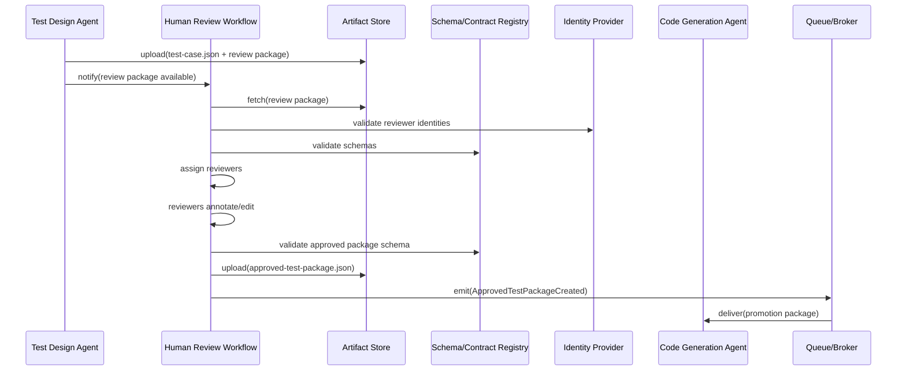
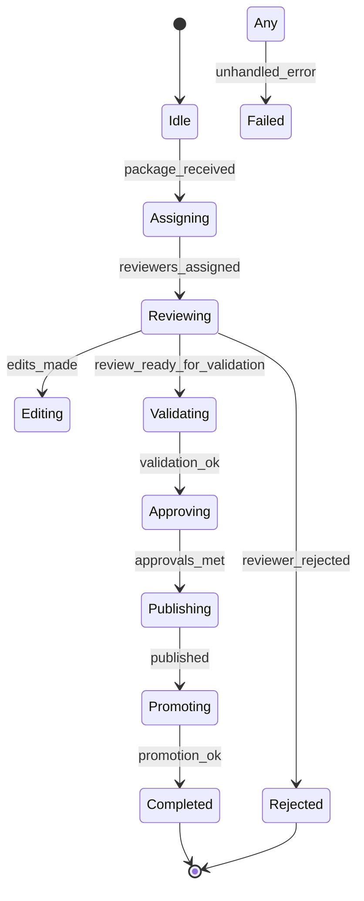
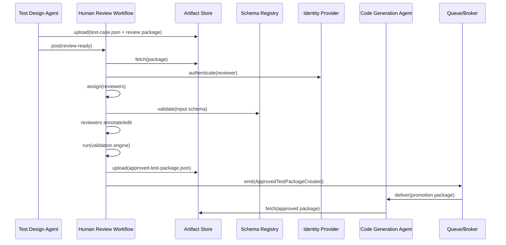
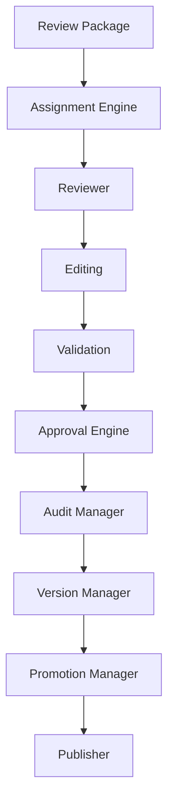
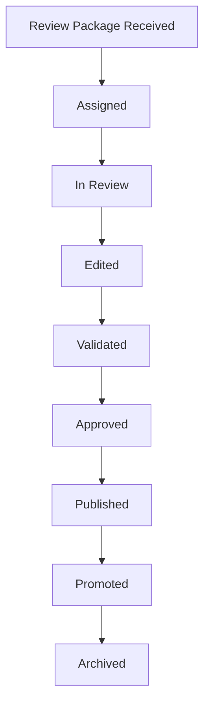

# Human Review Workflow — Engineering Specification

This document is the authoritative engineering specification for the Human Review Workflow. It defines the governance layer that validates, edits, approves, rejects, annotates, versions, and promotes AI-generated test packages before they become executable assets. The specification is implementation-independent and intended as the single source of truth for architects, implementers, SREs, security and compliance teams, and product stakeholders.

**Important:** Human Review is a **workflow gate with human decision-making**, not an AI agent or a deterministic service. It represents a human-in-the-loop approval process. This workflow is introduced in **Phase 2** and is NOT part of the MVP.

Use numbered sections. Do NOT include implementation code, API endpoints, pseudocode, or framework-specific instructions. Diagrams are rendered using Mermaid where useful.

## 1. System context

1.1 Placement in the platform pipeline

- **MVP (Phase 1):** Trigger Agent → AI Crawler Agent → DOM + Runtime Discovery Agent → Inventory Aggregator Service → Test Design Agent → Code Generation Agent → Execution Service → Reporting Service

- **Phase 2+ (with Human Review):** Trigger Agent → AI Crawler Agent → DOM + Runtime Discovery Agent → Inventory Aggregator Service → Test Design Agent → **Human Review Workflow Gate** → Code Generation Agent → Execution Service → Reporting Service

1.2 Integration points

- Upstream: Test Design Agent (producer of `test-case.json` and Review Packages), Artifact Store, Schema/Contract Registry, Policy Stores (Approval/Review Policies), Identity Provider.
- Downstream: Code Generation Agent, Execution Service, Reporting Service, Artifact Catalog, Governance Dashboards.

## 2. Primary purpose

2.1 Primary responsibility

- Serve as the governance and human-in-the-loop layer that transforms AI-generated test intent into authoritative, auditable, and promotable test packages suitable for code generation and execution.

2.2 Inputs consumed

- `test-case.json` (canonical test-case artifacts)
- Review Package (bundled artifacts, diffs, diagnostics, supporting evidence)
- Business Metadata, Risk Metadata, Coverage Metadata, Confidence Metadata

2.3 Outputs produced

- `approved-test-package.json` (approved, versioned package)
- Review Decision records (approve/reject/conditional)
- Review History and Audit Records
- Review Comments and Annotations
- Promotion Package for downstream code generation
- Review Metrics for governance dashboards

## 3. Consumed contracts

This workflow consumes a set of contracts that provide the artifacts and policies required for review. Each contract is validated for provenance, schema compatibility and freshness before use.

- `test-case.json` — canonical test-case artifacts produced by the Test Design Agent. Purpose: represent scenarios/test-cases to be reviewed and edited. Owner: Test Design Team. Validation: schema validation via Schema/Contract Registry. Versioning: `x-contract-version` / `producerVersion`.
- Review Package — a composite artifact containing `test-case.json`, diffs, evidence (screenshots, traces), and diagnostics. Purpose: provide context for reviewers. Owner: Test Design or Orchestration Team. Validation: package schema and artifact references.
- Execution Context — run-level metadata (tenant, environment, runId). Purpose: scoping and provenance. Owner: Orchestration/Control Plane.
- Configuration Snapshot — platform and tenant configuration influencing review policies and thresholds. Owner: Platform Configuration Team.
- Feature Flags — toggles affecting review behavior (auto-approve thresholds, enforcement modes). Owner: Feature Flag Service.
- Business Rules — business-domain acceptance criteria and templates used to validate business semantics of scenarios. Owner: Product/QA.
- Approval Policies — organizational policies that govern required approvers, SLAs, and escalation paths. Owner: Governance/Compliance.
- Review Policies — UI/UX-level policies and heuristics for review workload, batching and auto-suggestions. Owner: QA/Product.
- Risk Policies — policies describing risk thresholds, gated actions and promotion constraints. Owner: Risk & Compliance.

For each consumed contract the Human Review Workflow MUST perform schema validation, provenance checks and freshness checks, and record validation outcomes in the audit trail.

## 4. Produced contract

Primary produced contract: `approved-test-package.json` — the authoritative, versioned package that represents the reviewed and approved test design for downstream code generation and execution.

4.1 Purpose

- Represent the approved set of scenarios and test cases with editorial changes, approval metadata, audit trail and promotion instructions.

4.2 Ownership

- Owner: Human Review Team / Test Governance. The owner is responsible for schema stewardship and lifecycle.

4.3 Validation and Versioning

- Each `approved-test-package.json` MUST include schema version, `approvalVersion`, `producerVersion` (linking back to original `test-case.json`), approver identities and run provenance.

4.4 Publication

- The package is published to the Artifact Store, registered in the metadata catalog, and a `ApprovedTestPackageCreated` event is emitted for downstream consumers.

4.5 Downstream consumers

- Code Generation Agent, Execution Service, Reporting Service, Compliance Auditors.

## 5. Responsibilities

The Human Review Workflow is responsible for:

- Review management: orchestration of review tasks and reviewer assignments.
- Approval workflows: configurable flows, escalations and gating.
- Editing: scenario and test-case editing with traceable deltas.
- Review comments and annotations: threaded discussions and resolution metadata.
- Versioning: create and manage package versions, drafts and rollbacks.
- Approval policies: enforce business, technical and compliance approvers.
- Rejection workflow: manage corrective loops and re-submission.
- Risk validation: apply risk policies to surface gated items.
- Coverage validation: ensure generated tests meet coverage targets or flag gaps.
- Confidence validation: validate confidence levels and gate auto-approval thresholds.
- Metadata validation: ensure provenance, tagging and traceability are present.
- Governance and audit: record who changed what when and why, with evidence.
- Promotion: prepare and emit promotion packages to the Code Generation queue.
- Feedback collection: capture reviewer feedback for model and generator improvement.
- Metrics and reporting: emit review metrics for governance dashboards.

All responsibilities must be performed deterministically and with complete auditability.

## 6. Non-responsibilities

The Human Review Workflow MUST NOT:

- Generate tests or executable code (that is the domain of the Code Generation Agent).
- Execute tests or interact with test environments (Execution Service responsibility).
- Crawl or perform DOM analysis (upstream responsibilities).
- Replace final human decisions where policy mandates human sign-off.

## 7. Review model

The workflow must support multiple review modalities to meet organizational requirements:

- Single reviewer: one authorized reviewer signs off on a package.
- Multi-reviewer (consensus): multiple reviewers must approve; unanimous or majority rules configurable.
- Parallel review: reviewers operate concurrently on disjoint areas or partitions of a package.
- Sequential review: stages of review (business → technical → compliance) performed in order.
- Committee review: configurable committee for high-risk packages.
- Escalation review: automatic escalation to higher authority upon timeouts or policy triggers.
- Mandatory reviewers: enforce required roles per policy (e.g., product owner, security reviewer).
- Conditional reviewers: add reviewers dynamically when package includes specific risk tags or sensitive areas.

Review modalities must be policy-driven and auditable.

## 8. Review workflow

Canonical workflow states:

- Pending — package awaiting assignment.
- Assigned — reviewers allocated and the package is visible in their queue.
- In Review — active review workspace where edits and annotations occur.
- Changes Requested — reviewers require modifications before approval.
- Approved — final approval reached per policy.
- Rejected — package rejected with reasons; source package returned to Test Design.
- Escalated — forwarded to higher authority for decision.
- Archived — historical state for approved, rejected or superseded packages.
- Versioned — each approval cycle creates a new version.

The workflow MUST emit events for each transition and persist transition metadata for auditing and SLO calculations.

## 9. Editing model

Editing capabilities must be granular, auditable, and reversible:

- Scenario editing: edit titles, descriptions, and high-level acceptance criteria.
- Test case editing: add/remove test cases, modify testCase steps and assertions.
- Step editing: edit step descriptions and preconditions.
- Expected result editing: clarify or correct expected observable outcomes.
- Assertion editing: add or refine assertions and validation points.
- Priority editing: adjust priority and routing for execution.
- Metadata editing: tags, owners, requirement links, coverage mappings.
- Tag editing: add/remove tags and sensitivity markers (PII, compliance scope).
- Version creation: editing produces a new draft version with a changelog.
- Rollback: authorized users can rollback to prior approved versions subject to policy.

All edits MUST be stored in the audit trail with diffs, author identity, timestamp, and justifications.

## 10. Approval model

Approval rules are policy-driven and must support the following:

- Business approval: sign-off by product or business owner for business-facing changes.
- Technical approval: sign-off by engineering/QA for technical correctness and testability.
- QA approval: sign-off by QA owners for coverage and execution readiness.
- Risk approval: sign-off by Risk & Compliance for packages with elevated risk.
- Compliance approval: sign-off by legal or compliance when regulated controls are impacted.
- Final approval: configurable aggregator that applies policy to derive final decision (e.g., all required approvals present and no blocking reviewers).

Approval rules MUST be declarative, versioned and stored in the Policy Registry. Approval decisions must be deterministic given the policy and reviewer inputs.

## 11. Rejection model

Rejection must provide explicit feedback and a revision path:

- Reasons: missing evidence, insufficient coverage, business rule violations, high risk.
- Feedback: structured feedback fields and free-text commentary.
- Revision request: create a set of required changes and return to the Test Design Agent or to the creator.
- Version tracking: rejected package remains in history and the new iteration is linked.
- Re-review: re-submission triggers review steps with preserved context and prior discussion.

Rejections must be surfaced in governance dashboards and drive remediation workflows where necessary.

## 12. Annotation model

Annotations must support collaborative review and threaded discussions:

- Comments: general comments attached to the package.
- Inline comments: comments attached to specific scenario/test-case/step.
- Discussion threads: comment threads with resolution states.
- Mentions: notify reviewers or stakeholders via explicit mentions.
- Tags: annotate with policy or remediation tags.
- Resolutions: mark items as resolved with resolution metadata.

All annotations must be part of the audit record and searchable for governance review.

## 13. Versioning model

Version lifecycle:

- Draft — initial editable package produced by Test Design or created in review.
- Review — active review iteration.
- Approved — accepted version ready for promotion.
- Rejected — rejected iteration with remediation items.
- Archived — historical versions retained for compliance.
- Superseded — newer approved version replaces earlier one.
- Rollback — authorized restoration to a prior version.

Version records MUST include `approvalVersion`, `createdBy`, `createdAt`, `changeLog`, and `provenance` linking to source `test-case.json`.

## 14. Audit model

The audit model captures definitive answers to: Who, What, When, Why, Previous value, New value, Decision, Evidence.

Audit record fields:

- Actor identity (userId, role, delegation context).
- Action type (approve, edit, annotate, promote, reject, rollback).
- Timestamps with monotonic ordering.
- Prior and post artifact checksums.
- Evidence artifacts (screenshots, logs, diff patches).
- Decision rationale and references to policy.

Audit records must be immutable, tamper-evident and retained according to retention policies.

## 15. Promotion model

Promotion flow for approved packages:

- Approved Package → Promotion Validation → Promotion Metadata (approver, timestamp, metadata) → Code Generation Queue → Code Generation Agent

Promotion validation checks include schema validation, approval signatures, risk gating and any required compliance holds.

Promotion metadata MUST be embedded in the published package and emitted as part of the promotion event.

## 16. Feedback model

The Human Review Workflow must capture feedback to close the loop with upstream AI models and the Test Design Agent:

- Reviewer feedback: structured signals for false positives, missing coverage, or quality issues.
- AI feedback: suggested edits or rationales from reviewer interactions that can be fed into retraining pipelines.
- Corrections: structured diffs and approved corrections returned to Test Design as training examples.
- Learning signals: aggregate metrics used to adjust generation heuristics (false positive rate, edit rate, approval latency).
- Continuous improvement: periodic export of feedback datasets to model governance and training pipelines.

Feedback must be versioned and associated with the artifact provenance.

## 17. Collaboration model

Capabilities for human collaboration:

- Assignments: assignment engine supports auto-assignment, round-robin, skill-based routing.
- Ownership: teams and individual owners for packages and suites.
- Review queues: personal and team queues with prioritization rules.
- Notifications: event-driven notifications (email, chat, dashboard) for assignments and escalations.
- Mentions & discussions: in-context collaboration features.
- Conflict resolution: formal conflict resolution process for divergent reviewer opinions (escalation to committee or authority).

Collaboration features must preserve auditability and role-based access controls.

## 18. Review metrics

Operational and governance metrics to emit:

- Approval rate (approved / reviewed).
- Rejection rate.
- Mean time to review (MTTR) and percentiles (p50, p95).
- Reviewer workload (active reviews per reviewer).
- Confidence distribution for reviewed items.
- Coverage improvements pre/post review.
- Revision count per package.
- Feedback signals (false positives, correction types).

Metrics must be emitted as structured telemetry for dashboards and SLO/Ops alerts.

## 19. Approved package contract

High-level structure of `approved-test-package.json` (canonical):

- Package metadata: `packageId`, `approvalVersion`, `applicationId`, `producerVersion`, `createdAt`, `createdBy`, `runId`, `schemaVersion`.
- Approved scenarios: array of `scenario` objects with `scenarioId`, title, description, adopted acceptance criteria.
- Approved test cases: array of `testCase` objects with `testCaseId`, `steps`, `expectedResults`, `assertions`, `dependencies`, `priority`, `confidence`, `coverageLinks`.
- Review history: ordered list of review events with `actor`, `action`, `timestamp`, `comment`, `evidenceRef`.
- Comments & annotations: threaded comment references with state and resolution.
- Approval metadata: list of approvers, roles, signatures, policy references.
- Audit trail: immutable audit records linked or embedded.
- Promotion metadata: validation results, promotionTime, codeGenerationRef.

The schema MUST be registered in the Schema/Contract Registry and include examples, validation rules and retention policy.

## 20. Execution flow

High-level sequence:

Receive test package → Assign reviewers → Review (annotate, edit) → Validate (coverage/risk/schema) → Approve or Reject → Version → Publish Approved Package → Promote to Code Generation

Mermaid sequence diagram:

## 21. Validation

Validation responsibilities include:

- Review validation: ensure required approvers and signatures are present per policy.
- Approval validation: verify approver roles and delegation contexts.
- Coverage validation: verify package meets required coverage thresholds or annotate gaps.
- Risk validation: apply risk gating rules to determine promotion eligibility.
- Metadata validation: verify provenance, tags and trace links.
- Schema validation: validate `approved-test-package.json` against registered schema prior to publication.

Validation results and diagnostics MUST be recorded and surfaced to reviewers and SRE.

## 22. Error handling

Key error classes and recovery strategies:

- Missing reviewers: re-assign using fallback rules or escalate per policy.
- Conflicting reviews: surface conflict resolution workflow; optionally escalate to committee.
- Approval timeout: escalate and optionally auto-escalate based on SLA and policy.
- Validation failures: block promotion and present diagnostics for corrective action.
- Schema failures: attempt negotiated schema resolution if allowed or block promotion and notify owners.
- Promotion failures: retry with exponential backoff; if persistent, place package into error queue and notify operators.

All failures MUST produce structured diagnostics and be recorded in audit logs.

## 23. Retry strategy

- Resume: support resuming interrupted reviews and rehydrating reviewer state.
- Retry: bounded retries for transient infra failures (artifact fetch, queue publish).
- Checkpoint: persist intermediate review drafts and edits to allow resumability.
- Partial review: allow partial approvals for scoped partitions when policy permits.
- Idempotency: use idempotent identifiers for publish/promotion actions to avoid duplicates.

## 24. Observability

Observability requirements:

- Logs: structured logs with `packageId`, `reviewId`, `actor`, `action`, `runId`, `level` and `message`.
- Metrics: `reviews_assigned_total`, `reviews_completed_total`, `review_latency_seconds`, `approvals_total`, `rejections_total`, `promotions_total`, `validation_failures_total`.
- Tracing: propagate `trace_id` for cross-service correlation and per-review spans.
- Review metrics: per-reviewer workload, approval latency percentiles and correction rates.
- Audit metrics: recording rates and storage metrics for audit trail.

Observability outputs should integrate with platform dashboards and SRE runbooks.

## 25. Security

Security controls:

- Reviewer permissions: RBAC enforced via Identity Provider with fine-grained scopes.
- Segregation of duties: enforce separation for roles where policy requires (e.g., author vs approver).
- Audit protection: immutable, tamper-evident audit storage and controlled export.
- Comment visibility: control comment visibility for sensitive data and redaction capabilities.
- PII handling: detect, redact or mask PII in artifacts and comments according to tenant policy.
- Retention & compliance: apply retention schedules and legal holds to approved packages and audit trails.

## 26. Performance

Measurable objectives (examples):

- Maximum concurrent reviewers per package: 200
- Maximum review packages active: 10,000
- Review latency (p95): ≤ 48 hours for manual review; configurable per SLA
- Promotion latency: ≤ 5 minutes for automated promotion pipelines
- Memory per reviewer session: p95 ≤ 1 GB
- Throughput: support sustained ingestion of 1,000 review packages per hour across the cluster

Performance targets should be partitioned by interactive runs and bulk re-processing workloads.

## 27. Scalability

Scalability strategies:

- Distributed review: horizontal scaling of review workers and stateless UI frontends.
- Large review teams: support partitioned packages and partition-aware assignment.
- Parallel review: shard packages by scenario groups to enable parallelism.
- Review sharding: partition by application, workflow or tag for independent review streams.
- Incremental review: support delta-only review where only changed scenarios are surfaced.

Scalability design must preserve traceability and idempotency.

## 28. Dependencies

- Test Design Agent — producer of review packages.
- Artifact Store — storage for review artifacts and approved packages.
- Schema/Contract Registry — schema validation and version negotiation.
- Telemetry systems — metrics, logs and tracing.
- Configuration / Policy Registry — approval and review policies.
- Queue / Broker — event delivery for promotion and notifications.
- Identity Provider — authentication and authorization.

## 29. Internal components

- Review Manager — orchestrates review lifecycle and assignments.
- Assignment Engine — auto-assigns reviewers based on skills, load, and policy.
- Approval Engine — enforces approval rules and aggregates decisions.
- Validation Engine — runs coverage, risk and schema checks.
- Version Manager — manages drafts, versions and rollbacks.
- Audit Manager — persists immutable audit records.
- Feedback Manager — captures reviewer signals for model improvement.
- Notification Manager — drives alerts and notifications.
- Promotion Manager — validates and emits promotion packages.
- Telemetry Manager — emits logs, metrics and traces.

## 30. State machine

Canonical states for a review package:

- `Idle` — package received and awaiting assignment.
- `Assigning` — assignment in progress.
- `Reviewing` — active review/editing.
- `Editing` — editors modifying package content.
- `Validating` — validation checks executing.
- `Approving` — approval aggregation in progress.
- `Publishing` — approved package persisted and published.
- `Promoting` — promotion to code generation queue.
- `Completed` — promotion complete and package archived.
- `Rejected` — package rejected and returned for remediation.
- `Failed` — terminal failure requiring operator intervention.

Mermaid state diagram:

## 31. Sequence diagram

Detailed interaction diagram:

## 32. Quality attributes

- Reliability: deterministic review workflows with checkpointing and durable audit trails.
- Maintainability: modular components (assignment, approval, validation) and clear contract boundaries.
- Scalability: horizontal scaling with partitioned review streams and sharding.
- Security: enforced RBAC, segregation of duties, PII handling and audit protections.
- Auditability: immutable audit records and evidence attachments.
- Observability: rich telemetry for governance and SRE.
- Performance: bounded review latencies and graceful degradation.
- Extensibility: plugin points for custom approval rules and integrations.

## 33. Acceptance criteria

The Human Review Workflow specification is accepted when:

1. Responsibilities and non-responsibilities are unambiguous and documented.
2. Consumed and produced contracts are described with ownership, validation and versioning rules.
3. Review model, workflow, editing, approval and rejection models are specified.
4. Versioning, audit and promotion models are defined.
5. Execution flow, state machine and sequence diagrams are included.
6. Validation, error handling, retry, observability, security, performance and scalability requirements are specified.
7. Approved package contract (`approved-test-package.json`) shape and validation requirements are defined and registered.
8. Acceptance criteria and SLOs for review operations are documented and testable.

---

This specification is the authoritative engineering blueprint for the Human Review Workflow. Implementation teams must produce ADRs for any deviations and publish contract schema changes through the contract lifecycle process documented in `docs/specs/001-project-setup.md`.
# 007-human-review

## 34. Consumed and Produced Contracts

This matrix summarizes the primary contracts the Human Review Workflow consumes and produces, and the governance practices that surround those contracts.

| Contract | Direction | Purpose | Owner | Contract Version | Downstream Consumer |
|---|---:|---|---|---|---|
| `test-case.json` | Consumed | Canonical generated test cases and scenarios for human review | Test Design Team | `x-contract-version` / `producerVersion` | Human Review Workflow |
| Review Package | Consumed | Composite bundle (diffs, evidence, diagnostics) to contextualize review | Test Design / Orchestration | semantic package version | Human Review Workflow |
| Execution Context | Consumed | Run and tenant scoping for review decisions | Orchestration / Control Plane | runStamp | Human Review Workflow |
| Configuration Snapshot | Consumed | Review policies, thresholds and tenant settings | Platform Configuration Team | semantic | Human Review Workflow |
| Feature Flags | Consumed | Toggle behaviors (auto-approve, enforcement modes) | Feature Flag Service | N/A | Human Review Workflow |
| Business Rules | Consumed | Business acceptance criteria and templates | Product / QA | schema version | Human Review Workflow |
| Approval Policies | Consumed | Organizational approval rules and required approvers | Governance / Compliance | policy version | Human Review Workflow |
| Review Policies | Consumed | UI/UX heuristics and batching rules for review workloads | QA / Product | policy version | Human Review Workflow |
| Risk Policies | Consumed | Risk thresholds and gated actions for promotion | Risk & Compliance | policy version | Human Review Workflow |
| `approved-test-package.json` | Produced | Authoritative, approved package for promotion and code generation | Human Review Team | `approvalVersion` / `schemaVersion` | Code Generation Agent, Execution Service, Reporting Service |

Contract governance notes:

- **Contract ownership:** Every contract has a named owning team responsible for schemas, changelogs and backward-compatibility policies. Ownership must be recorded in the Schema/Contract Registry.
- **Version negotiation:** Consumers must check `x-contract-version` or equivalent markers and follow the contract lifecycle for incompatible versions; negotiated fallback strategies (compatible version mapping) are documented per contract.
- **Schema validation:** The agent MUST validate consumed artifacts against registered schemas and validate produced `approved-test-package.json` prior to publication. Validation outcomes are recorded in the audit trail.
- **Backward compatibility:** Producers SHOULD prefer additive, non-breaking changes; breaking changes require formal deprecation, migration guidance and coordination across owning teams.
- **Publication workflow:** Approved packages are published to the Artifact Store, registered in the contract registry, and emitted as `ApprovedTestPackageCreated` events containing provenance and promotion metadata.

## 35. Preconditions

The Human Review Workflow requires the following preconditions to be met before review work can proceed:

- Review Package available and reachable in the Artifact Store.
- Test Package validated for basic schema correctness.
- Reviewer identities synchronized with Identity Provider.
- Approval Policies loaded from the Policy Registry.
- Review Policies loaded and active.
- Risk Policies loaded and applicable to the tenant.
- Configuration snapshot resolved for the run.
- Artifact Store available and responsive.
- Schema / Contract Registry available for validation.
- Identity Provider available for authentication/authorization.
- Queue / Broker available for notifications and promotion delivery.

Preconditions are validated at run start, and failures are handled according to the Failure Decision Matrix (Section 37).

## 36. Postconditions

On successful completion of review operations the following postconditions must be observable and recorded:

- Review completed (approved, rejected or conditional).
- Immutable audit records generated and persisted.
- New version created when edits are applied.
- Approval metadata generated (approvers, timestamps, policy references).
- Promotion metadata generated (validation snapshot, signatures).
- Approved package published to the Artifact Store.
- Notifications delivered to downstream consumers and stakeholders.
- Metrics published for review operations and SLOs.
- Review history persisted and searchable for governance.

## 37. Failure Decision Matrix

This decision matrix defines platform-level responses to operational and policy failures encountered by the Human Review Workflow.

| Failure Scenario | Category | Retryable | Recovery Action | Event | Final State |
|---|---|---:|---|---|---|
| Missing Review Package | Input/Infra | Yes | Re-fetch; notify Test Design; if persistent, mark run failed and escalate | `HumanReview:PackageMissing` | Failed / Awaiting Input |
| Reviewer Unavailable | Operational | Yes | Reassign using fallback/reserve reviewers; escalate if SLA breached | `HumanReview:ReviewerUnavailable` | AssignedWithFallback |
| Identity Provider Failure | Infrastructure | Yes | Retry auth; if persistent, fail assignment and notify ops | `HumanReview:IdentityProviderError` | PendingAssignment / Escalated |
| Approval Policy Conflict | Policy | No | Surface conflict to governance; pause promotion until policy reconciled | `HumanReview:PolicyConflict` | Escalated / Blocked |
| Concurrent Edit Conflict | Conflict | No | Present conflict resolution UI; create conflict ticket for manual reconciliation | `HumanReview:ConcurrentEditConflict` | ConflictPendingResolution |
| Validation Failure | Validation | No | Block promotion; surface diagnostics and required remediation steps | `HumanReview:ValidationFailed` | ReworkRequired |
| Schema Validation Failure | Validation | No | Attempt negotiated version resolution; if impossible, block and notify schema owners | `HumanReview:SchemaValidationFailed` | Failed |
| Audit Persistence Failure | Infrastructure | Yes | Retry persist with backoff; if persistent, write to durable fallback store and alert ops | `HumanReview:AuditPersistFailed` | PersistedInFallback / Escalated |
| Artifact Upload Failure | Infrastructure | Yes | Retry upload; failover to alternate storage; persist metadata until upload succeeds | `HumanReview:ArtifactUploadFailed` | PublishedAfterRetry / Failed |
| Promotion Queue Failure | Infrastructure | Yes | Retry publish to queue; buffer promotion package in Artifact Store and alert ops | `HumanReview:PromotionQueueFailed` | QueuedForManualDelivery / Retrying |
| Notification Failure | Infrastructure | Yes | Retry notifications; log failure and provide manual notification path | `HumanReview:NotificationFailed` | NotifiedLater / Retrying |
| Unexpected Exception | Unknown | Depends | Capture diagnostics, persist current state for manual recovery, isolate problematic shard | `HumanReview:UnhandledException` | Failed / RecoveredAfterOperatorAction |

Recovery actions are prioritized to preserve auditability and avoid silent data loss. Persistent or policy-level failures trigger governance escalations.

## 38. Governance Pipeline

The Human Review Workflow implements a governance pipeline that ensures review tasks are assigned, decisions are auditable, and promotions are gated by policy.

Pipeline stages:

- Review Package
- Assignment Engine
- Reviewer
- Editing
- Validation
- Approval Engine
- Audit Manager
- Version Manager
- Promotion Manager
- Publisher

Mermaid flow diagram:

Each stage emits structured events and diagnostics to enable observability and automated remediation where policy permits.

## 39. Review Package Lifecycle

The lifecycle of the review package (`approved-test-package.json` and intermediate drafts) tracks progression from receipt to archive.

Lifecycle stages:

- Review Package Received
- Assigned
- In Review
- Edited
- Validated
- Approved
- Published
- Promoted
- Archived

Mermaid lifecycle diagram:

The lifecycle supports partial promotions (scoped sections) when policy allows and retains historical versions for compliance.

## 40. Decision Confidence Model

Decision confidence evolves through the review cycle and influences gating and automation.

Confidence chain:

- AI Confidence — initial confidence from the Test Design Agent and discovery signals.
- Reviewer Confidence — explicit confidence annotations by reviewers during review.
- Approval Confidence — aggregated confidence after required approvers sign off.
- Package Confidence — final normalized confidence encoded in the approved package.

Model behaviors:

- **Confidence adjustment:** reviewer inputs can increase or decrease AI confidence; adjustments are recorded as deltas with rationale.
- **Reviewer overrides:** explicit reviewer overrides are allowed per policy and recorded with justifications.
- **Approval weighting:** different approver roles carry configurable weights (e.g., risk approver > technical approver) when computing Approval Confidence.
- **Normalization:** confidences are normalized to a 0.0–1.0 scale for downstream decisioning.
- **Thresholds:** configurable thresholds gate automatic promotion, require additional reviewers, or mandate committee review.
- **Downstream usage:** Package Confidence informs code generation throttles, test selection for regression suites, and reporting dashboards.

Confidence values are persisted in the approved package and in review telemetry for model improvement.

## 41. Reviewer Role Matrix

The platform supports distinct reviewer roles with clearly defined responsibilities, permissions and authorities.

| Role | Responsibilities | Permissions | Approval Authority | Escalation Authority | Editing Permissions |
|---|---|---|---|---|---|
| Business Reviewer | Validate business semantics, acceptance criteria, requirement mapping | Read/Edit business fields, comment | Can approve business aspects | Escalate to product owner | Edit scenario descriptions, acceptance criteria |
| QA Reviewer | Validate coverage, testability and execution assumptions | Read/Edit test-case details, mark coverage | Can approve QA readiness | Escalate to QA lead | Edit test steps, assertions, priority |
| Technical Reviewer | Validate technical assumptions, dependencies and feasibility | Read/Edit technical metadata | Can approve technical readiness | Escalate to engineering manager | Edit dependencies and step-level technical notes |
| Security Reviewer | Validate security implications, data handling and PII | Read/Edit sensitive tags, request redaction | Can block promotion on security grounds | Escalate to security committee | Request edits, mark sensitive elements |
| Compliance Reviewer | Validate regulatory and legal controls | Read/Edit compliance metadata | Can require hold or approval | Escalate to legal/compliance lead | Add compliance tags and required controls |
| Final Approver | Aggregate approvals and issue final approval | Full approve authority per policy | Final escalation authority | Executive or governance board | May not change content; can request edits or sign off |

Role permissions and authorities are declarative and enforced by the Identity Provider and the Approval Engine.

## 42. SLA / SLO

Platform-level measurable objectives (examples):

| Metric | Target (example) |
|---|---|
| Availability | 99.95% (monthly) |
| Maximum Review Packages Active | 10,000 packages |
| Maximum Concurrent Reviewers | 2,000 concurrent reviewers across cluster |
| Review Completion Time | p50 < 24h ; p95 < 72h (manual review workload) |
| Approval Latency | p95 < 48h |
| Promotion Latency | < 5 minutes (automated promotions) |
| Notification Latency | < 30 seconds (event delivery) |
| Recovery Time Objective (RTO) | ≤ 30 minutes |
| Recovery Point Objective (RPO) | ≤ 5 minutes |
| Error Budget | 0.05% monthly for availability targets |

SLOs must be partitioned by tenant and workload class and enforced via monitoring and alerting.

## 43. Assumptions

Key assumptions underpinning this specification:

- Review Package validated and present in Artifact Store prior to assignment.
- Identity Provider and RBAC are operational and up-to-date.
- Policy Registry (Approval / Review policies) is available and versioned.
- Artifact Store and Schema Registry are reachable during review cycles.
- Queue/Broker is operational for notifications and promotion delivery.
- Telemetry systems ingest logs, metrics and traces.
- Reviewers are available according to capacity planning and on-call rosters.
- Clock synchronization across distributed components is available for consistent timestamps.

## 44. Related Specifications

The Human Review Workflow is a governance layer in the platform and integrates with the following specifications and contracts:

- `docs/specs/001-project-setup.md` — platform-level contract lifecycle and schema publication processes.
- `docs/specs/002-trigger-agent.md` — run initiation and orchestration that may trigger review runs.
- `docs/specs/003-ai-crawler-agent.md` — upstream discovery inputs that indirectly affect review scope.
- `docs/specs/004-dom-runtime-discovery-agent.md` — DOM-level artifacts referenced in review evidence.
- `docs/specs/005-inventory-aggregator.md` — canonical application inventory consumed upstream by Test Design.
- `docs/specs/006-test-design-agent.md` — primary upstream producer of `test-case.json` and review packages.
- `docs/specs/008-code-generation-agent.md` — primary downstream consumer of approved packages for code generation.
- `test-case.json` — canonical generated contract that is the input to Human Review.
- `approved-test-package.json` — canonical approved package contract produced by this agent.

Relationship summary:

- The Human Review Workflow enforces governance over the artifacts produced by the Test Design Agent, applying policy-driven review, edits, approvals and promotions. Approved packages produced here are the authoritative inputs for the Code Generation Agent and ultimately for execution and reporting. This specification defines the governance boundaries, lifecycle, and observability required to ensure the platform produces auditable and compliant `approved-test-package.json` artifacts for large-scale production use.

