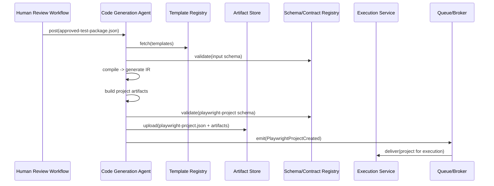
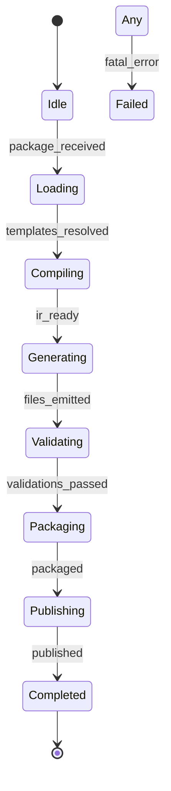
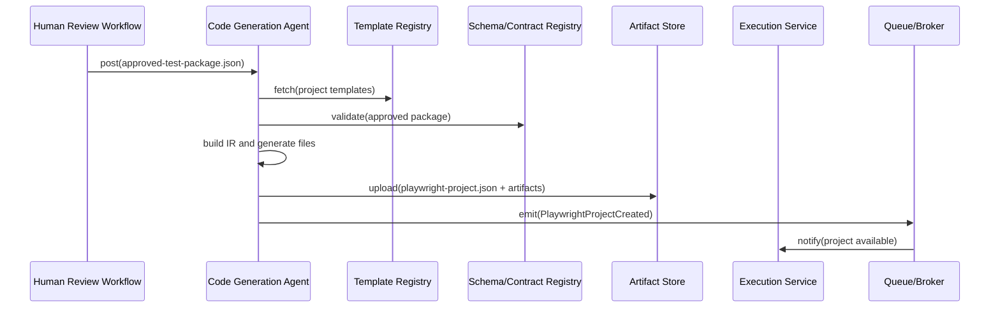
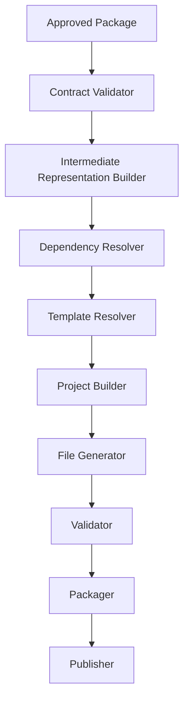
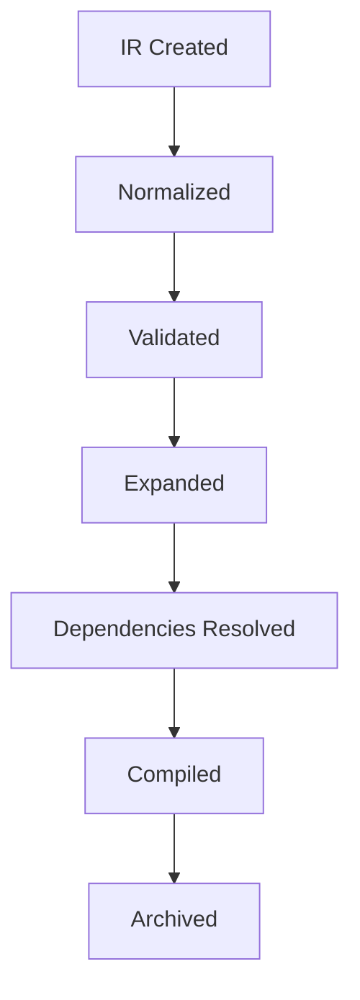
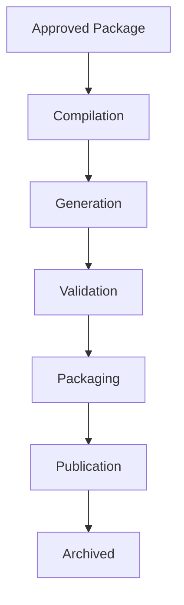

# Code Generation Agent — Engineering Specification

This document is the authoritative engineering specification for the Code Generation Agent. It defines how approved, human-governed test designs are compiled into deterministic, executable automation artifacts. The specification is implementation-independent and intended as the single source of truth for architects, implementers, SREs, and governance stakeholders.

Use numbered sections. Do NOT include implementation code, API endpoints, pseudocode, or framework-specific instructions. Diagrams are rendered using Mermaid where useful.

## 1. System context

1.1 Placement in the platform pipeline

- **MVP (Phase 1):** Trigger Agent → AI Crawler Agent → DOM + Runtime Discovery Agent → Inventory Aggregator Service → Test Design Agent → Code Generation Agent → Execution Service → Reporting Service

- **Phase 2+ (with Human Review):** Trigger Agent → AI Crawler Agent → DOM + Runtime Discovery Agent → Inventory Aggregator Service → Test Design Agent → Human Review Workflow Gate → Code Generation Agent → Execution Service → Reporting Service

1.2 Integration points

- Upstream: Human Review Workflow (Phase 2) or Test Design Agent (MVP), Artifact Store, Schema/Contract Registry, Template Registry, Naming & Coding Standards service.
- Downstream: Execution Service (test runners), Reporting Service, Artifact Catalog, CI/CD pipelines.

## 2. Primary purpose

2.1 Primary responsibility

- Deterministically transform approved test design artifacts into executable automation projects and packages suitable for execution and CI/CD pipelines. The Code Generation Agent compiles specifications into code artifacts, validates structure and traceability, packages, and publishes the generated project contract.

2.2 Inputs and outputs

Consume:
- `approved-test-package.json` (authoritative, approved test designs)
- Execution Context, Configuration Snapshot, Feature Flags
- Framework Configuration, Project Templates, Coding Standards, Naming Rules

Produce:
- `playwright-project.json` (canonical generated project contract)
- Generated Automation Package (source files, build artifacts)
- Generation Metadata, Compilation Report, Source Maps, Generation Metrics

## 3. Consumed contracts

The Code Generation Agent must validate and respect the following contracts prior to generation:

- `approved-test-package.json` — authoritative input for generation. Owner: Human Review Team. Validation: schema validation and provenance checks.
- Execution Context — run scoping and tenant information. Owner: Orchestration.
- Configuration Snapshot — generation-time configuration and template selection. Owner: Platform Configuration.
- Feature Flags — toggles for generation features and auto-fill behaviour. Owner: Feature Flag Service.
- Framework Configuration — framework-specific templates and adapters (e.g., Playwright configuration templates). Owner: Template Registry.
- Naming Standards & Coding Standards — organization rules for naming, linting and style. Owner: Engineering Standards.
- Generation Policies — constraints and signing/approval requirements for generated artifacts. Owner: Governance.
- Project Templates — approved scaffold templates for project layout and CI integration. Owner: Template Registry.

For each consumed contract the agent MUST perform schema validation, provenance checking, and compatibility negotiation where applicable. Validation outcomes are recorded with generation metadata.

## 4. Produced contract

Primary produced contract: `playwright-project.json` — declarative representation of the generated automation project including files, suites, dependencies and traceability links.

4.1 Purpose

- Provide a machine-readable manifest for the generated project that downstream systems (Execution Service, CI, Reporting Service) can consume.

4.2 Ownership

- Owner: Code Generation Team with Contracts Team stewarding the `playwright-project` schema.

4.3 Versioning and validation

- Each `playwright-project.json` MUST include schema version, `generatorVersion`, provenance to `approved-test-package.json`, artifact checksums and validation results.

4.4 Publication

- Generated artifacts and `playwright-project.json` are uploaded to the Artifact Store and registered in the metadata catalog. A `PlaywrightProjectCreated` event is emitted with artifact references and generation metadata.

4.5 Downstream consumers

- Execution Service, CI/CD pipelines, Reporting Service, Audit & Compliance tools.

## 5. Responsibilities

The Code Generation Agent is responsible for:

- Automation generation: compile approved designs into executable test code.
- Project generation: produce scaffolded projects with CI integration points.
- Suite generation: partition tests into suites aligned with review metadata and execution profiles.
- Scenario/test generation: convert scenarios and test-cases into concrete test methods, fixtures and assertions.
- Fixture generation: produce environment and test data fixtures (non-sensitive) required for execution.
- Page Object and Locator generation: represent UI interactions and elements in maintainable abstractions.
- Utility and helper generation: support code utilities, retry wrappers, and shared helpers.
- Configuration generation: generate framework-specific configuration (e.g., Playwright config) and environment templates.
- Metadata & traceability: embed provenance, source links and trace IDs into generated artifacts.
- Compilation & validation: ensure generated project compiles and passes structural validations.
- Packaging & publishing: package generated project and upload to Artifact Store.

All responsibilities must be deterministic, reproducible and auditable.

## 6. Non-responsibilities

The Code Generation Agent MUST NOT:

- Design or invent new tests beyond what is present in the approved package.
- Execute tests or manage runtime execution environments.
- Perform crawling or DOM analysis.
- Bypass human approvals or alter approval metadata.

## 7. Generation model

The generation model maps approved, high-level artifacts into concrete code artifacts through templating and deterministic compilation steps.

Key constructs:

- Project generation: assemble scaffold using project templates and tenant-specific settings.
- Suite generation: group test-cases into execution suites according to priority, tags, and execution profile.
- Scenario generation: map scenario semantics to high-level test method descriptions.
- Test generation: turn test steps into ordered executable steps with assertions and validations.
- Support file generation: generate shared helpers, fixtures, and constants.
- Metadata generation: attach traceability identifiers and provenance to each generated artifact.

Generation MUST be idempotent: given the same `approved-test-package.json` and template versions the output must be identical (modulo deterministic timestamps and non-functional metadata).

## 8. Compilation model

The compilation model describes the transformation pipeline from approved package to packaged automation.

High-level compilation stages:

- Approved Package → Compiler (template resolver + generator) → Intermediate Representation (IR)
- IR → Structural Validation (naming, topology) → Project Builder
- Project Builder → Compile & Format (when relevant) → Generated Project
- Generated Project → Validation (lint, schema, traceability) → Packaging → Publish

The IR is a deterministic, structured representation of files, classes, methods and dependencies created by normalising the approved package against selected templates and naming rules.

## 9. Traceability model

Traceability is mandatory: every generated artefact must link back to its originating approved scenario and test-case.

Trace chain:

- Approved Scenario → Generated Test → Generated File → Generated Method → Execution Result → Report

Traceability guarantees:

- Each test method includes metadata linking to `scenarioId`, `testCaseId`, `packageId` and `approvalVersion`.
- Generated file headers include generation timestamp, generatorVersion and checksums.
- The `playwright-project.json` manifest contains the mapping between generated paths and source artifact references.

Trace links enable impact analysis, debugging, and auditing.

## 10. Project organization model

Generated projects follow an organizational layout that balances readability, maintainability and execution performance.

Typical project structure:

- Project Root: metadata, `playwright-project.json`, README
- `suites/`: generated suites grouped by purpose (smoke, regression, workflow)
- `pages/`: Page Object definitions and components
- `fixtures/`: per-suite and global fixtures
- `utils/`: shared utilities and helpers
- `config/`: framework and environment configuration
- `tests/`: generated test files organized by suites and scenarios
- `resources/`: static assets and example data (non-sensitive)

Project layout is driven by templates and must include CI hooks and dependency descriptors when required.

## 11. Page Object model

Code generation must produce maintainable Page Objects and components:

- Page Objects: high-level classes representing navigable pages with actions and assertions.
- Components: reusable UI fragments encapsulated as smaller Page Object units.
- Locators: centralized locator definitions to enable reuse and fallback resolution.
- Actions: method-level abstractions for common operations (e.g., login, submit form).
- Assertions: expressive checks tied to business acceptance criteria rather than implementation details.

Page Objects MUST be versioned and generated with clear mapping to inventory/dom artifact identifiers.

## 12. Locator model

Locator generation must be robust and maintainable:

- Locator hierarchy: primary stable locators with ordered fallbacks.
- Locator confidence: attach discovery confidence metadata to each locator.
- Fallback locators: generate fallbacks to reduce brittleness.
- Dynamic locators: parameterized locators for variable elements.
- Versioning: locator sets are versioned alongside the project to enable rollbacks.

Locators must include trace metadata linking back to `dom-inventory` artifacts and discovery confidence scores.

## 13. Fixture model

Fixtures provide environment setup and teardown semantics required by generated tests:

- Authentication fixtures: token provisioning, session management (secrets not embedded in code).
- Environment fixtures: configuration of environment variables and test endpoints.
- Test data fixtures: seed data creation for predictable test runs (non-sensitive and tenant-aware).
- Cleanup & Isolation: ensure fixture scope and teardown to maintain isolation.
- Lifecycle: define fixture scope (suite, test, session) and deterministic ordering.

Fixtures must avoid embedding secrets; references to secret stores are used instead.

## 14. Code quality model

Generated code must align with enterprise code quality expectations:

- Naming: adhere to naming rules and tenant-specific conventions.
- Formatting: apply configured formatters and linters.
- Readability: produce clear, idiomatic code that engineers can maintain.
- Maintainability: encourage reuse by factoring common behaviors.
- Duplication avoidance: deduplicate helpers and common steps.

The generator MUST run quality validations and produce a compilation report documenting violations and auto-fix actions when safe.

## 15. Validation model

Validation stages:

- Input validation: schema and provenance checks against `approved-test-package.json`.
- Compilation validation: IR validation, naming and structural checks.
- Project validation: ensure project compiles or passes static validations (lint, formatter checks).
- Traceability validation: verify all generated tests map back to source IDs.
- Integrity validation: checksum and artifact consistency checks.

Validation results form the Compilation Report and must be persisted with the generated project.

## 16. Generation metrics

Essential metrics to emit:

- `projects_generated_total`
- `suites_generated_total`
- `files_generated_total`
- `methods_generated_total`
- `generation_duration_seconds`
- `compilation_success_total` and `compilation_failure_total`
- `generation_latency_seconds`

Metrics must be partitioned by tenant, runId, generatorVersion and templateVersion for observability and cost allocation.

## 17. Playwright project contract

High-level shape of `playwright-project.json` (canonical):

- Project metadata: `projectId`, `generatorVersion`, `schemaVersion`, `packageId`, `createdAt`, `producer`.
- Generated files: list of generated files with path, checksum, size and trace links.
- Suites: list of suites with suiteId, test file references, execution profile and tags.
- Dependencies: external dependencies and their pinned versions.
- Configuration: framework configuration snippets and environment placeholders.
- Traceability: mapping from file/method → `scenarioId`/`testCaseId`/`approvalVersion`.
- Generation metadata: `templateVersion`, `namingRulesVersion`, `generationReportRef`.

The schema MUST be registered with the Schema/Contract Registry and include examples and validation rules.

## 18. Execution flow

High-level sequence:

Receive Approved Package → Resolve Templates & Naming Rules → Compile → Generate IR → Build Project → Validate → Package → Publish

Mermaid sequence diagram:

## 19. Validation

Validation includes:

- Input validation: ensure `approved-test-package.json` is schema-compliant and approvals are intact.
- Compilation validation: verify IR correctness and naming rules.
- Project validation: run static checks (linters, formatters) and basic compile-time checks where applicable.
- Schema validation: validate `playwright-project.json` against registered schema.

Validation failures must be recorded and presented in the Compilation Report with actionable diagnostics.

## 20. Error handling

Common failure modes and recovery guidance:

- Compilation failures: record diagnostics, mark generation failed and route to operator or developer for template fixes.
- Template failures: fallback to conservative template or fail with clear diagnostics.
- Generation failures: isolate failing scenario(s), continue generation for unaffected parts and produce partial artifacts if policy allows.
- Validation failures: block publishing; persist artifacts for debugging and notify owners.
- Publishing failures: retry uploads with backoff; persist artifacts locally until successful.

All failures must preserve traceability and diagnostic context for debugging and remediation.

## 21. Retry strategy

- Resume: support resuming interrupted generation from IR checkpoints.
- Retry: bounded retries for transient infra failures.
- Checkpoint: incrementally persist IR and intermediate artifacts to enable incremental compilation.
- Incremental compilation: generate deltas for changed scenarios to reduce resource usage.
- Idempotency: ensure publish operations are idempotent using artifact checksums and unique artifact IDs.

## 22. Observability

Observability requirements:

- Structured logs: include `packageId`, `runId`, `generatorVersion`, `templateVersion`, `tenantId`.
- Metrics: emit generation metrics (see Section 16) with tags for tenant and versions.
- Tracing: propagate trace context across upstream and downstream services.
- Compilation reports: persist structured compilation reports for each run.

Observability outputs must integrate with platform dashboards and SRE runbooks.

## 23. Security

Security controls around generated artifacts:

- Secrets: never bake secrets into generated code; reference secret stores for runtime credentials.
- Credentials: generated projects contain placeholders with instructions for secure injection at runtime.
- PII: detect and avoid embedding PII in generated fixtures and resources.
- Project isolation: generated artifacts are tenant-scoped and access-controlled in the Artifact Store.

Security validations must be part of the validation pipeline; security-critical generation paths may require additional approvals.

## 24. Performance

Performance objectives (examples):

- Compilation throughput: 50 projects / hour per generator cluster node.
- Maximum project size: support projects with up to 100k LOC generated.
- Generation latency: p95 generation time per project ≤ 5 minutes for standard packages.
- Memory per generation worker: p95 ≤ 16 GB.

Performance targets should be tuned for tenant profiles and supported with resource controls.

## 25. Scalability

Scalability strategies:

- Distributed generation: partition generation work across workers by suites or scenario groups.
- Parallel compilation: parallelise compilation of independent modules and file generation.
- Template caching: cache compiled templates to reduce CPU work.
- Incremental generation: generate changes only for modified scenarios or files.

Design must preserve hermetic builds and deterministic outputs across sharded workers.

## 26. Dependencies

- Human Review Agent — source of approved packages.
- Artifact Store — storage for templates and generated artifacts.
- Schema/Contract Registry — schema validation and version negotiation.
- Template Registry — storage for approved generation templates.
- Telemetry systems — metrics, logs and tracing.
- Configuration / Policy Registry — naming and coding standards.
- Queue / Broker — event delivery for promotion and CI triggers.

## 27. Internal components

- Compiler — orchestrates template resolution and IR generation.
- IR Builder — normalises approved packages into an intermediate representation.
- Template Engine — renders templates deterministically from IR.
- Project Builder — assembles files, dependencies and project descriptors.
- Page Object Builder — constructs Page Objects and component classes.
- Locator Builder — compiles locator definitions and fallback logic.
- Fixture Builder — generates fixtures and environment scaffolding.
- Validator — runs compilation and project validations.
- Publisher — packages artifacts and uploads to Artifact Store.
- Telemetry Manager — emits metrics and traces.

## 28. State machine

Canonical states for generation:

- `Idle` — awaiting approved package.
- `Loading` — fetch templates and input artifacts.
- `Compiling` — building IR and rendering templates.
- `Generating` — emitting project files.
- `Validating` — running validations and checks.
- `Packaging` — creating artefact bundles.
- `Publishing` — uploading to Artifact Store and emitting events.
- `Completed` — generation and publication successful.
- `Failed` — terminal failure requiring operator action.

Mermaid state diagram:

## 29. Sequence diagram

Detailed interaction diagram:

## 30. Quality attributes

- Reliability: deterministic, reproducible generation with checkpoints and reproducible builds.
- Maintainability: clean generated artifacts with clear mapping back to sources and templates.
- Scalability: partitionable generation and parallel compilation.
- Security: secrets management, PII detection, and tenant isolation.
- Traceability: end-to-end links from scenario → generated artifact → execution result.
- Performance: bounded generation latencies and throughput SLAs.
- Extensibility: template and adapter model for additional frameworks.
- Determinism: same inputs produce byte-identical outputs (controlled metadata excluded).

## 31. Acceptance criteria

The Code Generation Agent specification is accepted when it defines:

1. Responsibilities and non-responsibilities clearly.
2. Generation lifecycle and compilation model.
3. Project organization, Page Object and Locator models.
4. Fixture and validation models.
5. Traceability guarantees and manifest (`playwright-project.json`).
6. Execution flow, state machine and sequence diagrams.
7. Contracts, validation, error handling and retry strategies.
8. Observability, security, performance and scalability requirements.
9. Internal components and responsibilities for each.

---

This specification is the authoritative engineering blueprint for the Code Generation Agent. Implementation teams must produce ADRs for any deviations and publish contract schema changes through the contract lifecycle process documented in `docs/specs/001-project-setup.md`.

## 32. Consumed and Produced Contracts

This matrix summarizes the primary contracts the Code Generation Agent consumes and produces, together with governance notes for versioning and publication.

| Contract | Direction | Purpose | Owner | Contract Version | Downstream Consumer |
|---|---:|---|---|---|---|
| `approved-test-package.json` | Consumed | Authoritative, human-approved test designs and metadata for deterministic generation | Human Review Team | `approvalVersion` / `producerVersion` | Code Generation Agent |
| Execution Context | Consumed | Run and tenant scoping for generation | Orchestration / Control Plane | runStamp | Code Generation Agent |
| Configuration Snapshot | Consumed | Generation-time configuration, template selection and tenant overrides | Platform Configuration Team | semantic | Code Generation Agent |
| Feature Flags | Consumed | Toggle generation behaviours (auto-fill, strict mode) | Feature Flag Service | N/A | Code Generation Agent |
| Framework Configuration | Consumed | Framework-specific generation adapters and config snippets | Template Registry | templateVersion | Code Generation Agent |
| Naming Standards | Consumed | Organizational naming rules for files, classes, methods | Engineering Standards | rulesVersion | Code Generation Agent |
| Coding Standards | Consumed | Style, linting and formatting rules | Engineering Standards | rulesVersion | Code Generation Agent |
| Generation Policies | Consumed | Governance constraints, signing and promotion gating | Governance / Compliance | policyVersion | Code Generation Agent |
| Project Templates | Consumed | Approved scaffolds and templates for project layout and CI integration | Template Registry | templateVersion | Code Generation Agent |
| `playwright-project.json` | Produced | Canonical generated project manifest describing files, suites, dependencies and trace links | Code Generation Team | `generatorVersion` / `schemaVersion` | Execution Service, CI, Reporting Service |

Governance notes:

- **Contract ownership:** Each contract has a named owning team responsible for schemas, changelogs and deprecation policy. The owner publishes schema changes through the Schema/Contract Registry.
- **Version negotiation:** Consumers MUST check version markers (e.g., `approvalVersion`, `templateVersion`, `schemaVersion`) and apply negotiated fallback strategies when supported. Breaking changes require a formal contract lifecycle.
- **Schema validation:** The agent MUST validate inputs (especially `approved-test-package.json`) against the registered schema and validate the produced `playwright-project.json` prior to publishing. Validation results are recorded in generation metadata.
- **Backward compatibility:** Producers SHOULD prefer additive, non-breaking changes. When breaking changes are unavoidable, the owning team MUST communicate migration steps and provide a deprecation window.
- **Publication workflow:** Produced artifacts are uploaded to the Artifact Store, registered in the metadata catalog, and a `PlaywrightProjectCreated` event is emitted containing provenance, checksums and generation metadata.

## 33. Preconditions

Preconditions that MUST be satisfied before starting deterministic generation:

- Approved package available (`approved-test-package.json`) in Artifact Store.
- Approval signatures verified and provenance intact.
- Project templates available in Template Registry.
- Template Registry operational and reachable.
- Artifact Store available for reads and writes.
- Schema / Contract Registry available for validation.
- Framework configuration resolved for the selected target framework.
- Naming rules and coding standards loaded and available.
- Queue / Broker available for promotion events.

Preconditions are validated at the start of a generation run and failures follow the Failure Decision Matrix (Section 35).

## 34. Postconditions

On successful generation the following postconditions MUST be observable, recorded and published:

- Project generated and persisted in Artifact Store.
- `playwright-project.json` manifest created and uploaded.
- Compilation report generated with validation outcomes and diagnostics.
- Source maps / trace links generated mapping back to source scenarios/test-cases.
- Traceability metadata attached to generated artifacts.
- Package published and registered in the metadata catalog.
- Generation metrics emitted for observability and cost allocation.
- Artifacts registered and discoverable by downstream systems.

## 35. Failure Decision Matrix

Enterprise decision matrix for common failure scenarios. This matrix drives automated recovery and governance escalations.

| Failure Scenario | Category | Retryable | Recovery Action | Event | Final State |
|---|---|---:|---|---|---|
| Missing Approved Package | Input | Yes | Re-fetch; notify Human Review; backoff and retry; if persistent, fail run and escalate | `CodeGen:ApprovedPackageMissing` | Failed / Awaiting Input |
| Template Missing | Template | Yes | Fallback to stable template version; notify Template Registry; if none, fail generation for affected modules | `CodeGen:TemplateMissing` | PartialFailed |
| Template Incompatible | Template | No | Surface compatibility diagnostics; attempt template version negotiation if allowed; require template owner remediation | `CodeGen:TemplateIncompatible` | Failed |
| Framework Configuration Missing | Config | Yes | Attempt default framework settings; mark affected suites for manual review; escalate if critical | `CodeGen:FrameworkConfigMissing` | PartialFailedWithWarnings |
| Compilation Failure | Compilation | Depends | Capture compilation diagnostics; isolate failing scenarios; continue where safe; persist partial artifacts | `CodeGen:CompilationFailed` | PartialFailed / Failed |
| Intermediate Representation Failure | Compilation | No | Persist IR for inspection; block publication and notify dev/ops | `CodeGen:IRGenerationFailed` | Failed |
| Validation Failure | Validation | No | Block publishing; surface actionable diagnostics to owners | `CodeGen:ValidationFailed` | ReworkRequired |
| Artifact Upload Failure | Infrastructure | Yes | Retry with backoff; failover to alternate store; persist artifacts locally until success | `CodeGen:ArtifactUploadFailed` | PublishedAfterRetry / Failed |
| Publishing Failure | Infrastructure | Yes | Retry publish; stage artifacts for manual promotion if persistent | `CodeGen:PublishingFailed` | QueuedForManualDelivery |
| Queue Failure | Infrastructure | Yes | Buffer event in Artifact Store and retry; notify ops | `CodeGen:QueuePublishFailed` | QueuedForManualDelivery |
| Schema Validation Failure | Validation | No | Attempt negotiated schema version; if impossible block and notify schema owners | `CodeGen:SchemaValidationFailed` | Failed |
| Unexpected Exception | Unknown | Depends | Capture diagnostics, persist current artifacts and IR, isolate shard | `CodeGen:UnhandledException` | Failed / RecoveredAfterOperatorAction |

Recovery actions prioritize auditability and avoidance of silent data loss; policy-level failures escalate to governance teams.

## 36. Compilation Pipeline

The compiler is architected as a staged pipeline with clear separation of concerns; each stage emits intermediate artifacts and metrics enabling resumability and debugging.

Pipeline stages:

- Approved Package
- Contract Validator
- Intermediate Representation Builder
- Dependency Resolver
- Template Resolver
- Project Builder
- File Generator
- Validator
- Packager
- Publisher

Mermaid flow diagram:

Each stage MUST persist sufficient context to allow incremental reruns and forensic inspection.

## 37. Intermediate Representation (IR) Lifecycle

The IR is a first-class, versioned artifact used to enable deterministic generation, validation and incremental builds.

IR lifecycle stages:

- IR Created
- Normalized (apply naming and conventions)
- Validated (structural checks)
- Expanded (template parameters, derived artifacts)
- Dependencies Resolved
- Compiled (into concrete file descriptors)
- Archived (for auditability and reruns)

Mermaid lifecycle diagram:

IR artifacts are retained according to retention policies to support reproducibility and debugging.

## 38. Generation Lifecycle

End-to-end generation lifecycle for projects:

Approved Package → Compilation → Generation → Validation → Packaging → Publication → Archived

Mermaid diagram:

The lifecycle supports partial generation and incremental updates for changed scenarios.

## 39. Template Resolution Model

Template selection follows a hierarchical, versioned model to support organizational customisation and safe fallbacks:

- **Template hierarchy:** global templates → organization templates → framework templates → project templates.
- **Global templates:** base templates maintained by platform engineering.
- **Organization templates:** tenant/organization-specific overrides and extensions.
- **Framework templates:** framework-specific adapters (e.g., Playwright, Selenium).
- **Project templates:** project-scoped scaffolds and CI integrations.
- **Overrides & Inheritance:** templates inherit from parents and may override partial sections; inheritance is explicit and versioned.
- **Version compatibility:** templates declare compatible generator versions and schema compatibility ranges.
- **Fallback templates:** when a template is missing or incompatible, the system falls back to the most recent compatible stable template.
- **Conflict resolution:** explicit precedence rules (project > organization > global) and template validation prevent incompatible merges.
- **Selection strategy:** select the most specific template matching run context, then fall back deterministically per compatibility rules.

Template metadata MUST include `templateVersion`, `compatibility`, and `owner` references for governance.

## 40. Dependency Resolution Model

The dependency model ensures generated artifacts import and reference shared utilities and components deterministically.

Key elements:

- **Dependency graph:** explicit graph of generated modules, shared utilities, fixtures and external libraries.
- **Shared utilities:** canonical helpers produced or referenced across projects to avoid duplication.
- **Shared fixtures & page objects:** reused where permitted to reduce maintenance.
- **Generated imports:** generator computes imports and resolves relative/absolute paths.
- **Dependency ordering:** build order determined by DAG traversal; parallel generation where dependencies are independent.
- **Circular dependency detection:** generator detects cycles and either refactors (where safe) or surfaces diagnostics.
- **Version compatibility:** external dependencies are pinned and documented in `playwright-project.json` to ensure hermetic builds.
- **Reuse strategy:** favour referencing shared libraries over inlining code; expose configuration to control reuse vs inline tradeoffs.

Dependency resolution MUST be deterministic and recorded in generation metadata for rebuilds.

## 41. Source Map Model

Generated projects MUST include source maps and trace links that map generated code back to source artifacts.

Canonical mapping:

- Scenario
- Test Case
- Generated File
- Generated Class
- Generated Method
- Generated Line

Source maps enable:

- Debugging: pinpoint runtime failures to originating scenario/test-case.
- Traceability: support impact analysis and auditability.
- Root cause analysis: link failing test lines back to source intent and inventory nodes.

Source maps and trace links MUST be persisted alongside artifacts and referenced in `playwright-project.json`.

## 42. Generation Confidence Model

Confidence assessment flows from the approved package through compilation into the final project and is used to gate promotions and prioritize human inspection.

Confidence chain:

- Approved Package Confidence → Compilation Confidence → Generation Confidence → Project Confidence

Behaviours:

- **Confidence propagation:** base confidence from the approved package is adjusted by compilation diagnostics and template heuristics.
- **Confidence adjustment:** errors, fallbacks and manual edits reduce confidence; clean successful generation increases it.
- **Confidence thresholds:** configurable thresholds determine whether additional manual review or committee approval is required before promotion.
- **Generation quality:** confidence metrics feed generation quality dashboards and retraining signals.
- **Downstream usage:** Project Confidence influences selection in regression suites and automatic promotion decisions.

Confidence values are stored in generation metadata and the `playwright-project.json` manifest.

## 43. SLA / SLO

Measurable objectives for the Code Generation Agent (examples):

| Metric | Target (example) |
|---|---|
| Availability | 99.95% (monthly) |
| Compilation Throughput | 50 projects / hour per cluster node |
| Maximum Generated Files per Project | 100,000 files |
| Maximum Generated Tests per Project | 100,000 tests |
| Compilation Latency (p95) | ≤ 5 minutes |
| Publication Latency | ≤ 2 minutes after packaging |
| Recovery Time Objective (RTO) | ≤ 30 minutes |
| Recovery Point Objective (RPO) | ≤ 5 minutes |
| Error Budget | 0.05% monthly for availability targets |

SLOs must be partitioned by tenant and workload profile (interactive vs bulk generations).

## 44. Assumptions

Assumptions underpinning the Code Generation Agent:

- Approved package validated and present in Artifact Store.
- Template Registry operational and reachable.
- Schema / Contract Registry operational.
- Artifact Store available for reads and writes.
- Queue/Broker operational for promotion events.
- Naming standards and coding standards available and versioned.
- Framework configuration resolved for target frameworks.
- Telemetry systems ingest logs, metrics and traces.

If assumptions fail, generation behaviour follows the Failure Decision Matrix (Section 35).

## 45. Related Specifications

This specification integrates with the broader platform reference architecture:

- `docs/specs/001-project-setup.md` — contract lifecycle and schema publication rules.
- `docs/specs/002-trigger-agent.md` — run initiation and orchestration.
- `docs/specs/003-ai-crawler-agent.md` — upstream discovery that influences inventory.
- `docs/specs/004-dom-runtime-discovery-agent.md` — DOM artifacts used in locator generation.
- `docs/specs/005-inventory-aggregator.md` — canonical application model upstream of Test Design.
- `docs/specs/006-test-design-agent.md` — source of designed test intent consumed by Human Review.
- `docs/specs/007-human-review.md` — authoritative approval and promotion gateway producing `approved-test-package.json`.
- `docs/specs/009-execution-agent.md` — runtime consumers of generated projects for execution and reporting.
- `approved-test-package.json` — canonical approved package consumed by this agent.
- `playwright-project.json` — canonical generated project contract produced by this agent.

Integration summary:

- The Code Generation Agent consumes the authoritative approved package and deterministic templates to produce hermetic, versioned automation projects. These projects are published as `playwright-project.json` + artefact bundles and consumed by execution and CI pipelines. This specification defines the compiler stages, IR lifecycle, template resolution and governance required to ensure reproducible, auditable generation at enterprise scale.

# 008-code-generation-agent
