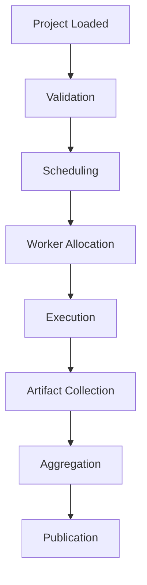
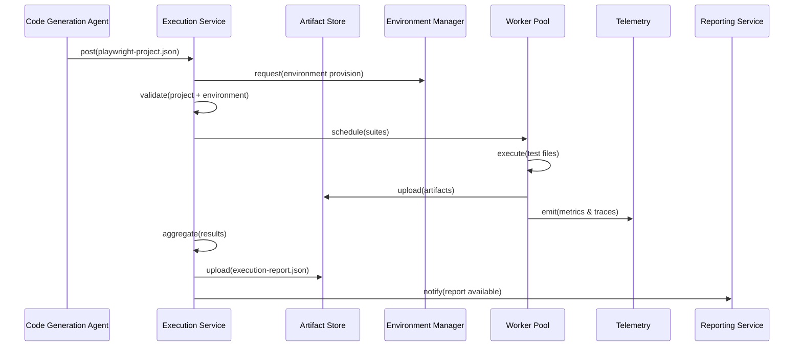
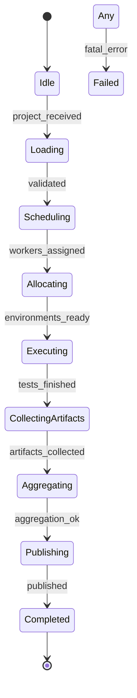
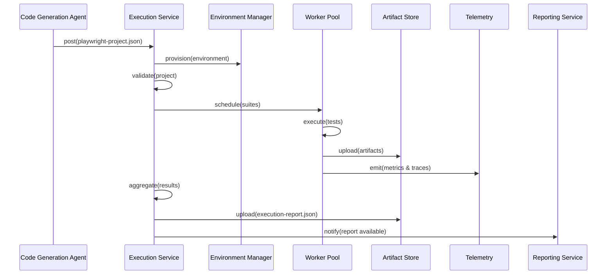
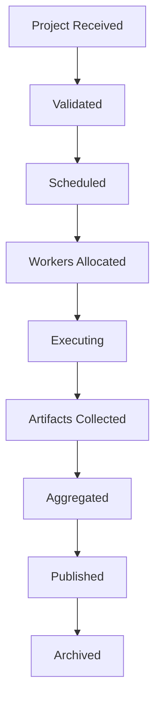
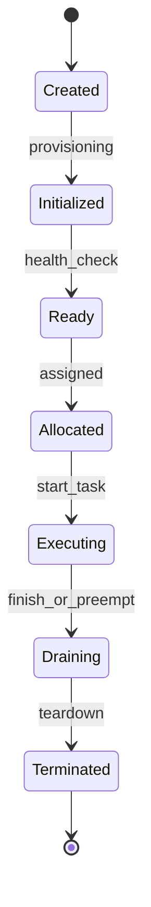
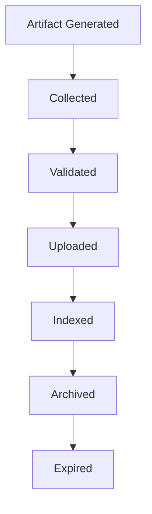

# Execution Service — Engineering Specification

This document is the authoritative engineering specification for the Execution Service. It defines how generated automation projects are scheduled, executed, observed, recovered and how runtime artifacts and execution reports are produced and published. The specification is implementation-independent and intended as the single source of truth for architects, operators, SREs, and governance stakeholders.

**Important:** The Execution Service is a **deterministic service**, not an AI agent. It orchestrates test execution, collects artifacts, and produces execution reports without AI inference.

Use numbered sections. DO NOT include implementation code, API endpoints, pseudocode, or framework-specific instructions. Diagrams are rendered using Mermaid where useful.

## 1. System context

1.1 Placement in the platform pipeline

- Trigger Agent → AI Crawler Agent → DOM + Runtime Discovery Agent → Inventory Aggregator Service → Test Design Agent → Code Generation Agent → **Execution Service** → Reporting Service

1.2 Integration points

- Upstream: Code Generation Agent (`playwright-project.json`), Artifact Store, Schema/Contract Registry, Template Registry, Secrets Manager, Environment Manager.
- Downstream: Reporting Service, Governance Dashboards, Artifact Catalog, CI/CD systems, Alerting and Incident Management.

## 2. Primary purpose

2.1 Primary responsibility

- Orchestrate, schedule, execute and monitor generated automation projects, collecting runtime artifacts, preserving traceability to generated sources, enforcing execution policies, and publishing authoritative `execution-report.json` artifacts.

2.2 Inputs and outputs

Consumes:
- `playwright-project.json` (generated project manifest)
- Execution Context, Environment Configuration
- Execution Policies, Retry Policies, Scheduling Policies
- Feature Flags, Resource Configuration, Secrets References

Produces:
- `execution-report.json` — canonical execution report
- Execution artifacts (logs, screenshots, videos, traces)
- Execution metadata and runtime metrics
- Runtime logs and trace metadata

## 3. Consumed contracts

The Execution Service consumes the following contracts and must validate them prior to scheduling or execution:

- `playwright-project.json` — project manifest with files, suites, dependencies, and trace links. Owner: Code Generation Team. Validation: schema validation and provenance checks.
- Execution Context — run-level metadata (tenant, runId, priority). Owner: Orchestration.
- Environment Configuration — environment templates, endpoints and resource descriptors. Owner: Environment Manager.
- Execution Policies — rules for execution (parallelism limits, sensitive data handling). Owner: Governance.
- Retry Policies — tuning parameters for retries and backoff. Owner: Platform Configuration.
- Scheduling Policies — queue priorities, tenant quotas, concurrency. Owner: Scheduler/Platform.
- Feature Flags — runtime toggles for execution behaviours. Owner: Feature Flag Service.
- Resource Configuration — CPU/memory/storage allocations and limits. Owner: Platform.
- Secrets References — references to secret stores for runtime injection. Owner: Secrets Manager.

All consumed contracts MUST be schema-validated, freshness-checked and provenance-verified before execution. Any mismatch is handled by the Failure Decision Matrix (Section 7).

## 4. Produced contract

Primary produced contract: `execution-report.json` — the authoritative report for an execution run.

4.1 Purpose

- Capture execution metadata, per-suite and per-test results, artifacts references, retry histories, failures, and traceability links to generated sources.

4.2 Ownership

- Owner: Execution Team; the contract schema is stewarded by the Contracts Team.

4.3 Versioning and validation

- Each `execution-report.json` MUST include `schemaVersion`, `executorVersion`, `runId`, `packageId`, `startTime`, `endTime`, and checksums for major artifacts.

4.4 Publication

- The report and artifacts are uploaded to Artifact Store, registered in the metadata catalog, and an `ExecutionReportCreated` event is emitted for downstream consumers.

4.5 Downstream consumers

- Reporting Service, Governance Dashboards, Incident Management, Audit & Compliance.

## 5. Responsibilities

The Execution Service is responsible for:

- Execution orchestration and lifecycle management.
- Suite scheduling and prioritization.
- Worker allocation, pools and lifecycle.
- Environment provisioning and teardown.
- Resource allocation and enforcement.
- Parallel and sequential execution patterns.
- Artifact collection (logs, screenshots, videos, traces, attachments).
- Retry orchestration according to policies.
- Failure recovery and checkpoint-based retries.
- Monitoring, telemetry and runtime tracing.
- Ensuring end-to-end traceability from generated sources to execution artifacts.
- Publishing `execution-report.json` and registering artifacts.

All operations must be deterministic where possible, auditable, and preserve provenance.

## 6. Non-responsibilities

The Execution Service MUST NOT:

- Design or generate tests (Code Generation Agent responsibility).
- Approve or edit test designs (Human Review Workflow responsibility).
- Modify generated project sources in a way that breaks traceability.
- Crawl applications or perform DOM discovery.

## 7. Execution model

Canonical execution model hierarchy:

- Project (`playwright-project.json`) → Suites → Workers → Test Files → Test Cases → Steps → Assertions

Execution semantics:

- Suites may be executed in parallel or sequentially depending on suite profiles and dependencies.
- Workers execute tasks isolatedly with defined resource constraints and environment contexts.

## 8. Execution pipeline

High-level pipeline stages:

- Project Loaded → Validation → Scheduling → Worker Allocation → Execution → Artifact Collection → Aggregation → Publication

Mermaid pipeline diagram:

Each stage emits events and metrics; intermediate artifacts are persisted for durability and resumability.

## 9. Worker model

Worker characteristics and lifecycle:

- Worker lifecycle: provision → warm-up → execute → teardown.
- Worker pools: grouped by capabilities (OS, browser versions, GPU availability), tenant affinity, and isolation requirements.
- Worker isolation: container or VM-level isolation per tenant or per sensitive workload.
- Worker allocation: scheduler matches suite requirements to worker capabilities and current load.
- Worker reuse: reuse warm workers for multiple suites to reduce startup costs while respecting isolation.
- Worker shutdown: graceful drain of running tasks, forced termination for health violations.

Workers must report health, resource usage and telemetry to the Execution Orchestrator.

## 10. Scheduling model

Scheduling primitives and policies:

- Execution queues: partitioned by tenant, priority and workload type.
- Priorities: support multi-level priorities; business-critical suites elevated.
- Concurrency: per-tenant and per-suite concurrency limits enforced by scheduler.
- Parallel execution: suites and tests flagged for parallelism are distributed across workers.
- Sequential execution: dependencies and order constraints maintained (e.g., setup/teardown ordering).
- Dependency-aware scheduling: respect declared dependencies between suites or tests.
- Dynamic scheduling: adapt to runtime conditions (worker failures, queue backpressure).

Scheduling must be policy-driven and observable.

## 11. Retry model

Retry strategies supported:

- Retry policies: per-project/per-suite settings defining retry limits and backoff strategies.
- Retry limits: configurable retries per test-case, per suite and per project.
- Exponential backoff: jittered backoff to avoid thundering herds.
- Partial retries: support retrying only failed tests rather than full suites when safe.
- Suite and project retries: re-run entire suite or project where required by policy.

Retry orchestration must preserve idempotency and traceability and record retry reasons and counts in the report.

## 12. Failure recovery model

Recovery strategies for common failures:

- Worker failure: detect via health checks; re-schedule in-flight tests to warm workers or new workers; persist partial artifacts.
- Environment failure: tear down and rebuild environment, re-run affected suites after verification.
- Timeouts: abort hung tests, collect diagnostics and optionally re-run per policy.
- Infrastructure failures: retry with exponential backoff; use alternate regions or failover clusters when configured.
- Artifact failures: persist partial artifacts locally and attempt background uploads.
- Partial execution: support partial success semantics and clearly mark incomplete runs in `execution-report.json`.
- Checkpoint recovery: use persisted checkpoints to resume long-running suites without restarting from scratch.

Recovery actions prioritize data integrity, auditability and minimal impact to other tenants.

## 13. Artifact model

Artifacts collected during execution:

- Logs: structured stdout/stderr with timestamps and context.
- Screenshots: per-step or on-failure; referenced by path and checksum.
- Videos: optional session recordings with retention metadata.
- Traces: distributed traces correlated with `trace_id` from generation and review phases.
- Console logs: captured browser console messages.
- Network logs: recorded requests/responses where policy permits.
- Attachments: arbitrary files (heap dumps, diagnostics) attached to runs.
- Metadata: artifact type, size, checksum, retention policy and trace links.

Artifact governance:

- Retention: configurable per-tenant and per-artifact type; support legal holds.
- Versioning: artifact versions tied to runs and preserved for audit.
- Access control: artifacts protected with tenant-scoped permissions and encryption at rest.

## 14. Traceability model

Trace chain for execution artifacts:

Generated File → Executed Test → Execution Step → Runtime Event → Artifact → Execution Report

Traceability guarantees:

- Each runtime artifact and test result MUST include `packageId`, `scenarioId`, `testCaseId`, `testFilePath`, and `runId` for end-to-end linkage.
- Distributed traces MUST propagate `trace_id` across scheduler, worker and telemetry systems.

Traceability supports impact analysis, root-cause investigation and compliance audits.

## 15. Environment model

Environment provisioning and lifecycle:

- Provisioning: allocate environment resources per suite requirements (platform, browser, services).
- Isolation: enforce tenant isolation (network namespaces, credentials, resource quotas).
- Secrets: inject secrets from Secrets Manager at runtime without persisting them in artifacts.
- Configuration: environment configured using templated snapshots supplied by Environment Manager.
- Cleanup: deterministic teardown with resource reclamation and temporary data purging.
- Reuse: safe environment reuse strategies for performance while respecting isolation policies.

Environment provisioning MUST be auditable and policy-driven.

## 16. Resource model

Resource abstractions and controls:

- CPU, memory, storage and network quotas per worker and per tenant.
- Limits and reservations: support soft and hard limits with throttling behaviours.
- Scaling: dynamic scaling of worker pools based on queue depth and SLOs.
- Resource tagging: label resources with tenant, runId and suite metadata for billing and governance.

Resource usage must be recorded and tied to runs for cost allocation and capacity planning.

## 17. Monitoring model

Monitoring and health signals:

- Execution monitoring: per-run progress, failures, and duration metrics.
- Worker monitoring: health, utilization, and lifecycle events.
- Queue monitoring: queue depths, wait times, and backpressure signals.
- Infrastructure monitoring: host/cluster health and autoscaling metrics.
- Alerting: thresholds for failures, high error rate, or resource exhaustion.

Monitoring outputs integrate with SRE dashboards and incident management systems.

## 18. Execution metrics

Key metrics to emit:

- `projects_executed_total`
- `suites_executed_total`
- `tests_executed_total`
- `tests_passed_total`
- `tests_failed_total`
- `retry_count_total`
- `worker_utilization`
- `execution_duration_seconds`
- `artifact_bytes_uploaded_total`

Metrics must be tagged by tenant, runId, generatorVersion and environment for observability and chargeback.

## 19. Execution report contract

High-level shape of `execution-report.json` (canonical):

- Run metadata: `runId`, `packageId`, `executorVersion`, `startTime`, `endTime`, `tenantId`, `environmentId`.
- Suites: array of suite results with `suiteId`, `status`, `duration`, `tests`.
- Tests: per-test results with `testCaseId`, `status`, `duration`, `attempts`, `artifacts`.
- Artifacts: references to logs, screenshots, videos, traces with checksums and storage paths.
- Failures: structured failure entries with `errorType`, `message`, `stackTrace`, `diagnosticsRef`.
- Retries: retry history with timestamps and reasons.
- Metrics: aggregated metrics for run and per-suite.
- Traceability: mapping back to generated files, lines and scenario IDs.
- Validation: execution-time validation results (environment, permissions, schema checks).

The report schema MUST be registered in the Schema/Contract Registry with examples and validation rules.

## 20. Execution flow

High-level sequence:

Receive Project → Validate → Schedule → Allocate Workers → Execute → Collect Artifacts → Aggregate Results → Publish Report

Mermaid sequence diagram:

## 21. Validation

Validation responsibilities include:

- Input validation: validate `playwright-project.json` schema and provenance.
- Environment validation: verify environment templates and secrets access.
- Execution validation: pre-check resource quotas, concurrency constraints and feature flags.
- Artifact validation: verify artifacts meet retention and type policies prior to publication.
- Report validation: validate `execution-report.json` against registered schema before publishing.

Validation failures are recorded in the run report and trigger appropriate recovery flows.

## 22. Error handling

Error handling patterns:

- Execution failures: capture diagnostics, mark test status, and trigger retries per policy.
- Worker failures: reallocate tasks and persist partial artifacts.
- Infrastructure failures: failover to healthy clusters or escalate to operators.
- Artifact failures: queue artifact persistence for background retry and alert owners.
- Publishing failures: persist report locally and retry publishing; create manual remediation tickets if persistent.

All error events must include structured diagnostics and link back to trace IDs and artifacts.

## 23. Retry strategy

Retry strategy features:

- Resume: resume interrupted runs from persisted checkpoints where supported.
- Retry: bounded automatic retries for transient failures with exponential backoff.
- Checkpoint: granular checkpoints at test, suite or environment level to reduce rework.
- Incremental reruns: ability to re-run only failed tests within a suite.
- Idempotency: ensure retried actions (artifact uploads, report publishing) are idempotent using checksums and unique IDs.

## 24. Observability

Observability requirements:

- Logs: structured per-run logs with `runId`, `suiteId`, `workerId` and contextual metadata.
- Metrics: emit execution metrics (see Section 18) with tenant and run tags.
- Tracing: propagate distributed traces across scheduler, workers and telemetry systems.
- Live dashboards: per-run progress and health metrics for SRE and operations.
- Audit trail: immutable records of scheduling and execution decisions for compliance.

Observability outputs feed SRE dashboards, incident management and governance reporting.

## 25. Security

Security controls for execution:

- Secrets management: inject secrets at runtime via Secrets Manager; do not persist secrets in artifacts.
- Credential isolation: per-tenant credential scoping and ephemeral credentials for environments.
- Tenant isolation: network and resource isolation to prevent cross-tenant leakage.
- Artifact protection: encrypt artifacts at rest and control access via RBAC.
- PII handling: detect and redact PII in artifacts and logs per tenant policy.
- Compliance: support legal holds and audit exports for regulated tenants.

Security operations must be auditable and integrated with governance policies.

## 26. Performance

Performance objectives (examples):

- Maximum concurrent projects: 1,000 across cluster.
- Maximum workers: scalable to 50,000 workers in large deployments.
- Execution throughput: support 10,000 test executions per minute (aggregate).
- Execution latency: p95 suite start latency < 2 minutes under typical load.
- Artifact upload latency: p95 < 30 seconds for small artifacts.

Performance targets should be partitioned by tenant and workload type and monitored continuously.

## 27. Scalability

Scalability strategies:

- Distributed execution: stateless schedulers with independent worker pools.
- Horizontal scaling: autoscale worker pools and schedulers based on queue depth.
- Queue partitioning: partition by tenant or region to reduce noisy neighbours.
- Dynamic scaling: scale ephemeral environments and workers to meet load.

Design must ensure fairness, tenant isolation and efficient resource utilization.

## 28. Dependencies

- Code Generation Agent — producer of generated projects.
- Artifact Store — storage for project artifacts and execution artifacts.
- Schema/Contract Registry — validation of project and report schemas.
- Queue/Broker — event delivery for scheduling and notifications.
- Telemetry systems — metrics, logs and tracing.
- Secrets Manager — runtime secrets injection.
- Environment Manager — provision environments and resources.

## 29. Internal components

- Execution Orchestrator — coordinates the end-to-end run lifecycle.
- Scheduler — selects suites and assigns workers.
- Worker Manager — manages worker pools and lifecycle.
- Environment Manager — provisions and maintains execution environments.
- Retry Manager — coordinates retries and checkpointing.
- Artifact Collector — aggregates artifacts from workers and validates them.
- Validator — runs environment and input validations.
- Publisher — publishes `execution-report.json` and artifacts to Artifact Store.
- Telemetry Manager — emits logs, metrics and traces.
- Health Manager — monitors system health and triggers remediation.

## 30. State machine

Canonical run state machine:

- `Idle` — awaiting project.
- `Loading` — fetching project and templates.
- `Scheduling` — scheduling suites.
- `Allocating` — allocating workers and environments.
- `Executing` — active execution of tests.
- `CollectingArtifacts` — workers uploading artifacts.
- `Aggregating` — synthesizing results and metrics.
- `Publishing` — persisting report and artifacts.
- `Completed` — successful completion and archive.
- `Failed` — terminal failures requiring operator action.

Mermaid state diagram:

## 31. Sequence diagram

Detailed interaction diagram:

## 32. Quality attributes

- Reliability: deterministic retries and checkpointing with strong data durability.
- Scalability: horizontal scale across workers and clusters.
- Performance: bounded start latencies and efficient artifact handling.
- Availability: multi-region failover and graceful degradation.
- Security: tenant isolation, secrets management and PII controls.
- Traceability: end-to-end links from generated sources to execution artifacts.
- Recoverability: robust failure recovery and automated remediation pathways.
- Observability: rich telemetry for operations and governance.

## 33. Acceptance criteria

The Execution Service specification is accepted when it:

1. Defines responsibilities and non-responsibilities clearly.
2. Documents the execution lifecycle, pipeline and worker models.
3. Specifies scheduling, retry and failure recovery models.
4. Defines artifact model and `execution-report.json` contract.
5. Includes execution flow, state machine and sequence diagrams.
6. Specifies validation, error handling and retry strategies.
7. Defines observability, security, performance and scalability requirements.
8. Provides traceability guarantees and integration points.

---

This specification is the authoritative engineering blueprint for the Execution Service. Implementation teams must produce ADRs for any deviations and publish contract schema changes through the contract lifecycle process documented in `docs/specs/001-project-setup.md`.

## 34. Consumed and Produced Contracts

This section provides a concise contract matrix describing the primary artifacts that the Execution Service consumes and produces, their purpose, stewarding owners, versioning metadata, and immediate downstream consumers.

| Contract | Direction | Purpose | Owner | Contract Version | Downstream Consumer |
|---|---|---|---:|---|---|
| `playwright-project.json` | Consumed | Generated project manifest: suites, test files, dependencies, and trace links used to drive execution. | Code Generation Team | `schemaVersion` (registered) | Execution Service, Scheduler, Worker Manager |
| Execution Context | Consumed | Run-level metadata and overrides (tenant, `runId`, priority, bookkeeping). | Orchestration / Trigger Team | `schemaVersion` | Execution Service, Scheduler |
| Environment Configuration | Consumed | Environment templates, endpoints, resource descriptors for provisioning execution environments. | Environment Manager | `schemaVersion` | Execution Service, Worker Manager |
| Execution Policies | Consumed | Governance rules (parallelism, PII handling, retention, access controls). | Governance / Policy Team | `policyVersion` | Execution Service, Scheduler, Retry Manager |
| Retry Policies | Consumed | Retry/backoff definitions and thresholds used by Retry Manager. | Platform Configuration Team | `policyVersion` | Retry Manager, Execution Service |
| Scheduling Policies | Consumed | Queue, quota and prioritization rules for fair scheduling. | Scheduler Team | `policyVersion` | Scheduler, Execution Orchestrator |
| Feature Flags | Consumed | Runtime toggles that influence execution behaviour. | Feature Flag Service | runtime | Execution Service, Workers |
| Resource Configuration | Consumed | Resource allocations and constraints (CPU, memory, storage) per tenant/workload. | Platform/Infra Team | `schemaVersion` | Scheduler, Worker Manager |
| Secrets References | Consumed | References to secrets for runtime injection (no secret material transported in contracts). | Secrets Manager | reference-based | Environment Manager, Workers |
| `execution-report.json` | Produced | Authoritative execution report capturing results, artifacts, retry histories and traceability. | Execution Team (owner); Contracts Team (schema steward) | `schemaVersion` (registered) | Reporting Service, Governance Dashboards, Audit & Compliance, Artifact Catalog, CI systems |

Contract lifecycle notes:

- Contract ownership: The `Owner` column denotes the steward responsible for schema evolution, documentation, and communication to consumers. Owners MUST register schema changes in the Schema/Contract Registry and maintain migration guidance.
- Version negotiation: Producers MUST include explicit contract metadata (`schemaVersion`, `producerVersion`, `x-contract-version` or equivalent) in produced artifacts. Consumers MUST check supported versions and follow the platform's version negotiation policy (backward-compatibility acceptance, graceful degradation, or rejection with clear error semantics).
- Schema validation: All inbound contracts MUST be validated against canonical schemas held in the Schema/Contract Registry prior to scheduling or execution. Validation failures route through the Failure Decision Matrix.
- Backward compatibility: Producers SHOULD preserve backward-compatible changes (additive fields, non-breaking relaxations). Breaking changes MUST follow the contract lifecycle: deprecation announcement, consumer migration windows, and explicit major-version bump with migration plan.
- Publication workflow: Producers publish schema changes to the Schema/Contract Registry with examples, change notes, compatibility assertions and CI contract tests. After registration, producers and consumers run CI contract validation (producer tests, consumer tests) and update `producerVersion` and `schemaVersion` in artifacts.

## 35. Preconditions

The Execution Service MUST verify the following preconditions before accepting a project for scheduling or execution. Preconditions are prerequisites for deterministic execution and recoverability.

- Project manifest available (`playwright-project.json` published and accessible).
- Schema validated (manifest and supporting contracts validate against registered schemas).
- Environment available (target environment template and required endpoints resolvable).
- Worker pool operational (sufficient healthy workers for requested parallelism).
- Queue operational (message broker and scheduling queues reachable and healthy).
- Artifact Store operational (storage writable with required permissions and capacity).
- Secrets Manager operational (runtime secret references resolvable and accessible).
- Environment Manager operational (provisioning service reachable and healthy).
- Resource quotas allocated (tenant and workload quotas permit the requested execution).
- Scheduling policies loaded and resolvable (policies available to scheduler at time of scheduling).

If any precondition is unmet, the Execution Service MUST apply the Failure Decision Matrix to decide whether to delay, retry, or fail the request.

## 36. Postconditions

On successful completion of an execution pipeline run, the following postconditions MUST be achieved and verifiable by downstream consumers:

- Execution completed (suites and tests executed according to policy).
- `execution-report.json` generated and validated against the registered schema.
- Runtime metrics emitted and available in telemetry backends.
- Artifacts uploaded to the Artifact Store and registered in the metadata catalog.
- Traceability preserved (all artifacts and results include `packageId`, `runId`, `testCaseId`, and lineage links back to generated sources).
- Execution metadata persisted for audit and billing (run-level and suite-level records stored durably).
- Report published (report artifact available and `ExecutionReportCreated` event emitted).
- Audit records generated for governance, including who triggered the run and policy decisions taken.

Partial success is an acceptable postcondition when failures are recoverable or when policies allow partial completion; such cases MUST be clearly documented in the `execution-report.json` and surfaced to consumers.

## 37. Failure Decision Matrix

The table below codifies common failure scenarios, their categories, whether they are retryable, the recommended recovery action, the canonical event emitted for observability and automation, and the expected final state recorded in the run lifecycle.

| Failure Scenario | Category | Retryable | Recovery Action | Event | Final State |
|---|---|---:|---|---|---|
| Project Manifest Missing | Input Error | No | Emit alert to producer; mark run failed; create remediation ticket. | `ProjectManifestMissing` | `Failed` (terminal) |
| Schema Validation Failure | Input Validation | Conditional | If transient (registry outage) retry; otherwise reject manifest and notify producer with validation errors. | `SchemaValidationFailed` | `Failed` (requires producer action) |
| Worker Unavailable | Infrastructure | Yes | Re-schedule to other healthy workers, scale worker pool if autoscaling allowed; emit health alert if capacity insufficient. | `WorkerUnavailable` | `Retrying` / `AwaitingResources` |
| Worker Crash | Runtime | Yes (bounded) | Reassign in-flight tests to other workers; collect crash diagnostics; retry according to retry policy; mark attempts in report. | `WorkerCrashed` | `Retrying` or `PartialSuccess` / `Failed` if retries exhausted |
| Queue Failure | Infrastructure | Conditional | Failover to secondary broker if configured; persist run state to durable store; backoff and retry; alert SRE if prolonged. | `QueueFailure` | `AwaitingResources` / `Degraded` |
| Environment Failure | Infrastructure | Yes (policy-bound) | Tear down and reprovision environment; re-run affected suites after environment verification; escalate if repeated failures. | `EnvironmentFailure` | `Retrying` / `PartialSuccess` |
| Environment Provisioning Failure | Provisioning | Yes (bounded) | Attempt reprovision with backoff; fallback to alternate environment template or region; notify operators if persistent. | `EnvironmentProvisioningFailed` | `Failed` (after bounded retries) |
| Execution Timeout | Runtime | Conditional | Abort hung test(s), capture diagnostics; if policy permits, retry failed tests or rerun suite. | `ExecutionTimeout` | `PartialSuccess` / `Failed` |
| Artifact Upload Failure | Data Persistence | Yes | Buffer artifacts locally; retry upload asynchronously; switch to alternate storage endpoint if configured; alert on prolonged failure. | `ArtifactUploadFailed` | `PartialSuccess` (artifacts pending) |
| Artifact Corruption | Data Integrity | No (requires remediation) | Mark artifact corrupted; attempt re-collection or re-execution of affected tests; record integrity failure and alert owners. | `ArtifactCorruptionDetected` | `Failed` (requires re-run or manual remediation) |
| Report Publication Failure | Infrastructure | Yes | Persist report locally and retry publication; if persistent, surface to operators for manual publish; create remediation ticket. | `ReportPublicationFailed` | `AwaitingRemediation` / `Completed (manual)` |
| Telemetry Failure | Observability | Yes | Buffer telemetry events and retry; degrade observability until recovered; create alerts if critical signals absent. | `TelemetryFailure` | `Operational (reduced observability)` |
| Unexpected Runtime Exception | Runtime | Conditional | Capture diagnostics, attempt bounded retries or safe termination; escalate to engineering if recurring. | `UnexpectedRuntimeException` | `Failed` (requires investigation) |

Notes:

- The matrix is normative: each failure SHOULD have an automated handler where safe, record structured diagnostics, and emit the canonical event named in the `Event` column.
- Retry bounds, backoff policies, and escalation thresholds are provided by `Retry Policies` and `Execution Policies` contracts and MUST be configurable per-tenant or per-project.

## 38. Execution Lifecycle

The Execution Service follows a deterministic and auditable lifecycle from project reception to archival. The canonical pipeline is:

Project Received
↓
Validated
↓
Scheduled
↓
Workers Allocated
↓
Executing
↓
Artifacts Collected
↓
Aggregated
↓
Published
↓
Archived

Mermaid lifecycle diagram:

Each stage records timestamps, responsible components, and policy decisions in the run metadata to support audit, replay and deterministic recovery.

## 39. Worker Lifecycle

Workers progress through an explicit lifecycle managed by the Worker Manager and visible to the Scheduler and Orchestrator.

Worker Created
↓
Initialized
↓
Ready
↓
Allocated
↓
Executing
↓
Draining
↓
Terminated

Mermaid lifecycle diagram:

Worker lifecycle policies MUST define warm-up times, health checks, maximum task durations, and graceful drain behaviour to preserve determinism and allow safe scaling.

## 40. Artifact Lifecycle

Artifacts emitted by workers follow a governed lifecycle to ensure integrity, discoverability and retention.

Artifact Generated
↓
Collected
↓
Validated
↓
Uploaded
↓
Indexed
↓
Archived
↓
Expired

Mermaid lifecycle diagram:

Artifact governance rules MUST specify retention periods, legal-hold behavior, checksum validation, indexing metadata and access controls. Validation steps include schema checks (where applicable), checksum verification and policy-based redaction for PII.

## 41. Execution Confidence Model

The Execution Service maintains a multidimensional confidence model used to communicate the trustworthiness of produced outputs. Confidence flows through the pipeline and is reflected in the final `execution-report.json`.

Core confidence tiers:

- Project Confidence: confidence that the `playwright-project.json` manifest is complete, validated and provenance-verified.
- Execution Confidence: confidence that the run executed under stable environment conditions (worker health, environment readiness, no infra degradation).
- Artifact Confidence: confidence in the integrity, completeness and admissibility of collected artifacts (checksums, upload success, non-corruption).
- Report Confidence: aggregate confidence in the final `execution-report.json`, derived from inputs above plus validation and aggregation integrity.

Confidence propagation and degradation:

- Confidence is propagated from Project → Execution → Artifact → Report. A deficiency at any stage reduces downstream confidence.
- Each retry, timeout or infrastructure incident reduces Execution Confidence by a policy-defined weight; repeated incidents can move confidence from `High` → `Medium` → `Low`.
- Artifact failures (corruption, missing uploads) reduce Artifact Confidence and can render Report Confidence `Low` until artifacts are re-collected or verified.

Confidence thresholds and actions:

- High confidence: auto-publish report and mark as trusted for downstream automation.
- Medium confidence: publish with warnings and attach diagnostic metadata; recommend re-run for critical suites.
- Low confidence: require human review or block promotion to downstream automated workflows.

Retry impact and downstream usage:

- Retries may improve Execution Confidence if they result in successful, stable outcomes, but each retry also signals instability and reduces confidence weight unless corrective actions were taken (environment reprovision, worker reprovision).
- Downstream consumers (reporting, governance) MUST consider the `reportConfidence` field when automating actions such as promoting tests to CI/CD gates or triggering alerts.

## 42. SLA / SLO

The Execution Service is governed by measurable SLAs and SLOs that the platform operator and tenants agree on. The following are recommended production SLOs (examples) that should be tailored per deployment tier and tenant agreement:

- Availability: 99.9% uptime for core orchestration and scheduling services (monthly).
- Execution Throughput: support baseline throughput of 10,000 test executions per minute (aggregate) with scaling targets as defined per deployment.
- Worker Startup Time: p95 worker ready time < 60 seconds (warm pools) / < 180 seconds (cold starts).
- Execution Latency: p95 suite start latency < 2 minutes under typical load.
- Artifact Upload Latency: p95 small-artifact upload < 30 seconds.
- Report Publication Latency: p95 `execution-report.json` publication < 60 seconds after aggregation completes.
- Maximum Concurrent Projects: baseline 1,000 concurrent projects across cluster (scale target configurable).
- Maximum Workers: scale to 50,000 workers in large deployments (architecture-dependent).
- Recovery Time Objective (RTO): critical scheduling path recovery < 15 minutes for most infra failures.
- Recovery Point Objective (RPO): persistent run-state RPO < 5 minutes for scheduling and checkpointing systems.
- Error Budget: defined per SLO; example — for 99.9% availability, monthly error budget ≈ 43.2 minutes.

Operational notes:

- SLO targets should be translated into concrete metrics instrumented in telemetry (availability, queue latency, worker warm-up, throughput, artifact latency). Error budget burn and alerts MUST be integrated into SRE runbooks and capacity planning.

## 43. Assumptions

The Execution Service design and guarantees assume the following foundational capabilities are present and operational in the platform:

- Project manifest validated and registered in the Schema/Contract Registry prior to execution.
- Environment Manager is operational and can provision required environments on demand.
- Worker pools are available and healthy to meet requested concurrency.
- Secrets Manager is operational and accessible for runtime secret injection.
- Artifact Store is available with sufficient capacity and access controls.
- Schema/Contract Registry is operational and accessible for validation and version negotiation.
- Queue / Broker is operational for scheduling and notifications.
- Telemetry and tracing backends are operational for diagnostics and observability.

Any deviation from these assumptions increases the likelihood of degraded confidence, longer recovery windows, and manual remediation.

## 44. Related Specifications

The Execution Service integrates tightly with platform components and the following specifications and contracts serve as the normative integration points:

- [docs/specs/001-project-setup.md](docs/specs/001-project-setup.md)
- [docs/specs/002-trigger-agent.md](docs/specs/002-trigger-agent.md)
- [docs/specs/003-ai-crawler-agent.md](docs/specs/003-ai-crawler-agent.md)
- [docs/specs/004-dom-runtime-discovery-agent.md](docs/specs/004-dom-runtime-discovery-agent.md)
- [docs/specs/005-inventory-aggregator.md](docs/specs/005-inventory-aggregator.md)
- [docs/specs/006-test-design-agent.md](docs/specs/006-test-design-agent.md)
- [docs/specs/007-human-review.md](docs/specs/007-human-review.md)
- [docs/specs/008-code-generation-agent.md](docs/specs/008-code-generation-agent.md)
- [docs/specs/010-reporting-agent.md](docs/specs/010-reporting-agent.md)
- [contracts/playwright-project.json](contracts/playwright-project.json)
- [contracts/execution-report.json](contracts/execution-report.json)

Integration summary:

The Execution Service consumes `playwright-project.json` artifacts produced by the Code Generation Agent, validates them against the Schema/Contract Registry, and schedules execution using the platform Scheduler and Worker Manager. During execution it coordinates with the Environment Manager for provisioning, the Secrets Manager for runtime injection, and the Artifact Store for artifact persistence. Upon completion the Execution Service publishes `execution-report.json` and emits the `ExecutionReportCreated` event for the Reporting Service and governance consumers. The Execution Service therefore functions as the bridge that deterministically transforms `playwright-project.json` into the canonical `execution-report.json` while enforcing policy, traceability and observability requirements across the platform.

