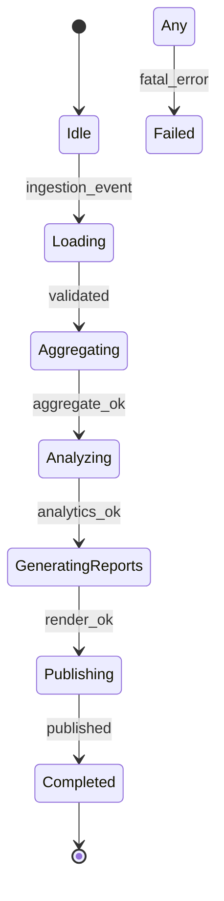
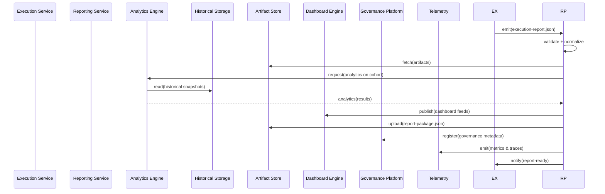
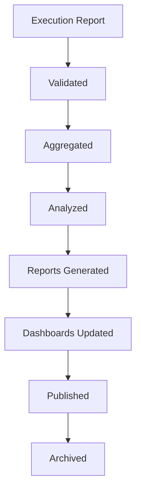
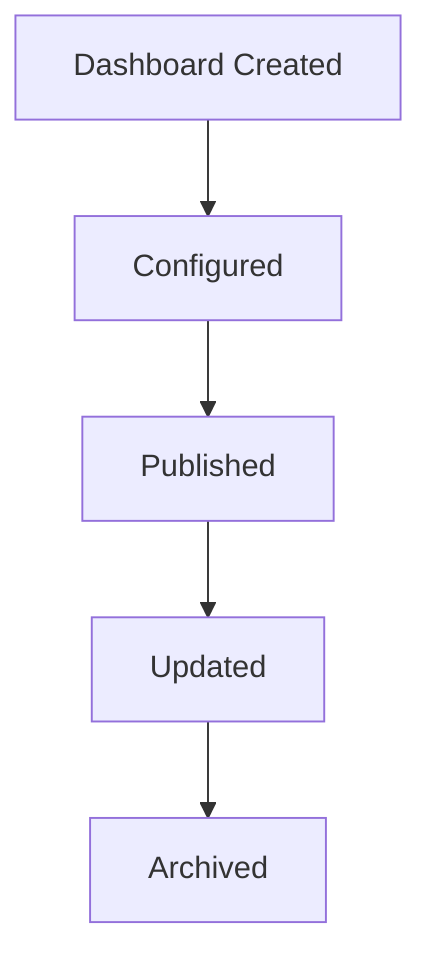
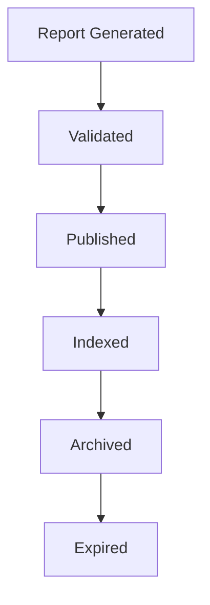

# Reporting Service — Engineering Specification

This document is the authoritative engineering specification for the Reporting Service. It defines how execution outputs, analytics, governance insights, operational metrics, historical trends, audit records and business intelligence are aggregated, validated, stored, and published as canonical reporting artifacts. The specification is implementation-independent and serves as the single source of truth for architects, SREs, analytics teams, governance, and product stakeholders.

**Important:** The Reporting Service is a **deterministic service**, not an AI agent. It performs data aggregation, analytics computation, and report generation without AI inference.

Use numbered sections. DO NOT include implementation code, API endpoints, pseudocode, or framework-specific instructions. Diagrams are rendered using Mermaid where useful.

## 1. System context

1.1 Placement in the platform pipeline

- Trigger Agent → AI Crawler Agent → DOM + Runtime Discovery Agent → Inventory Aggregator Service → Test Design Agent → Code Generation Agent → Execution Service → **Reporting Service**

1.2 Integration points

- Upstream: Execution Service (`execution-report.json`), Artifact Store, Schema/Contract Registry, Telemetry and Tracing backends, Governance Platform, Feature Flag Service, Configuration Snapshots, Historical Storage.
- Downstream: Dashboards, BI consumers, Governance dashboards, Compliance exports, Executive reporting consumers, Alerting and Notification systems, Data warehouses and analytics consumers.

## 2. Primary purpose

2.1 Primary responsibilities

- Aggregate execution results and runtime artifacts into canonical, validated reporting artifacts.
- Generate multi-level analytics: operational, historical, trend, governance and executive reports.
- Provide dashboards and data feeds for BI and governance systems.
- Maintain audit trails and compliance-ready exports.
- Provide deterministic, reproducible report packages (`report-package.json`) and attach traceability to source `execution-report.json` artifacts.

2.2 Inputs and outputs

Consumes:
- `execution-report.json` (authoritative execution reports)
- Execution metadata (run-level, suite-level)
- Runtime metrics and traces
- Execution logs and artifact metadata
- Governance metadata and policy decisions
- Feature Flags and Configuration Snapshots
- Historical snapshots and prior report packages

Produces:
- `report-package.json` — canonical reporting package
- Executive reports and executive-ready summaries
- Dashboards and time-series feeds
- Analytics artifacts (aggregations, derived metrics, forecasts)
- Audit and compliance reports
- Operational and historical metrics for SRE and capacity planning

## 3. Consumed contracts

The Reporting Service consumes the following contracts. For each, the Reporting Service validates schema conformance, provenance, and freshness prior to ingest.

- `execution-report.json` — canonical execution result produced by Execution Service. Purpose: single-run authoritative source for results, artifacts and traceability. Owner: Execution Team. Validation: strict schema validation and provenance checks.
- Execution Metadata — enriched metadata for runs (tenant, runId, projectId, environment). Purpose: contextualize analytics and for multi-run aggregation. Owner: Orchestration/Trigger Team.
- Runtime Metrics — time-series metrics emitted by Execution Service and Workers (counters, gauges, histograms). Purpose: operational analytics and SLO tracking. Owner: Telemetry/Observability Team.
- Execution Logs — structured logs and contextual logging streams. Purpose: diagnostics and failure analysis. Owner: Execution Team / Workers.
- Trace Metadata — distributed trace events and trace IDs. Purpose: correlate user actions, generation pipeline and execution artifacts. Owner: Telemetry Team.
- Artifact Metadata — storage paths, checksums, retention, artifact types. Purpose: artifact discoverability, indexing and governance. Owner: Artifact Store/Execution Team.
- Governance Metadata — policy decisions, approvals, human-review annotations. Purpose: governance reporting and audit. Owner: Governance/Human Review Team.
- Feature Flags & Configuration Snapshot — runtime configuration used during execution. Purpose: explainability and experiment analysis. Owner: Feature Flag Service / Config Team.

Validation, versioning and compatibility requirements for consumed contracts follow the platform contract lifecycle policies documented in [docs/specs/001-project-setup.md](docs/specs/001-project-setup.md).

## 4. Produced contract

Primary produced artifact: `report-package.json` — a canonical, versioned package that bundles analytics outputs, report manifests, dashboards references, historical snapshots and audit records for a cohort of runs or time window.

4.1 Purpose

- Provide a reproducible, validated bundle that downstream consumers (executive dashboards, BI, compliance systems) can consume to present, analyze, and archive reporting outcomes.

4.2 Ownership

- Owner: Reporting Team (operational steward). Schema steward: Contracts Team.

4.3 Versioning and validation

- `report-package.json` MUST include `schemaVersion`, `producerVersion`, `timestamp`, `cohortId` or `reportId`, and references to `execution-report.json` artifacts it was derived from.
- The Reporting Service MUST validate generated `report-package.json` against the registered schema in the Schema/Contract Registry prior to publication.

4.4 Publication and downstream consumers

- Publication: upload to Artifact Store, register in metadata catalog, emit `ReportPackageCreated` event.
- Downstream consumers: Dashboards, BI and Analytics systems, Governance and Compliance, Data Warehouses, Executive consumers and SRE dashboards.

## 5. Responsibilities

The Reporting Service is responsible for:

- Result aggregation: ingest and aggregate single-run `execution-report.json` into multidimensional aggregates.
- Analytics generation: compute derived metrics, trends, quality metrics, forecasting and anomaly detection.
- Historical reporting: snapshot time-series and support historical comparisons and baselines.
- Trend analysis: produce trend lines and forecasting models for pass/fail rates, performance, and coverage.
- Operational reporting: provide SRE-facing metrics (queue lags, worker utilization, error budgets).
- Executive reporting: distilled executive summaries with business risk indicators.
- Governance reporting: policy compliance, reviewer decisions, contract violations, and audit trails.
- Compliance reporting: regulatory exports, data retention and legal-hold support.
- Audit reporting: maintain immutable trails of inputs, transformations and publication steps.
- Dashboard generation: create and publish dashboard manifests and data feeds.
- Metrics aggregation: normalise, tag and index metrics across tenants and generator versions.
- Traceability reporting: maintain lineage from `report-package.json` back to `execution-report.json` and generated sources.
- Publishing: ensure deterministic publication of `report-package.json` and associated artifacts.

All responsibilities mandate deterministic, auditable processing with clear provenance metadata.

## 6. Non-responsibilities

The Reporting Service MUST NOT:

- Execute tests or schedule executions.
- Generate or modify tests.
- Approve or human-review tests.
- Perform code generation.
- Crawl applications or perform DOM discovery.

Reporting Service focuses exclusively on deterministic aggregation, analytics and publication.

## 7. Reporting model

Canonical reporting flow:

Execution Results
↓
Aggregation
↓
Analytics
↓
Insights
↓
Reports
↓
Dashboards

Notes:

- Aggregation uses validated `execution-report.json` artifacts as the canonical input.
- Analytics produce both batch (cohort-based) and incremental (real-time / near-real-time) outputs depending on SLOs and tenant needs.

## 8. Analytics model

Analytic capabilities the Reporting Service provides:

- Execution analytics: per-run pass/fail rates, flaky-test detection, failure clusters.
- Trend analytics: time-series for pass rates, failure rates, and throughput.
- Historical analytics: baselines, version comparisons and regression detection.
- Failure analytics: root-cause clustering and impact assessments.
- Retry analytics: retry-induced success rates, retry costs and volatility.
- Coverage analytics: mapping tests to application inventory and coverage heatmaps.
- Quality analytics: defect density, flaky-test ratios, test reliability scores.
- Performance analytics: execution durations, per-step latency distributions, resource usage correlations.
- Governance analytics: policy violations, reviewer decision distributions, contract compliance metrics.

Analytics outputs are annotated with confidence scores (see Section 15) and provenance links to source runs and artifacts.

## 9. Report model

Report types and their purpose:

- Executive reports: condensed, high-level summaries for stakeholders with risk signals and top-line KPIs.
- Operational reports: run-level and suite-level detail for SRE and engineers to triage and act.
- Historical reports: multi-period comparisons, baselines, and trend annotations.
- Trend reports: forecasts and anomaly detection outputs.
- Compliance reports: exports formatted for regulatory requirements with PII redaction and legal-hold markers.
- Audit reports: immutable logs of decisions, publishing records and data lineage.
- Developer reports: test-level detail, failure traces and reproduction artifacts.
- Management reports: aggregated metrics for program-level monitoring.

Each report in the `report-package.json` includes metadata: `reportId`, `generatedBy`, `cohort`, `timeWindow`, `confidence`, `dependencies` and `provenance`.

## 10. Dashboard model

Dashboard categories and typical consumers:

- Executive dashboards: KPIs, health indicators, risk summaries (C-level).
- Operational dashboards: live run progress, worker pools, queue latency (SRE/ops).
- Engineering dashboards: test reliability, failure clusters, flaky-test hotlists (developers).
- Governance dashboards: policy compliance, approvals and contract drift (governance teams).
- Quality dashboards: test coverage and quality indices (QA leads).
- Historical dashboards: archived comparisons and baselines.

Dashboards are defined by manifests and data feeds; manifests are published as part of `report-package.json` with pointers to indexed time-series and artifact references.

## 11. Trend model

Trend model capabilities:

- Execution trends: rolling averages of pass/fail rates per project and tenant.
- Pass rate trends: windowed analysis with seasonality and smoothing.
- Failure trends: detection of growing failure classes and their impact.
- Performance trends: latency trends, resource consumption over time.
- Coverage trends: coverage growth or decline mapped to inventory.
- Quality trends: test reliability scores and their evolution.
- Forecasting: short-term forecasts for expected pass rates and resource needs.

Trend models MUST be versioned and archived to allow re-computation with historical model parameters.

## 12. Audit model

Audit requirements and artifacts:

- Execution audit: immutable record linking `report-package.json` to source `execution-report.json` artifacts and the decisions applied during aggregation.
- Governance audit: records of policy evaluations, reviewer decisions, and approval timelines.
- Contract audit: history of schema versions and validation results used in report generation.
- Artifact audit: checksums, storage references, retention markers and legal-hold flags.
- Security and compliance audit: access logs and data redaction events.

Audit outputs are exportable to compliance archives and must support courtroom-grade retrieval (immutable, timestamped, signed when required by policy).

## 13. Metric model

Metric domains and examples:

- Execution metrics: runs completed, run durations, pass/fail counts.
- Quality metrics: flaky-test ratio, mean time to detect failure.
- Coverage metrics: percentage of inventory exercised by automated tests.
- Reliability metrics: success rates and retry overhead.
- Performance metrics: p50/p95/p99 durations for suites and tests.
- Business metrics: test coverage for revenue-critical paths, risk exposure.
- Platform metrics: reporting pipeline latency, aggregation throughput, storage usage.

Metrics MUST be tagged by `tenant`, `project`, `generatorVersion`, `reportId`, and `timeWindow` for slicing and chargeback.

## 14. Traceability model

Traceability chain:

`execution-report.json` → Analytics artifacts → Dashboard data feeds → `report-package.json` → Executive Report → Business Decision

Traceability guarantees:

- Each derived analytic, dashboard metric and exported report MUST include provenance links to the original `execution-report.json` artifacts, including `runId`, `packageId`, `testCaseId`, `artifact checksums` and `trace_id` when available.
- The Reporting Service MUST preserve transformation metadata (aggregation windows, filter criteria, model versions) to enable deterministic recomputation and auditing.

## 15. Historical model

Historical capabilities and policies:

- Snapshots: periodic or event-driven snapshots of aggregated metrics and report packages.
- Time series: normalized storage of metrics to support long-range trend analysis.
- Version comparisons: ability to compare reports across `schemaVersion` and `producerVersion` boundaries.
- Baseline comparisons: reference baselines stored per-project and per-release.
- Historical archive: long-term retention with tiered storage and legal-hold support.
- Retention: tenant-configurable retention policies with governance overrides.

Historical archives MUST be indexed for efficient retrieval and support replay of analytic computations using archived model parameters.

## 16. Report package contract

The `report-package.json` contract bundles reports, analytics artifacts, dashboard manifests and audit metadata. Key inclusions:

- Manifest: `reportId`, `schemaVersion`, `producerVersion`, `timeWindow`, `cohortId`.
- Inputs: list of `execution-report.json` references with checksums and provenance.
- Analytics: derived metric snapshots, aggregations and model metadata.
- Reports: summaries, executive PDFs or structured content pointers.
- Dashboards: manifests and data feed references.
- Metrics: aggregated time-series and pointers to TSDB keys.
- Audit: transformation logs, validation results and signed publication records.
- Governance: policy evaluation results and reviewer annotations.

`report-package.json` MUST be registered in the Schema/Contract Registry and accompanied by example payloads and validation rules.

## 17. Reporting pipeline

High-level pipeline stages:

Execution Report
↓
Ingest & Validate
↓
Normalize & Index
↓
Aggregate & Enrich
↓
Analytics & Model Evaluation
↓
Report & Dashboard Generation
↓
Publish & Archive

Notes:

- The pipeline supports both near-real-time processing for operational dashboards and batch cohort processing for historical packages.
- Each stage emits deterministic events and stores intermediate artifacts for recomputation and audit.

## 18. Validation

Validation responsibilities:

- Input validation: ensure `execution-report.json` and all inputs conform to registered schemas and pass provenance checks.
- Analytics validation: verify derived metrics against sanity bounds (non-negative rates, expected ranges) and flag anomalies.
- Report validation: schema-validate `report-package.json` prior to publication.
- Dashboard validation: verify data feed availability and integrity for dashboard widgets.
- Contract validation: ensure cross-contract consistency (e.g., `packageId` referenced exists and checksums match).

Validation failures MUST be recorded in the audit log and propagate to the report's `confidence` field.

## 19. Error handling

Error classes and recovery behaviours:

- Aggregation failures: fail fast for corrupted inputs; attempt re-ingest from original `execution-report.json` source; emit `AggregationFailed` and cascade to retries.
- Analytics failures: isolate failed analytic computations; continue publishing baseline reports with diagnostic annotations; schedule recomputation.
- Publishing failures: persist `report-package.json` locally and retry; if persistent, alert operators and provide manual publish workflows.
- Dashboard failures: degrade gracefully showing last-known-good snapshots and flag staleness.
- Storage failures: failover to alternate storage tiers or regions based on retention policies.

All error events MUST include diagnostic metadata and links to source artifacts for rapid investigation.

## 20. Retry strategy

Retry and resume features:

- Retry: bounded retries for transient ingestion and publishing errors with exponential backoff.
- Resume: support resumption of interrupted aggregation pipelines using persisted checkpoints.
- Checkpoint: persist intermediate aggregation state at defined boundaries to allow partial recompute.
- Partial regeneration: allow recomputation of specific reports or cohorts without reprocessing the entire historical set.
- Idempotency: ensure repeated processing of the same `execution-report.json` or partial results is idempotent using checksums and unique ids.

Retry policies are configurable per-tenant and should be stored in the platform's `Retry Policies` contract.

## 21. Observability

Observability requirements:

- Logs: structured, correlated logs with `reportId`, `cohortId` and `runId` tags.
- Metrics: internal metrics for pipeline throughput, latency, error rates and backlog.
- Tracing: distributed traces to correlate ingestion, aggregation and publication across services.
- Analytics telemetry: expose model evaluation metrics, drift detection and anomaly signals.
- Dashboard telemetry: widget health, feed lag and staleness indicators.

Instrumentation SHOULD allow drill-down from executive KPI to the raw `execution-report.json` artifacts.

## 22. Security

Security controls and requirements:

- Access control: RBAC for report generation, viewing and publication; tenant isolation enforced.
- PII handling: redaction and masking policies applied during aggregation and prior to publication where needed.
- Data protection: encrypt data at rest and in transit; apply tenant-specific key management where required.
- Compliance: support legal-hold, export controls and retention policy enforcement.
- Audit logging: immutable logs of all publication and governance actions.

Security controls MUST be auditable and integrated with governance policies.

## 23. Performance

Recommended measurable objectives (examples):

- Analytics throughput: process 10,000 execution reports per minute for operational pipelines.
- Dashboard latency: p95 widget refresh < 30 seconds for near-real-time dashboards.
- Report generation latency: p95 cohort package generation < 10 minutes for medium cohorts.
- Historical query latency: p95 time-series query < 5 seconds for common slices.
- Aggregation throughput: support incremental aggregation at scale with horizontal scaling.

Targets should be partitioned by tenant SLA and class of workload (operational vs batch).

## 24. Scalability

Scalability approaches:

- Distributed analytics: partitioning and sharding of aggregation workloads by tenant, project or time window.
- Horizontal scaling: autoscale aggregation and analytics workers based on ingestion rates.
- Partitioning: time-based and tenant-based partitions for time-series stores.
- Caching: cache common aggregations and dashboard snapshots with eviction policies.
- Time-series scaling: leverage TSDB scaling patterns (compaction, retention tiers).

Design must avoid noisy-neighbour effects and guarantee fairness across tenants.

## 25. Dependencies

- Execution Service — source of `execution-report.json` artifacts.
- Artifact Store — storage for artifacts and report packages.
- Schema/Contract Registry — validation and version negotiation.
- Telemetry systems — metrics, logs and tracing.
- Historical Storage / Data Lake — long-term retention and archival.
- Analytics Engine — compute engine for model evaluation and aggregations.
- Governance Platform — policy decisions and reviewer metadata.

## 26. Internal components

- Ingest & Validator — ingest `execution-report.json`, validate and normalize.
- Aggregation Engine — rollups, group-bys and multi-dimensional aggregation.
- Analytics Engine — models, forecasting, anomaly detection and statistical analysis.
- Metrics Engine — time-series normalization and TSDB writes.
- Trend Engine — forecasting and trend analytics.
- Dashboard Engine — manifest generation and data feeds for dashboards.
- Audit Engine — immutable audit trail and export capabilities.
- Governance Engine — evaluate policies and incorporate reviewer annotations.
- Publisher — create `report-package.json`, persist artifacts and emit events.
- Validator — final schema validation of `report-package.json`.
- Telemetry Manager — logging, metrics and tracing integration.

## 27. State machine

Canonical states for a reporting pipeline job:

- `Idle` — awaiting ingestion or schedule.
- `Loading` — ingesting inputs and validating schemas.
- `Aggregating` — performing rollups and normalization.
- `Analyzing` — running analytics and models.
- `GeneratingReports` — rendering report artifacts and dashboard manifests.
- `Publishing` — persisting `report-package.json` and associated artifacts.
- `Completed` — successful publication and archival.
- `Failed` — terminal failure requiring operator action or manual remediation.

Mermaid state diagram:

## 28. Sequence diagram

Mermaid sequence diagram showing a canonical reporting flow:

## 29. Quality attributes

- Accuracy: analytics and reports must be correct and reproducible given the same inputs.
- Reliability: robust handling of partial failures and deterministic retries.
- Scalability: ability to handle peak ingestion and cohort recomputations.
- Performance: predictable latency for dashboards and report generation.
- Security: tenant isolation, PII handling and access controls.
- Auditability: complete, immutable lineage and audit records.
- Traceability: end-to-end provenance from execution to report.
- Observability: rich telemetry for pipeline health and analytics integrity.
- Maintainability: modular components with clear interfaces and well-documented transformations.

## 30. Acceptance criteria

The Reporting Service specification is accepted when it:

1. Defines responsibilities and non-responsibilities clearly.
2. Documents the reporting lifecycle, analytics, and aggregation models.
3. Describes report and dashboard models and `report-package.json` contract expectations.
4. Defines validation, error handling, retry strategies and observability requirements.
5. Specifies traceability, audit and historical models that support deterministic recomputation.
6. Includes state machine and sequence diagrams illustrating the canonical flows.
7. Provides performance, scalability, security and governance requirements suitable for enterprise deployment.

---

This specification is the authoritative engineering blueprint for the Reporting Service. Implementation teams must produce ADRs for any deviations and register schema changes through the contract lifecycle process documented in [docs/specs/001-project-setup.md](docs/specs/001-project-setup.md).

## 31. Consumed and Produced Contracts

This section provides a concise contract matrix that enumerates the primary artifacts the Reporting Service consumes and produces, their stewarding owners, versioning metadata, and immediate downstream consumers.

| Contract | Direction | Purpose | Owner | Contract Version | Downstream Consumer |
|---|---|---|---:|---|---|
| `execution-report.json` | Consumed | Authoritative per-run results including test outcomes, artifacts and traceability used as canonical input for reporting. | Execution Team | `schemaVersion` (registered) | Aggregation Engine, Analytics Engine, Audit Engine |
| Execution Metadata | Consumed | Run-level context (tenant, `runId`, projectId, environment) for grouping and slicing analytics. | Orchestration/Trigger Team | `schemaVersion` | Aggregation Engine, Analytics Engine |
| Runtime Metrics | Consumed | Time-series metrics from execution and workers for SLOs and operational analytics. | Telemetry/Observability Team | runtime / metric schema | Metrics Engine, Trend Engine, Dashboard Engine |
| Execution Logs | Consumed | Structured logs for diagnostics and failure analysis. | Execution Team / Workers | log schema | Analytics Engine, Audit Engine |
| Trace Metadata | Consumed | Distributed traces and trace IDs for correlating pipeline stages and forensic analysis. | Telemetry Team | trace schema | Analytics Engine, Audit Engine |
| Artifact Metadata | Consumed | Artifact references, checksums and retention markers used to index and verify artifacts. | Artifact Store / Execution Team | `schemaVersion` | Aggregation Engine, Publisher |
| Governance Metadata | Consumed | Policy decisions, reviewer annotations and approval markers used in governance reporting. | Governance / Human Review Team | `policyVersion` | Governance Engine, Audit Engine |
| Feature Flags | Consumed | Runtime toggles and experiment identifiers used for causal and A/B analytics. | Feature Flag Service | runtime | Analytics Engine, Reporting Service |
| Configuration Snapshot | Consumed | Snapshot of runtime configuration used during execution for explainability and experiment reproducibility. | Config Team | snapshotVersion | Analytics Engine, Reporting Service |
| `report-package.json` | Produced | Canonical reporting bundle: analytics artifacts, dashboards, metrics and audit metadata for downstream consumption. | Reporting Team (owner); Contracts Team (schema steward) | `schemaVersion` (registered) | Dashboards, BI Consumers, Governance, Compliance |

Contract governance notes:

- Contract ownership: Owners are stewards responsible for schema evolution, migration guidance, and consumer communication. Owners MUST register schema changes in the Schema/Contract Registry and publish compatibility notes.
- Version negotiation: Producers MUST embed explicit version metadata (`schemaVersion`, `producerVersion`, `x-contract-version`) in artifacts. Consumers MUST verify supported versions and apply the platform's version negotiation policy (graceful degradation, migration windows, or rejection with clear diagnostics).
- Schema validation: All consumed contracts MUST be validated against canonical schemas from the Schema/Contract Registry before ingestion. Validation failures MUST be surfaced via audit logs and the failure decision matrix.
- Backward compatibility: Producers SHOULD follow backward-compatible, additive changes where possible. Breaking changes require deprecation notices, consumer migration windows and a major-version bump with documented migration steps.
- Publication workflow: Producers publish schema changes to the Schema/Contract Registry with examples, CI producer tests, and compatibility assertions. After registration, producers and consumers update CI contract tests and coordinate deployment windows.

## 32. Preconditions

Before ingesting and processing reports, the Reporting Service MUST verify the following preconditions:

- Execution reports available (`execution-report.json` accessible from Artifact Store or event feed).
- Schema validated (execution reports and supporting inputs validate against registered schemas).
- Analytics Engine operational and healthy.
- Historical Storage available and accessible for lookups and baselines.
- Artifact Store operational and readable for referenced artifacts.
- Governance Platform operational for reviewer metadata and policy decisions.
- Telemetry and tracing backends operational for contextual correlation.
- Configuration snapshot available for the execution window.
- Feature flags loaded and resolvable for experiment analysis.

If preconditions are unmet, the Reporting Service MUST consult the Failure Decision Matrix to determine whether to delay processing, run in degraded mode, or fail the reporting job.

## 33. Postconditions

Upon successful completion of a reporting pipeline job the following postconditions MUST hold and be verifiable by downstream consumers:

- `report-package.json` generated and validated against the registered schema.
- Analytics computations completed and stored as artifacts or time-series.
- Dashboards updated or feeds published for downstream visualization.
- Historical data and snapshots stored with retention metadata.
- Aggregated metrics written to the metrics backends and indexed.
- Audit records persisted capturing inputs, transformations and publication events.
- Governance reports generated with reviewer annotations and policy evaluations.
- `report-package.json` published to Artifact Store and `ReportPackageCreated` event emitted.

Partial success outcomes (e.g., missing artifacts or degraded analytics) MUST be documented in the package with diagnostic metadata and reduced confidence indicators.

## 34. Failure Decision Matrix

This matrix codifies expected responses for common failure scenarios during reporting. Each row names the failure, its category, whether it is retryable, the recommended recovery action, the canonical event to emit, and the expected final state.

| Failure Scenario | Category | Retryable | Recovery Action | Event | Final State |
|---|---|---:|---|---|---|
| Execution Report Missing | Input Error | No | Notify producer and orchestrator; mark cohort incomplete; create remediation ticket. | `ExecutionReportMissing` | `Failed` (requires producer action) |
| Schema Validation Failure | Input Validation | Conditional | If registry outage, retry; otherwise reject input and notify producer with validation diagnostics. | `SchemaValidationFailed` | `Failed` |
| Analytics Engine Failure | Compute | Yes (bounded) | Re-run analytics on alternate nodes or scale compute; fall back to cached aggregates if available. | `AnalyticsEngineFailure` | `Retrying` / `Degraded` |
| Aggregation Failure | Data Processing | Conditional | Recompute aggregation from validated inputs using persisted checkpoints; if input corruption detected, flag and fail cohort. | `AggregationFailed` | `Failed` / `PartialSuccess` |
| Dashboard Generation Failure | Presentation | Yes | Re-render using last-known-good snapshots; mark dashboard as stale and alert owners. | `DashboardGenerationFailed` | `Degraded` |
| Historical Storage Failure | Storage | Yes | Failover to secondary storage, buffer snapshots locally and retry; alert operations on prolonged failure. | `HistoricalStorageFailure` | `AwaitingRemediation` / `Degraded` |
| Artifact Retrieval Failure | Data Access | Yes | Retry artifact fetch; use alternate replicas; mark missing artifacts in package and flag for remediation. | `ArtifactRetrievalFailed` | `PartialSuccess` |
| Governance Platform Failure | Integration | Conditional | Buffer governance events and annotations; process reports with degraded governance metadata; retry annotations when available. | `GovernancePlatformFailure` | `Degraded` |
| Report Publication Failure | Publishing | Yes | Persist `report-package.json` locally and retry publication; escalate if persistent and provide manual publish path. | `ReportPublicationFailed` | `AwaitingRemediation` |
| Telemetry Failure | Observability | Yes | Buffer telemetry and metrics; degrade observability and alert. | `TelemetryFailure` | `Operational (reduced observability)` |
| Unexpected Runtime Exception | Runtime | Conditional | Capture diagnostics; isolate failing processing step and retry according to policy; escalate on recurrence. | `UnexpectedRuntimeException` | `Failed` (requires investigation) |

Notes:

- The matrix is normative. Where safe, failure handlers SHOULD be automated. All failures MUST emit structured diagnostics and link back to source `execution-report.json` artifacts.
- Retry bounds, backoff and escalation thresholds are provided by platform `Retry Policies` and `Execution Policies` and MUST be configurable per tenant.

## 35. Reporting Lifecycle

The canonical reporting lifecycle is deterministic and auditable. The pipeline stages are:

Execution Report
↓
Validated
↓
Aggregated
↓
Analyzed
↓
Reports Generated
↓
Dashboards Updated
↓
Published
↓
Archived

Mermaid lifecycle diagram:

Each stage records timestamps, responsible components, inputs consumed, and decision metadata for audit and recomputation.

## 36. Dashboard Lifecycle

Dashboards are curated documents with their own governed lifecycle:

Dashboard Created
↓
Configured
↓
Published
↓
Updated
↓
Archived

Mermaid lifecycle diagram:

Dashboard lifecycle policies MUST define manifest versioning, data feed contracts, staleness indicators and permission models.

## 37. Report Lifecycle

Reports flow through a publication lifecycle that enforces validation, indexing and retention:

Report Generated
↓
Validated
↓
Published
↓
Indexed
↓
Archived
↓
Expired

Mermaid lifecycle diagram:

Indexing and archival policies MUST preserve provenance and enable efficient retrieval for audit and recomputation.

## 38. Analytics Confidence Model

The Reporting Service uses a layered confidence model that flows from raw execution inputs to business decisions:

- Execution Confidence: confidence that `execution-report.json` inputs are complete, validated and provenance-verified.
- Analytics Confidence: confidence in analytic outputs based on data quality, model health and sampling coverage.
- Report Confidence: confidence in the aggregated report package that incorporates input confidence and analytic validation.
- Business Confidence: the degree to which downstream business decisions can rely on the report (informed by `reportConfidence`).

Confidence propagation and degradation:

- Confidence is propagated downward from Execution → Analytics → Report → Business. A deficit at any stage reduces downstream confidence.
- Data quality issues, model drift, or repeated retries reduce Analytics Confidence and therefore lower Report Confidence.
- Validation failures (schema or integrity) immediately lower Execution Confidence and block high-confidence publishing.

Thresholds and actions:

- High confidence: auto-publish and allow downstream automation and CI gating.
- Medium confidence: publish with warnings, annotate package with diagnostics and recommend re-run for critical cohorts.
- Low confidence: require manual review and block automated promotions into CI/CD or executive dashboards.

Downstream usage:

- Consumers MUST read the `reportConfidence` field and decide gating or human-review requirements accordingly. Confidence values are part of the `report-package.json` metadata.

## 39. SLA / SLO

Recommended measurable objectives (examples):

- Availability: 99.9% uptime for reporting ingestion and aggregation services (monthly).
- Analytics Throughput: process 10,000 execution reports per minute in operational pipelines.
- Aggregation Throughput: support cohort aggregation of 100K runs within 10 minutes (batch targets configurable).
- Dashboard Latency: p95 widget refresh < 30 seconds for near-real-time dashboards.
- Historical Query Latency: p95 common time-series queries < 5 seconds.
- Report Generation Latency: p95 cohort package generation < 10 minutes for medium cohorts.
- Publication Latency: p95 `report-package.json` publication < 60 seconds after generation completes.
- Recovery Time Objective (RTO): critical pipeline recovery < 15 minutes for most infra failures.
- Recovery Point Objective (RPO): ingestion and aggregation state RPO < 5 minutes for checkpointed systems.
- Error Budget: defined per SLO; for 99.9% availability, monthly error budget ≈ 43.2 minutes.

Operational notes: SLOs should be translated into metrics and integrated with SRE runbooks and capacity planning.

## 40. Assumptions

The Reporting Service's guarantees assume the following capabilities are available and operational:

- Execution reports are validated and discoverable in Artifact Store or event streams.
- Analytics Engine is operational and has sufficient compute resources.
- Historical Storage / Data Lake is available for baseline computations.
- Telemetry and tracing backends are operational for correlation and diagnostics.
- Schema/Contract Registry is operational for validation and version negotiation.
- Artifact Store is accessible for artifact retrieval and indexing.
- Governance Platform is available for reviewer metadata and policy evaluations.
- Configuration snapshot and feature flag services are available for explainability and experiment analysis.

Any deviations from these assumptions will increase recovery time and reduce confidence in analytics outputs.

## 41. Related Specifications

Normative integration points and references:

- [docs/specs/001-project-setup.md](docs/specs/001-project-setup.md)
- [docs/specs/002-trigger-agent.md](docs/specs/002-trigger-agent.md)
- [docs/specs/003-ai-crawler-agent.md](docs/specs/003-ai-crawler-agent.md)
- [docs/specs/004-dom-runtime-discovery-agent.md](docs/specs/004-dom-runtime-discovery-agent.md)
- [docs/specs/005-inventory-aggregator.md](docs/specs/005-inventory-aggregator.md)
- [docs/specs/006-test-design-agent.md](docs/specs/006-test-design-agent.md)
- [docs/specs/007-human-review.md](docs/specs/007-human-review.md)
- [docs/specs/008-code-generation-agent.md](docs/specs/008-code-generation-agent.md)
- [docs/specs/009-execution-agent.md](docs/specs/009-execution-agent.md)
- `contracts/execution-report.json`
- `contracts/report-package.json`

Integration summary:

The Reporting Service consumes `execution-report.json` artifacts produced by the Execution Service, validates them against registered schemas, and enriches them with runtime metrics, traces and governance metadata. It then aggregates and analyzes cohorts of runs to produce deterministic analytics artifacts and `report-package.json` bundles which are published to the Artifact Store and consumed by dashboards, BI systems, governance consumers and compliance tools. The Reporting Service thus completes the transformation from `execution-report.json` to `report-package.json` while preserving provenance, auditability, determinism and enterprise governance.

---

This specification is the authoritative engineering blueprint for the Reporting Service. Implementation teams must produce ADRs for any deviations and register schema changes through the contract lifecycle process documented in [docs/specs/001-project-setup.md](docs/specs/001-project-setup.md).

